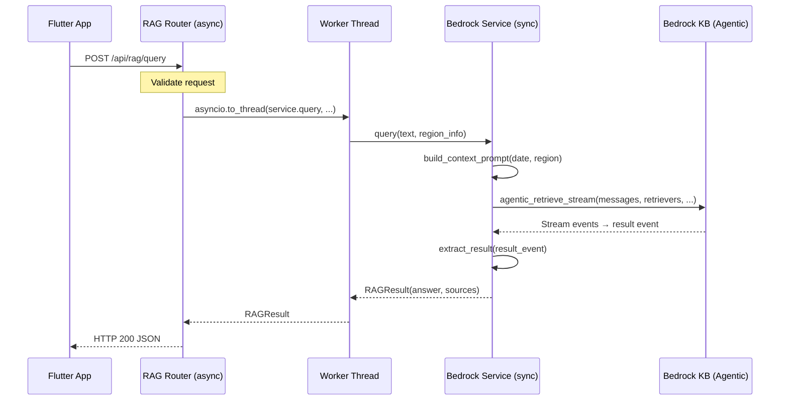
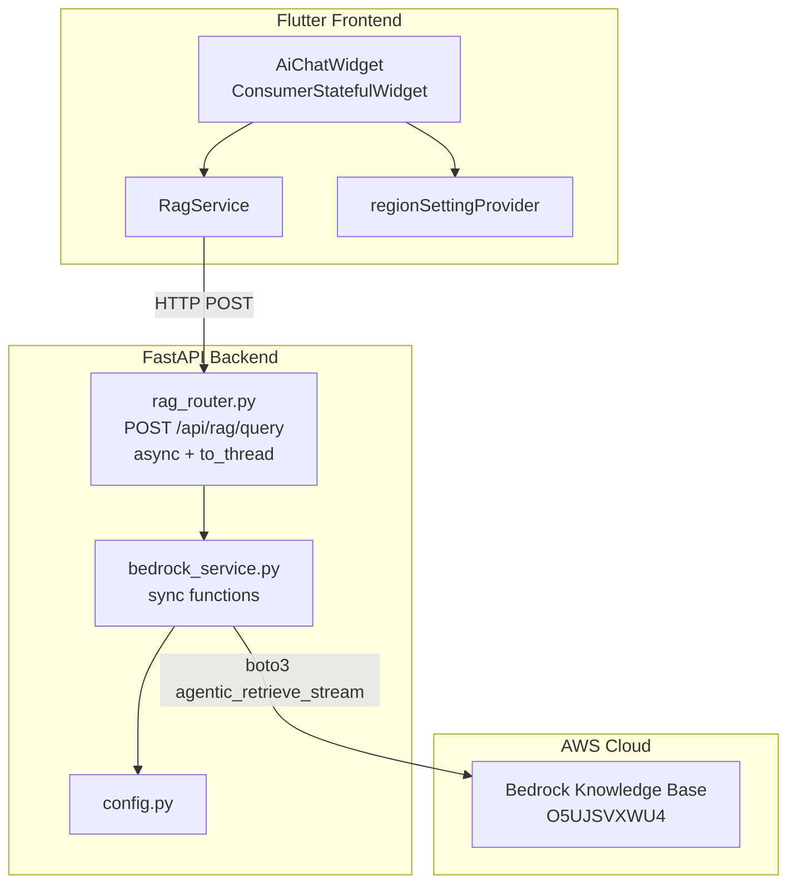
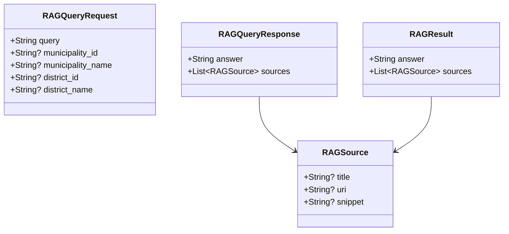

# Design Document: Bedrock RAG Query

## Overview

既存のGemini APIによるAIチャットを、Amazon Bedrock Knowledge Base（Agentic Retrieval）ベースのRAGシステムに置き換える。アーキテクチャはFlutter → FastAPI → Bedrock Managed KBの3層構成で、バックエンドがストリームの最終resultイベントから回答を抽出し、完成した回答をHTTPレスポンスとして返す。

### 設計判断
- **Agentic Retrieval（agentic_retrieve_stream）を使用**: retrieve_and_generate ではなく agentic_retrieve_stream を使用。Managed KBに対応し、反復的な検索が可能
- **バックエンドでresult抽出**: 最終resultイベントの `generatedResponse.answer` を正とし、フロントエンドへは通常のHTTPレスポンスとして返す。将来的にSSE/WebSocket対応の余地を残す
- **認証不要**: RAGクエリは未ログインユーザーも利用可能（ゴミ出し情報は公共情報）
- **地域コンテキストは動的**: フロントエンドから送信される地域情報をそのまま利用し、バックエンドでハードコードしない
- **boto3は同期SDK**: RAG_Serviceは同期関数として実装し、FastAPIのasyncルーターからは `asyncio.to_thread()` で呼び出す
- **地域IDの検証は行わない**: バックエンドに地域マスターがないため、IDと名称の整合性検証は今回の実装対象外。IDは将来の拡張用にAPIに保持する

## Architecture





## Components and Interfaces

### Backend Components

#### `backend/app/config.py` (拡張)

既存のconfig.pyにRAG関連の環境変数を追加する。

```python
# RAG設定
AWS_REGION = os.getenv("AWS_REGION", "ap-northeast-1")
KNOWLEDGE_BASE_ID = os.getenv("KNOWLEDGE_BASE_ID", "")
TIMEZONE = os.getenv("TIMEZONE", "Asia/Tokyo")
AGENTIC_MAX_ITERATIONS = int(os.getenv("AGENTIC_MAX_ITERATIONS", "5"))
AGENTIC_FOUNDATION_MODEL_TYPE = os.getenv("AGENTIC_FOUNDATION_MODEL_TYPE", "MANAGED")
```

#### `backend/app/services/bedrock_service.py` (新規)

boto3は同期SDKのため、サービスクラスの主要メソッドはすべて同期関数として実装する。FastAPIルーターからは `asyncio.to_thread()` で呼び出す。

```python
class BedrockRAGService:
    """Bedrock Knowledge Base Agentic Retrieval サービス（同期実装）"""

    def __init__(self, client=None):
        """boto3クライアントをDI可能にする（テスト容易性）
        
        clientが未指定の場合は boto3.client('bedrock-agent-runtime', region_name=config.AWS_REGION) を生成する。
        """
        ...

    def build_context_prompt(self, query: str, municipality_name: str | None,
                             district_name: str | None) -> str:
        """動的コンテキストプロンプトを構築する（同期）"""
        ...

    def extract_result(self, stream) -> RAGResult:
        """ストリームを消費し、最終resultイベントから回答とソースを抽出する（同期）
        
        - ストリームをイテレートして最終resultを取得
        - result.generatedResponse.answer を最終回答として使用
        - result.generatedResponse.citations と result.results からソース情報を構築
        - responseEvent のテキストチャンクは将来のストリーミング対応のためにも構造を把握するが、
          今回のHTTPレスポンスには result.generatedResponse.answer を使用する
        """
        ...

    def query(self, query: str, municipality_name: str | None = None,
              district_name: str | None = None) -> RAGResult:
        """Knowledge Baseにクエリを発行し回答を返す（同期）
        
        1. build_context_prompt() でコンテキスト付きプロンプトを構築
        2. agentic_retrieve_stream() を呼び出し
        3. extract_result() で最終結果を抽出
        4. RAGResult を返す
        """
        ...
```

#### `backend/app/routers/rag_router.py` (新規)

```python
router = APIRouter(prefix="/api/rag", tags=["rag"])

@router.post("/query", response_model=RAGQueryResponse)
async def rag_query(request: RAGQueryRequest) -> RAGQueryResponse:
    """RAGクエリエンドポイント（認証不要）
    
    boto3は同期SDKのため、asyncio.to_thread()でサービス呼び出しを実行し
    FastAPIのイベントループをブロックしない。
    """
    service = BedrockRAGService()
    try:
        result = await asyncio.to_thread(
            service.query,
            query=request.query,
            municipality_name=request.municipality_name,
            district_name=request.district_name,
        )
    except TimeoutError:
        raise HTTPException(status_code=504, ...)
    except BedrockServiceError:
        raise HTTPException(status_code=503, ...)
    
    return RAGQueryResponse(answer=result.answer, sources=result.sources)
```

#### `backend/app/schemas.py` (拡張)

```python
class RAGQueryRequest(BaseModel):
    query: str = Field(min_length=1)
    municipality_id: str | None = None
    municipality_name: str | None = None
    district_id: str | None = None
    district_name: str | None = None

    @field_validator("query")
    @classmethod
    def query_not_whitespace(cls, v: str) -> str:
        if not v.strip():
            raise ValueError("query must not be empty or whitespace only")
        return v

class RAGSource(BaseModel):
    title: str | None = None
    uri: str | None = None
    snippet: str | None = None

class RAGQueryResponse(BaseModel):
    answer: str
    sources: list[RAGSource] = []
```

### Frontend Components

#### `frontend/lib/services/rag_service.dart` (新規)

```dart
class RagService {
  final String _baseUrl = AppConfig.apiBaseUrl;

  Future<String> sendMessage(String query, {RegionSetting? region}) async {
    // POST /api/rag/query with query and optional region info
    // Returns answer text or Japanese error message
  }
}
```

#### `frontend/lib/widgets/ai_chat_widget.dart` (変更)

- `StatefulWidget` → `ConsumerStatefulWidget` に変更
- `GeminiService` → `RagService` に変更
- `regionSettingProvider` からregion情報を取得してRAG_Clientに渡す

## Data Models

### Request/Response Flow



### Context Prompt Template

動的に構築されるコンテキストプロンプト。値はすべて実行時に動的に設定する。

```
現在の日付は日本時間で{current_date}です。
利用自治体は{municipality_name}です。
対象地区は{district_name}です。
以下の質問について、Knowledge Baseから取得した情報に基づいて回答してください。
取得情報にない分別方法・注意事項・収集日を推測して追加しないでください。

質問:
{query}
```

- `{current_date}`: Asia/Tokyo タイムゾーンでの現在日付（例: 2026年8月21日）
- `{municipality_name}`: リクエストから取得。値がない場合は「利用自治体は...」行を省略
- `{district_name}`: リクエストから取得。値がない場合は「対象地区は...」行を省略
- `{query}`: ユーザーの質問文

### Bedrock API Call Structure (agentic_retrieve_stream)

AWS公式のAgenticRetrieveStream APIフォーマットに準拠する。

```python
# agentic_retrieve_stream() パラメータ
response = client.agentic_retrieve_stream(
    messages=[
        {
            "role": "user",
            "content": {"text": context_prompt}
        }
    ],
    retrievers=[
        {
            "description": "松山市ゴミ出し情報のKnowledge Base",
            "configuration": {
                "knowledgeBase": {
                    "knowledgeBaseId": config.KNOWLEDGE_BASE_ID
                }
            }
        }
    ],
    agenticRetrieveConfiguration={
        "foundationModelType": config.AGENTIC_FOUNDATION_MODEL_TYPE,  # "MANAGED"
        "maxAgentIteration": config.AGENTIC_MAX_ITERATIONS,  # 5
    },
    generateResponse=True
)
```

### Result Event Processing

AgenticRetrieveStreamからはストリーミングでイベントが返る。今回の通常HTTPレスポンス生成では最終resultイベントを利用する。

```python
# ストリームの処理概念
stream = response["stream"]
for event in stream:
    if "responseEvent" in event:
        # 将来のストリーミング表示用（今回はresultを正とする）
        pass
    if "result" in event:
        # 最終結果
        result = event["result"]
        answer = result["generatedResponse"]["answer"]
        citations = result["generatedResponse"].get("citations", [])
        results = result.get("results", [])
```

- **answer**: `result.generatedResponse.answer` を最終回答として使用
- **sources**: `result.generatedResponse.citations` と `result.results` からRAGSourceリストを構築
- **responseEvent**: 将来のストリーミング対応のために構造を把握するが、現在は使用しない

### Region ID Handling

- `municipality_id` と `district_id` はAPIリクエストに含まれるが、バックエンドでマスター検証はしない
- コンテキストプロンプトには `municipality_name` と `district_name`（表示名）を使用する
- IDは将来の地域データ紐付け・ログ・分析のためにAPIスキーマに保持する

## Correctness Properties

### Property 1: Whitespace-only queries are rejected

*For any* string composed entirely of whitespace characters (spaces, tabs, newlines, or combinations thereof), submitting it as a query to the RAG endpoint SHALL result in a validation error (422 status).

**Validates: Requirements 1.2**

### Property 2: Context prompt includes municipality when provided

*For any* valid query and any non-empty municipality_name string, the constructed context prompt SHALL contain "利用自治体は{municipality_name}です。" where {municipality_name} is the provided string.

**Validates: Requirements 1.5, 3.2**

### Property 3: Context prompt excludes district when not provided

*For any* valid query where district_name is not provided (None), the constructed context prompt SHALL NOT contain "対象地区は" text.

**Validates: Requirements 1.4, 3.4**

### Property 4: Context prompt includes district when provided

*For any* valid query and any non-empty district_name string, the constructed context prompt SHALL contain "対象地区は{district_name}です。" where {district_name} is the provided string.

**Validates: Requirements 3.3**

### Property 5: Result answer is extracted from generatedResponse

*For any* result event containing a `generatedResponse.answer` field with a non-empty string, the extract_result function SHALL return that exact string as the answer.

**Validates: Requirements 2.4, 8.2**

### Property 6: Region fields included in request when region is set

*For any* valid RegionSetting object, the RAG_Client SHALL include municipality_id, municipality_name, district_id, and district_name in the HTTP request body sent to the backend.

**Validates: Requirements 6.2**

### Property 7: Successful response parsing extracts answer

*For any* valid JSON response containing an "answer" field with a non-empty string, the RAG_Client SHALL parse and return that exact answer string.

**Validates: Requirements 6.4**

### Property 8: Source citations extracted from result event

*For any* result event containing citation metadata in generatedResponse.citations, the extract_result function SHALL include all source citations in the returned sources list.

**Validates: Requirements 8.3**

### Property 9: Context prompt includes anti-hallucination instruction

*For any* valid query (regardless of region parameters), the constructed context prompt SHALL contain the instruction to not fabricate information not in retrieved data.

**Validates: Requirements 3.7**

## Error Handling

| Error Condition | HTTP Status | Response Message | Source |
|---|---|---|---|
| Empty/whitespace query | 422 | Pydantic validation error detail | Request validation |
| AWS credentials error | 503 | "AIサービスに接続できません。しばらくしてからお試しください。" | boto3 NoCredentialsError, ClientError |
| Bedrock API error | 503 | "AIサービスでエラーが発生しました。しばらくしてからお試しください。" | boto3 ClientError |
| Request timeout | 504 | "リクエストがタイムアウトしました。しばらくしてからお試しください。" | asyncio.TimeoutError |
| No answer from KB | 200 | answer: "回答が見つかりませんでした。質問を変えてお試しください。" | result.generatedResponse.answer が空 |
| Stream/result processing error | 503 | "応答の処理中にエラーが発生しました。" | Exception during extract_result |

### Frontend Error Messages

| Backend Status | Frontend Display |
|---|---|
| 422 | "質問を入力してください。" |
| 503 | "AIサービスに接続できません。しばらくしてからお試しください。" |
| 504 | "リクエストがタイムアウトしました。しばらくしてからお試しください。" |
| Network error | "通信エラーが発生しました。インターネット接続を確認してください。" |

### Design Decision: No Fallback

エラー発生時にGemini APIやローカル検索へのフォールバックは行わない。理由:
- ユーザーに一貫した情報源からの回答を提供する
- デバッグ時にどのサービスが応答したか不明確になることを防ぐ
- 将来的にRAGの品質を正確に測定するため

### Design Decision: No Region ID Validation

バックエンドで `municipality_id` / `district_id` のマスター検証を行わない。理由:
- 現在バックエンドに地域マスターデータが存在しない
- IDはフロントエンドの地域選択UIで既に検証済み
- RAGコンテキストには名称（municipality_name / district_name）を使用するため、IDの正当性はRAG回答品質に直接影響しない
- 将来バックエンドに地域マスターを導入する際に検証を追加する

## Testing Strategy

### Backend Tests (pytest + pytest-asyncio)

**Unit Tests:**
- `bedrock_service.py`: コンテキスト構築、result抽出、エラーハンドリング
- `rag_router.py`: リクエストバリデーション、レスポンス構造、HTTPステータスコード、asyncio.to_thread統合
- `config.py`: 環境変数読み込み、デフォルト値

**Property-Based Tests (hypothesis):**
- Property 1: Whitespace-only query rejection
- Property 2: Municipality in context
- Property 3: District absence in context
- Property 4: District in context
- Property 5: Result answer extraction
- Property 9: Anti-hallucination instruction presence

**Mocking Strategy:**
- boto3クライアントはunittest.mockでモック（agentic_retrieve_streamの戻り値をモック）
- 日時はunittest.mock.patchでモック（datetime.now(tz=...)）
- 環境変数はmonkeypatchでモック
- asyncio.to_thread はそのまま使用（同期サービスがモック済みなら高速）

**Property test configuration:**
- Minimum 100 iterations per property
- Tag format: `Feature: bedrock-rag-query, Property {N}: {title}`

### Frontend Tests (flutter_test)

**Unit Tests:**
- `rag_service.dart`: HTTP request construction, response parsing, error handling
- Widget test: `AiChatWidget` with mocked `RagService` and `regionSettingProvider`

**Mocking Strategy:**
- `http` package mocked via `MockClient`
- `regionSettingProvider` overridden in test ProviderScope

## boto3 Version Requirement

`agentic_retrieve_stream` は Bedrock Agent Runtime の比較的新しいAPIである。実装時に利用可能な最新の boto3 バージョンを確認し、このAPIが含まれるバージョン以上を requirements.txt に指定する。現時点の推定では `boto3>=1.38.0` が必要だが、実装時に `pip install boto3` で入るバージョンで `agentic_retrieve_stream` メソッドが存在することを確認すること。
