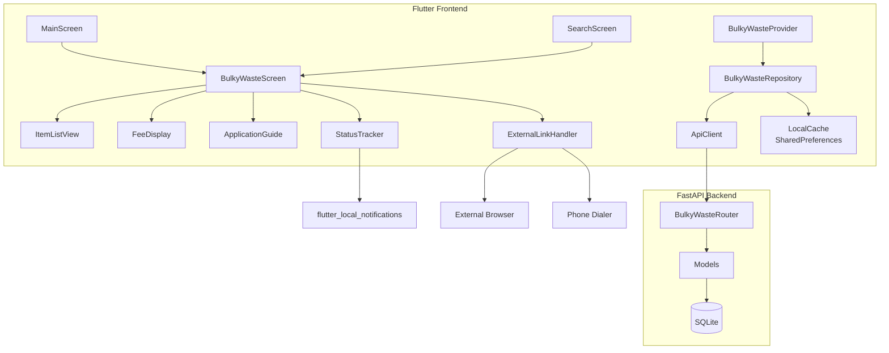
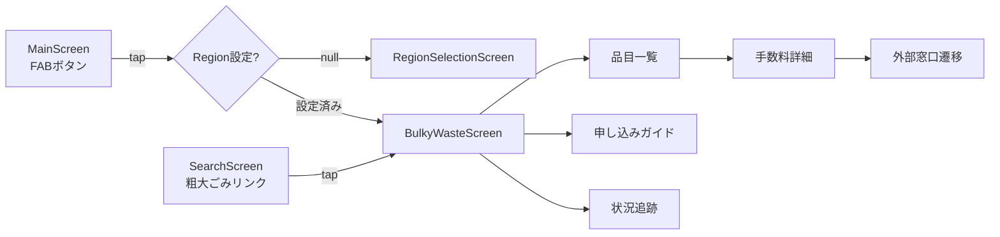
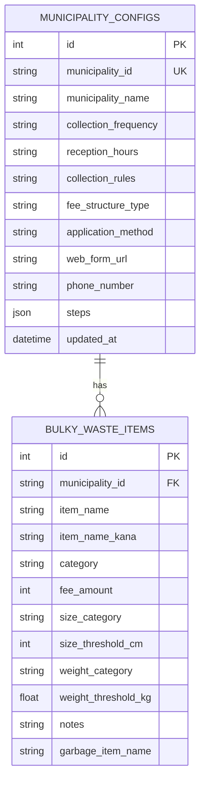
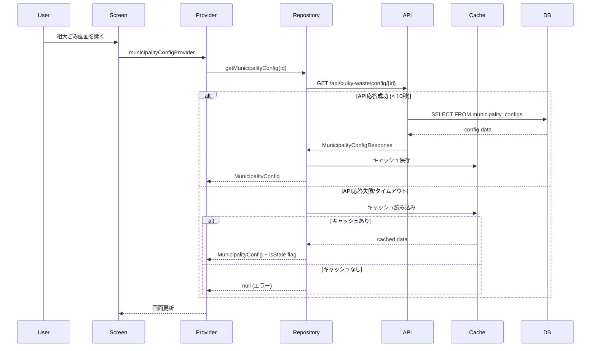
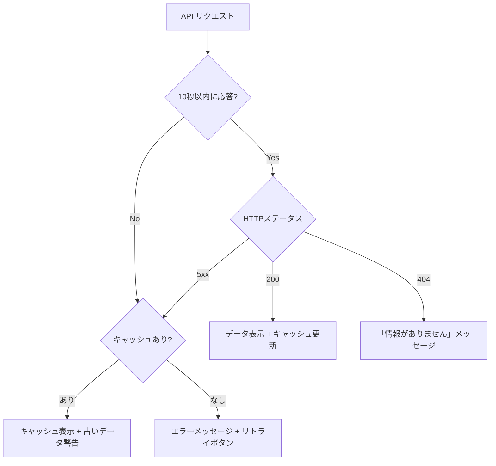

# Design Document: 粗大ごみ申し込み連携

## Overview

本設計書は、愛媛県向けゴミ出しアプリケーションに粗大ごみ収集の情報提供・申し込みガイド機能を追加するための技術設計を定義する。

ユーザーの選択した市区町村に応じて、粗大ごみの対象品目一覧・手数料・申し込み手順を提示し、自治体の公式窓口（Webフォーム/電話）へ遷移させる。さらに申し込み状況のローカル追跡と収集日前の通知機能を提供する。

### 設計方針

- **既存アーキテクチャの踏襲**: Flutter + Riverpod（フロントエンド）、FastAPI + SQLAlchemy async（バックエンド）の既存パターンに準拠
- **オフライン対応**: SharedPreferencesによるキャッシュでネットワーク不通時もデータ閲覧可能
- **自治体可変性**: Municipality_Configの設計により、自治体ごとの異なるルール・手数料体系を柔軟に表現
- **既存機能との統合**: ゴミ検索結果から粗大ごみ詳細へのシームレスな導線

## Architecture

### システム構成図



### レイヤー構成

| レイヤー | Frontend | Backend |
|---------|----------|---------|
| Presentation | Screen / Widget | - |
| State Management | Riverpod Provider | - |
| Repository | Repository (API + Cache) | - |
| API | http package | FastAPI Router |
| Domain | Model classes | Pydantic Schema |
| Data | SharedPreferences | SQLAlchemy Model + SQLite |

### ナビゲーション導線



**導線の設計判断**: 既存の4タブBottomNavigationBarに5つ目のタブを追加するとUI密度が高くなりすぎるため、メイン画面にFloatingActionButton（FAB）を配置し、粗大ごみ機能への導線とする。FABはカレンダー画面表示時にも常に表示され、どのタブからでもアクセス可能。

## Components and Interfaces

### Backend Components

#### 1. BulkyWasteRouter (`backend/app/routers/bulky_waste_router.py`)

粗大ごみ関連のAPIエンドポイントを提供するFastAPIルーター。

```python
# エンドポイント一覧
GET /api/bulky-waste/config/{municipality_id}
    → MunicipalityConfigResponse

GET /api/bulky-waste/items/{municipality_id}
    → BulkyWasteItemListResponse
    Query params: search (optional), sort_by (name|fee), sort_order (asc|desc)

GET /api/bulky-waste/items/{municipality_id}/{item_id}
    → BulkyWasteItemDetailResponse
```

#### 2. Backend Models (`backend/app/models.py` に追加)

```python
class MunicipalityConfig(Base):
    """自治体粗大ごみ設定"""
    __tablename__ = "municipality_configs"
    
    id: Mapped[int]                    # PK
    municipality_id: Mapped[str]       # 5桁の自治体コード (e.g. "38201")
    municipality_name: Mapped[str]     # 表示用自治体名
    collection_frequency: Mapped[str]  # 収集頻度テキスト
    reception_hours: Mapped[str]       # 受付時間
    collection_rules: Mapped[str]      # 収集ルール
    fee_structure_type: Mapped[str]    # "size_based" | "weight_based" | "fixed"
    application_method: Mapped[str]    # "web_form" | "phone" | "both"
    web_form_url: Mapped[str | None]   # Web申し込みURL
    phone_number: Mapped[str | None]   # 電話番号
    steps: Mapped[list]                # 申し込み手順 (JSON array)
    updated_at: Mapped[datetime]

class BulkyWasteItem(Base):
    """粗大ごみ品目"""
    __tablename__ = "bulky_waste_items"
    
    id: Mapped[int]                    # PK
    municipality_id: Mapped[str]       # FK → municipality_configs.municipality_id
    item_name: Mapped[str]             # 品目名
    item_name_kana: Mapped[str]        # 品目名かな（ソート用）
    category: Mapped[str]              # カテゴリ
    fee_amount: Mapped[int]            # 手数料(円) 0~99999
    size_category: Mapped[str | None]  # サイズカテゴリ名
    size_threshold_cm: Mapped[int | None]  # サイズ閾値(cm)
    weight_category: Mapped[str | None]    # 重量カテゴリ名
    weight_threshold_kg: Mapped[float | None]  # 重量閾値(kg)
    notes: Mapped[str | None]          # 備考（最大200文字）
    garbage_item_name: Mapped[str | None]  # GarbageItemとのマッピング用品目名
```

#### 3. Backend Schemas (`backend/app/schemas.py` に追加)

```python
class MunicipalityConfigResponse(BaseModel):
    municipality_id: str
    municipality_name: str
    collection_frequency: str
    reception_hours: str
    collection_rules: str
    fee_structure_type: str  # "size_based" | "weight_based" | "fixed"
    application_method: str  # "web_form" | "phone" | "both"
    web_form_url: str | None
    phone_number: str | None
    steps: list[ApplicationStep]

class ApplicationStep(BaseModel):
    step_number: int
    title: str
    description: str
    notes: str | None = None

class BulkyWasteItemResponse(BaseModel):
    id: int
    item_name: str
    category: str
    fee_amount: int
    size_category: str | None
    size_threshold_cm: int | None
    weight_category: str | None
    weight_threshold_kg: float | None
    notes: str | None

class BulkyWasteItemListResponse(BaseModel):
    items: list[BulkyWasteItemResponse]
    total_count: int
    municipality_name: str
```

### Frontend Components

#### 4. Models (`frontend/lib/models/bulky_waste.dart`)

```dart
/// 自治体粗大ごみ設定
class MunicipalityConfig {
  final String municipalityId;
  final String municipalityName;
  final String collectionFrequency;
  final String receptionHours;
  final String collectionRules;
  final FeeStructureType feeStructureType;
  final ApplicationMethod applicationMethod;
  final String? webFormUrl;
  final String? phoneNumber;
  final List<ApplicationStep> steps;
  
  // fromJson / toJson
}

enum FeeStructureType { sizeBased, weightBased, fixed }
enum ApplicationMethod { webForm, phone, both }

class ApplicationStep {
  final int stepNumber;
  final String title;
  final String description;
  final String? notes;
}

/// 粗大ごみ品目
class BulkyWasteItem {
  final int id;
  final String itemName;
  final String category;
  final int feeAmount;
  final String? sizeCategory;
  final int? sizeThresholdCm;
  final String? weightCategory;
  final double? weightThresholdKg;
  final String? notes;
}

/// 申し込み状況記録（ローカル保存）
class ApplicationRecord {
  final String id;           // UUID
  final String itemName;     // 最大50文字
  final DateTime collectionDate;
  final ApplicationStatus status;
  final DateTime createdAt;
  final DateTime updatedAt;
}

enum ApplicationStatus { applied, ticketPurchased, awaitingCollection, completed }
```

#### 5. Repository (`frontend/lib/repositories/bulky_waste_repository.dart`)

```dart
class BulkyWasteRepository {
  final HttpClient _client;
  final SharedPreferences _prefs;
  
  /// 自治体設定取得（API → キャッシュフォールバック）
  Future<MunicipalityConfig?> getMunicipalityConfig(String municipalityId);
  
  /// 品目一覧取得（API → キャッシュフォールバック）
  Future<BulkyWasteItemList> getItems(String municipalityId, {String? search, SortBy? sortBy, SortOrder? sortOrder});
  
  /// 品目詳細取得
  Future<BulkyWasteItem?> getItemDetail(String municipalityId, int itemId);
  
  /// キャッシュ保存・読み込み
  Future<void> _cacheConfig(String municipalityId, MunicipalityConfig config);
  Future<MunicipalityConfig?> _getCachedConfig(String municipalityId);
}
```

#### 6. Providers (`frontend/lib/providers/bulky_waste_provider.dart`)

```dart
/// リポジトリプロバイダー
final bulkyWasteRepositoryProvider = Provider<BulkyWasteRepository>(...);

/// 自治体設定プロバイダー（地域設定に連動）
final municipalityConfigProvider = FutureProvider<MunicipalityConfig?>((ref) {
  final regionSetting = ref.watch(regionSettingProvider).value;
  if (regionSetting == null) return null;
  final repo = ref.watch(bulkyWasteRepositoryProvider);
  return repo.getMunicipalityConfig(regionSetting.municipalityId);
});

/// 品目一覧プロバイダー
final bulkyWasteItemsProvider = FutureProvider.family<BulkyWasteItemList, BulkyWasteQuery>(...);

/// 申し込み記録プロバイダー
final applicationRecordsProvider = StateNotifierProvider<ApplicationRecordNotifier, List<ApplicationRecord>>(...);
```

#### 7. Screens

| Screen | パス | 責務 |
|--------|------|------|
| BulkyWasteScreen | `screens/bulky_waste_screen.dart` | 粗大ごみ機能のメインハブ（TabBar: 品目一覧/ガイド/状況追跡） |
| ItemListView | `widgets/bulky_waste/item_list_view.dart` | 品目一覧・検索・ソート |
| FeeDisplayScreen | `screens/fee_display_screen.dart` | 品目詳細・手数料表示 |
| ApplicationGuideView | `widgets/bulky_waste/application_guide_view.dart` | ステップガイド表示 |
| StatusTrackerView | `widgets/bulky_waste/status_tracker_view.dart` | 申し込み状況追跡 |
| ExternalLinkHandler | `widgets/bulky_waste/external_link_handler.dart` | 外部遷移ボタン群 |

## Data Models

### ER図



### ローカルデータ（SharedPreferences）

| キー | 型 | 内容 |
|------|-----|------|
| `bulky_waste_config_{municipalityId}` | JSON String | MunicipalityConfigのキャッシュ |
| `bulky_waste_items_{municipalityId}` | JSON String | 品目一覧キャッシュ |
| `bulky_waste_config_timestamp_{municipalityId}` | int (epoch ms) | キャッシュ取得時刻 |
| `application_records` | JSON String (List) | 申し込み記録一覧 |

### データフロー



### 品目名マッピング (Requirement 9)

既存の `GarbageItem.name` と `BulkyWasteItem.garbage_item_name` が文字列完全一致で対応する。検索結果表示時に一致する品目があれば粗大ごみリンクを表示する。

```dart
// SearchResultTile内での判定ロジック
bool hasBulkyWasteMapping(GarbageItem item, String municipalityId) {
  // BulkyWasteItemのgarbage_item_nameとGarbageItem.nameの完全一致
  return bulkyWasteItems.any((bwi) => bwi.garbageItemName == item.name);
}
```


## Correctness Properties

*A property is a characteristic or behavior that should hold true across all valid executions of a system—essentially, a formal statement about what the system should do. Properties serve as the bridge between human-readable specifications and machine-verifiable correctness guarantees.*

### Property 1: Sort invariant

*For any* list of BulkyWasteItem entries and any selected sort mode (name or fee), after sorting, the resulting list SHALL be ordered according to the selected criterion: lexicographic ascending on `item_name_kana` for name sort, or numeric ascending/descending on `fee_amount` for fee sort.

**Validates: Requirements 3.1, 3.5**

### Property 2: Search filter correctness

*For any* list of BulkyWasteItem entries and any non-empty search keyword (1+ characters), the filtered result SHALL contain only items whose `item_name` or `category` contains the keyword as a substring, and SHALL contain all such items from the original list.

**Validates: Requirements 3.3**

### Property 3: Item list rendering completeness

*For any* BulkyWasteItem, when rendered in the item list view, the output SHALL contain the item name, category, and fee amount followed by "円".

**Validates: Requirements 3.2**

### Property 4: Fee display by structure type

*For any* BulkyWasteItem and its associated MunicipalityConfig fee_structure_type, the fee detail display SHALL render: size thresholds (cm) and tier fees when size-based, weight ranges (kg) and tier fees when weight-based, or the single fixed fee amount when fixed. In all cases the item name and fee amount with currency unit SHALL be present.

**Validates: Requirements 4.2, 4.3, 4.4, 4.5**

### Property 5: Application guide step rendering

*For any* MunicipalityConfig with N steps (N ≥ 1), the Application Guide SHALL render exactly N steps, numbered sequentially from 1 to N, each displaying the title and description from the config. Steps that include notes SHALL render the notes content in a visually distinct section.

**Validates: Requirements 5.1, 5.3, 5.4**

### Property 6: External link button visibility

*For any* MunicipalityConfig, the External Link Handler SHALL display a web form button if and only if `application_method` is "web_form" or "both", and SHALL display a phone button if and only if `application_method` is "phone" or "both".

**Validates: Requirements 6.1, 6.2, 6.3**

### Property 7: Application record creation validation

*For any* input pair (itemName, collectionDate): if itemName is non-empty (after trimming, ≤50 characters) and collectionDate is today or a future date, then record creation SHALL succeed and the record SHALL appear in the active records list. If itemName is empty/whitespace-only OR collectionDate is in the past, then creation SHALL be rejected and the active records list SHALL remain unchanged.

**Validates: Requirements 7.1, 7.6**

### Property 8: Status transition freedom

*For any* existing ApplicationRecord and any target ApplicationStatus value, updating the record's status to the target value SHALL succeed regardless of the current status, and the persisted record SHALL reflect the new status.

**Validates: Requirements 7.2, 7.3**

### Property 9: Collection notification scheduling

*For any* ApplicationRecord whose scheduled collection date is within the next 24 hours and whose status is not "completed", the system SHALL schedule a local notification. For records with collection dates more than 24 hours away or with "completed" status, no notification SHALL be scheduled.

**Validates: Requirements 7.4**

### Property 10: Completed record archival

*For any* ApplicationRecord in the active list, when its status is changed to "completed", the record SHALL be removed from the active records list and SHALL appear in the archived records list.

**Validates: Requirements 7.5**

### Property 11: Overdue record indication

*For any* ApplicationRecord whose scheduled collection date has passed and whose status is not "completed", the record SHALL be marked as overdue in the active records list.

**Validates: Requirements 7.7**

### Property 12: Bulky waste link visibility in search results

*For any* GarbageItem in search results and a given municipality ID: a bulky waste link SHALL be displayed if and only if (1) there exists a BulkyWasteItem whose `garbage_item_name` exactly equals the GarbageItem's `name`, AND (2) a MunicipalityConfig exists for the user's current municipality.

**Validates: Requirements 9.1, 9.4, 9.5**

### Property 13: Fee response structure validation

*For any* BulkyWasteItem returned by the Backend API, the fee information SHALL be structured data containing: amount as an integer in the range [0, 99999], currency unit "yen", and an applicable category name (size or weight category when applicable).

**Validates: Requirements 8.4**

### Property 14: Municipality config display completeness

*For any* valid MunicipalityConfig, the Bulky Waste Screen overview SHALL display: the municipality name, collection frequency, reception hours, and collection rules.

**Validates: Requirements 2.2**

## Error Handling

### Backend Error Responses

| 状況 | HTTPステータス | レスポンス |
|------|--------------|----------|
| municipality_id不存在 | 404 Not Found | `{"detail": "指定された自治体が見つかりません"}` |
| DB接続エラー | 500 Internal Server Error | `{"detail": "サーバーエラーが発生しました"}` |
| 不正なパラメータ | 422 Unprocessable Entity | FastAPI標準バリデーションエラー |

### Frontend Error Handling Strategy



### エラーハンドリング方針

1. **ネットワークエラー**: 10秒タイムアウト → キャッシュフォールバック → エラーUI
2. **URL起動失敗**: エラーメッセージ + コピー可能テキスト表示
3. **電話発信失敗**: エラーメッセージ + コピー可能電話番号表示
4. **バリデーションエラー**: フィールド横にインラインエラーメッセージ
5. **データ不整合**: 該当フィールドに「情報がありません」+ 自治体連絡先を表示

## Testing Strategy

### テスト種別と責務

| テスト種別 | ツール | 対象 |
|-----------|--------|------|
| Property-based tests | glados (Dart) | Properties 1-12, 14 (フロントエンドロジック) |
| Property-based tests | Hypothesis (Python) | Property 13 (バックエンドスキーマ) |
| Unit tests | flutter_test | 個別コンポーネント、エラーケース、UIレンダリング |
| Unit tests | pytest | API Router、バリデーション |
| Integration tests | pytest + httpx | Backend API エンドポイント |
| Widget tests | flutter_test | 画面遷移、UI状態変化 |

### Property-Based Testing Configuration

- **ライブラリ**: Frontend → `glados` (既にdev_dependenciesに含まれる)、Backend → `hypothesis`
- **反復回数**: 各プロパティテスト最低100回
- **タグ形式**: `Feature: bulky-waste-application, Property {N}: {title}`

### Unit Test Focus Areas

- ナビゲーション分岐（Region null/設定済み）
- API応答タイムアウトとキャッシュフォールバック
- url_launcher / phone dialer エラーハンドリング
- 通知スケジューリングのタイミング計算
- 品目名完全一致マッピングの境界条件

### Integration Test Focus Areas

- Backend APIエンドポイントの正常応答
- DB → API → Frontend の自治体設定取得フロー
- キャッシュの保存・読み込み・期限切れ判定
- 外部URL/電話番号の形式バリデーション
