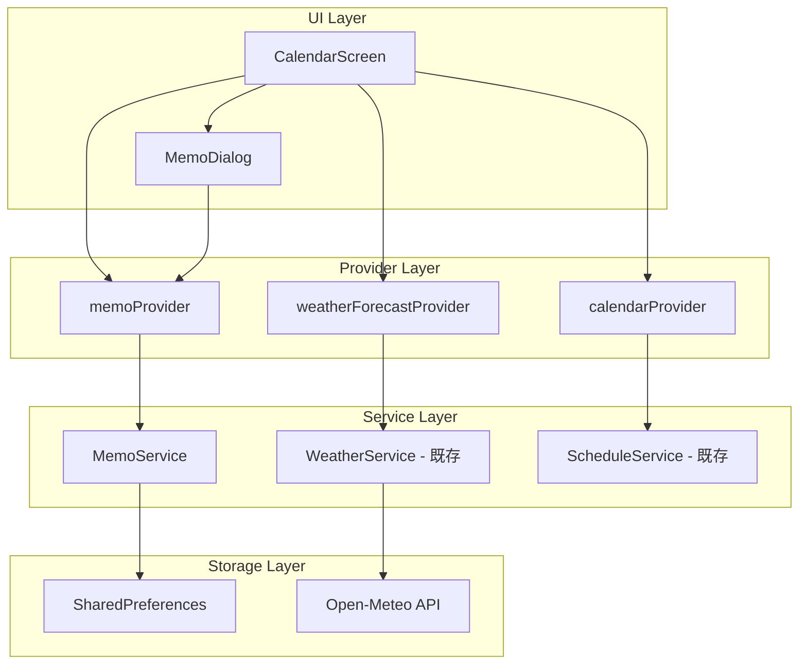
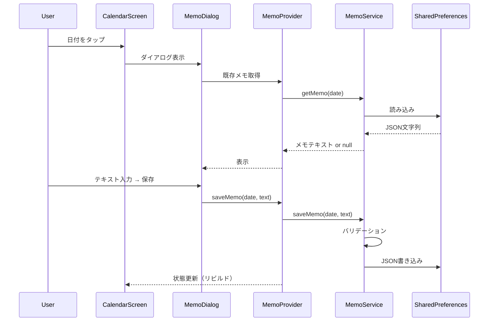

# 設計書: カレンダーメモ・天気機能

## 概要

カレンダー画面にメモ機能と天気予報表示を追加する。メモ機能はMemoServiceとして新規実装し、SharedPreferencesでJSON形式の永続化を行う。天気表示は既存のWeatherServiceとweatherForecastProviderを活用し、カレンダー日付セルへのアイコン表示と選択日の詳細表示を実現する。

### 設計方針

- 既存のアーキテクチャ（Riverpod + Service層）に準拠する
- MemoServiceは純粋なデータ管理ロジックとして実装し、UIから分離する
- 天気表示は既存のWeatherService/weatherForecastProviderをそのまま利用する（既に実装済みの部分は変更しない）
- カレンダーのDay_Cellレイアウトは、ゴミカテゴリドット・天気アイコン・メモアイコンが重ならないよう配置する

## アーキテクチャ



### データフロー



## コンポーネントとインターフェース

### MemoService

メモデータの永続化・バリデーションを担当するサービスクラス。

```dart
class MemoService {
  static const String _storageKey = 'calendar_memos';
  static const int maxMemoLength = 200;

  final SharedPreferences _prefs;
  Map<String, String> _cache = {};

  MemoService(this._prefs);

  /// キャッシュを初期化（SharedPreferencesから読み込み）
  Future<void> init();

  /// 指定日付のメモを取得する（nullは未登録）
  String? getMemo(DateTime date);

  /// 指定月に存在するメモの日付セットを取得する
  Set<DateTime> getMemoDatesForMonth(int year, int month);

  /// メモを保存する。バリデーション失敗時はfalseを返す。
  Future<bool> saveMemo(DateTime date, String text);

  /// メモを削除する
  Future<void> deleteMemo(DateTime date);

  /// 日付をストレージキー文字列に変換する（yyyy-MM-dd形式）
  String _dateToKey(DateTime date);

  /// 全メモデータをJSON文字列にシリアライズする
  String _serialize(Map<String, String> memos);

  /// JSON文字列から全メモデータをデシリアライズする
  Map<String, String> _deserialize(String json);

  /// テキストのバリデーション（空文字・空白のみ・文字数制限）
  bool isValidMemoText(String text);
}
```

### MemoProvider（Riverpod）

```dart
/// MemoServiceのプロバイダー
final memoServiceProvider = Provider<MemoService>((ref) { ... });

/// 月間メモデータのプロバイダー（月ごとにメモがある日付セットを提供）
final monthlyMemosProvider = Provider.family<Set<DateTime>, DateTime>((ref, month) { ... });

/// 特定日付のメモ取得用プロバイダー
final memoForDateProvider = Provider.family<String?, DateTime>((ref, date) { ... });
```

### MemoDialog（UIコンポーネント）

```dart
class MemoDialog extends ConsumerStatefulWidget {
  final DateTime date;
  final String? existingMemo;

  /// テキスト入力（maxLength: 200）、文字数カウンター表示
  /// 保存ボタン、削除ボタン（既存メモ時のみ）、キャンセルボタン
}
```

### CalendarScreen Day_Cell レイアウト変更

現在のmarkerBuilder内に、メモアイコンを追加する：

```
┌─────────────┐
│     日付     │
│             │
│  ☁️  📝     │  ← 天気アイコン（左）+ メモアイコン（右上隅）
│  ● ● ●     │  ← ゴミカテゴリドット（下部中央）
└─────────────┘
```

- 天気アイコン: 日付数字の下、カテゴリドットの上（既存位置）
- メモアイコン: セル右上隅に小さなドットまたはアイコン（4x4 px）
- カテゴリドット: セル最下部（既存位置）

## データモデル

### メモデータの永続化形式

SharedPreferencesに以下の形式でJSON文字列として保存する：

```json
{
  "2025-01-15": "可燃ゴミの袋を多めに用意する",
  "2025-01-20": "引越し後の粗大ゴミ申請を忘れない",
  "2025-02-01": "資源ゴミの分別確認"
}
```

- キー: `yyyy-MM-dd`形式の日付文字列
- 値: メモテキスト（1〜200文字）
- ストレージキー: `calendar_memos`

### バリデーションルール

| ルール | 条件 | 結果 |
|--------|------|------|
| 空文字拒否 | `text.trim().isEmpty` | 保存しない |
| 文字数上限 | `text.length > 200` | 保存しない |
| 正常 | 上記以外 | 保存する |

## 正確性プロパティ

*プロパティとは、システムの全ての有効な実行において真であるべき特性や振る舞いのことです。仕様を形式的に記述したもので、人間が読める仕様と機械的に検証可能な正確性保証の橋渡しをします。*

### Property 1: メモのシリアライズ・ラウンドトリップ

*For any* 有効なメモデータ（日付→テキストのMap）に対して、シリアライズしてからデシリアライズした結果は、元のデータと等しくなる

**Validates: Requirements 1.2, 7.1, 7.2, 7.3**

### Property 2: 1日付1メモ（最終書き込み勝ち）

*For any* 日付と複数のメモテキストの列に対して、同じ日付に順次保存した場合、取得されるメモは最後に保存したテキストのみである

**Validates: Requirements 1.3, 2.2**

### Property 3: 空白文字列の拒否

*For any* 空白文字のみで構成される文字列に対して、メモとして保存を試みた場合、保存は拒否されストレージの状態は変化しない

**Validates: Requirements 1.4**

### Property 4: メモ削除後の不在

*For any* メモが存在する日付に対して、削除操作を実行した後、その日付のメモ取得結果はnullとなる

**Validates: Requirements 3.2**

### Property 5: 文字数制限バリデーション

*For any* 文字列に対して、文字数が200文字以下なら保存が成功し、200文字を超える場合は保存が拒否される

**Validates: Requirements 8.1**

## エラーハンドリング

| シナリオ | 対応 |
|----------|------|
| SharedPreferences読み込み失敗 | 空のMapで初期化、ログ出力 |
| SharedPreferences書き込み失敗 | falseを返しUIでエラーメッセージ表示 |
| JSON デシリアライズ失敗 | 空のMapで初期化（データリセット） |
| 天気API取得失敗 | 既存の挙動通り空Mapを返す（天気アイコン非表示） |
| 不正な日付キー形式 | パース失敗エントリをスキップ |

### エラー時のUI表示

- メモ保存失敗: SnackBarで「メモの保存に失敗しました」表示
- メモ削除失敗: SnackBarで「メモの削除に失敗しました」表示
- 天気取得失敗: 天気アイコンを表示しない（ユーザーへの明示的エラー表示なし）

## テスト戦略

### プロパティベーステスト（glados使用）

プロジェクトで既に`glados`パッケージが導入されているため、これを使用してプロパティベーステストを実装する。

各プロパティテストは最低100回のイテレーションで実行する。

テスト対象:
- MemoServiceのシリアライズ/デシリアライズロジック
- MemoServiceのバリデーションロジック
- MemoServiceのCRUD操作の整合性

タグ形式: `// Feature: calendar-memo-weather, Property {number}: {property_text}`

### ユニットテスト

- MemoService: 具体的なメモ保存・取得・削除のシナリオ
- MemoService: 境界値テスト（200文字ちょうど、201文字）
- MemoProvider: プロバイダー状態管理の正常系

### ウィジェットテスト

- MemoDialog: ダイアログの表示・入力・保存フロー
- MemoDialog: 文字数カウンターの表示
- MemoDialog: 削除確認ダイアログの表示
- CalendarScreen: メモアイコンインジケーターの表示/非表示
- CalendarScreen: 天気アイコンの表示（既存テストの拡張）

### テスト構成

```
test/
  services/
    memo_service_test.dart          # ユニットテスト
    memo_service_property_test.dart # プロパティベーステスト
  providers/
    memo_provider_test.dart         # プロバイダーテスト
  widgets/
    memo_dialog_test.dart           # ウィジェットテスト
```
