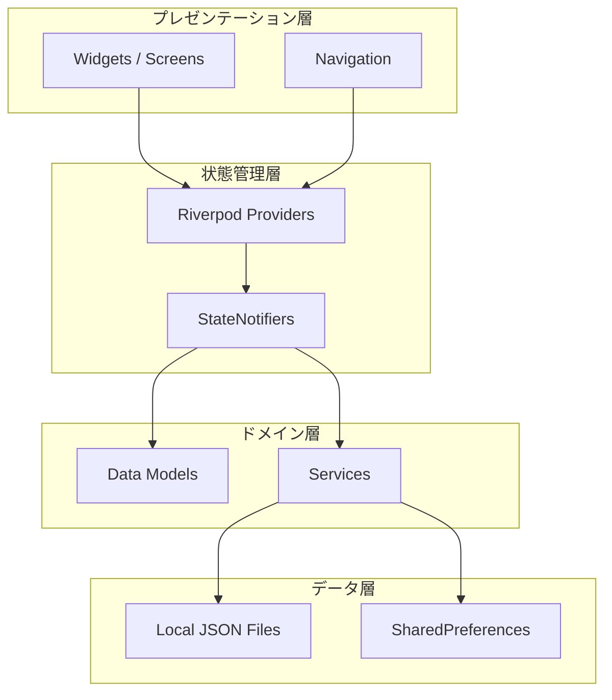
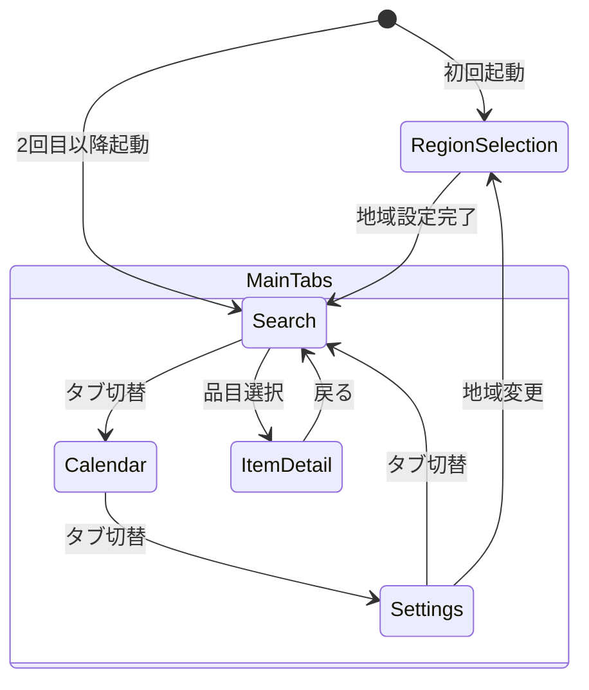

# 技術設計書: 愛媛県ゴミ出しアプリ

## Overview

本設計書は、愛媛県向けゴミ出しアプリケーションのプロトタイプに対する技術設計を定義する。Flutter（Dart）を使用し、Android/iOS両プラットフォームに対応する。

プロトタイプ段階のため、バックエンドAPIは構築せず、ローカルJSONファイルをデータソースとして使用する。地域設定はSharedPreferencesで永続化し、状態管理にはRiverpodを採用する。

### 設計方針

- **データソース**: assets/配下のローカルJSONファイル
- **永続化**: SharedPreferences（地域設定、通知設定）
- **状態管理**: Riverpod（StateNotifier + Provider）
- **ナビゲーション**: BottomNavigationBar（3タブ: 検索・カレンダー・設定）
- **カレンダー**: table_calendarパッケージ
- **オフライン対応**: プロトタイプ段階ではローカルJSONのためデフォルトでオフライン動作

## Architecture

### アーキテクチャ概要

レイヤードアーキテクチャを採用し、責務を明確に分離する。



### レイヤー構成

| レイヤー | 責務 | 主要コンポーネント |
|---------|------|-------------------|
| プレゼンテーション層 | UI描画、ユーザー入力処理 | Screen widgets, BottomNavigationBar |
| 状態管理層 | アプリ状態の管理・通知 | Riverpod Providers, StateNotifiers |
| ドメイン層 | ビジネスロジック、データ変換 | Models, Services |
| データ層 | データ読み込み・永続化 | JSON loader, SharedPreferences |

### ディレクトリ構成

```
lib/
├── main.dart
├── app.dart
├── models/
│   ├── region.dart
│   ├── garbage_item.dart
│   ├── garbage_category.dart
│   └── collection_schedule.dart
├── providers/
│   ├── region_provider.dart
│   ├── search_provider.dart
│   ├── calendar_provider.dart
│   └── settings_provider.dart
├── services/
│   ├── region_service.dart
│   ├── garbage_service.dart
│   ├── schedule_service.dart
│   └── notification_service.dart
├── screens/
│   ├── region_selection_screen.dart
│   ├── search_screen.dart
│   ├── item_detail_screen.dart
│   ├── calendar_screen.dart
│   └── settings_screen.dart
├── widgets/
│   ├── region_header.dart
│   ├── category_tag.dart
│   ├── search_result_tile.dart
│   ├── popular_items_section.dart
│   └── calendar_day_marker.dart
├── constants/
│   ├── colors.dart
│   └── strings.dart
└── utils/
    └── text_utils.dart

assets/
├── data/
│   ├── prefectures.json
│   ├── municipalities.json
│   ├── districts.json
│   ├── garbage_items.json
│   ├── collection_schedules.json
│   ├── popular_items.json
│   └── category_colors.json
```

## Components and Interfaces

### 画面遷移図



### 主要コンポーネント

#### 1. RegionSelectionScreen

地域選択画面。3段階（都道府県→市区町村→地区）のステップ形式。

```dart
// インターフェース
class RegionSelectionScreen extends ConsumerStatefulWidget {
  // 地域選択完了時のコールバック
  final VoidCallback? onRegionSelected;
}
```

**状態管理:**
- `selectedPrefecture`: 選択中の都道府県
- `selectedMunicipality`: 選択中の市区町村
- `selectedDistrict`: 選択中の地区
- `currentStep`: 現在のステップ（0-2）

#### 2. SearchScreen

ゴミ品目検索画面。テキスト入力による検索とよく検索される品目のタグ表示。

```dart
class SearchScreen extends ConsumerWidget {
  // 検索結果から品目選択時のコールバック
  // ItemDetailScreenへ遷移する
}
```

**状態管理:**
- `searchQuery`: 検索文字列（最大50文字）
- `searchResults`: 検索結果リスト（最大50件）
- `popularItems`: よく検索される品目リスト（5-10件）

#### 3. ItemDetailScreen

品目詳細画面。品目名、分類、次回収集日、出し方、注意事項を表示。

```dart
class ItemDetailScreen extends ConsumerWidget {
  final GarbageItem item;
}
```

#### 4. CalendarScreen

カレンダー画面。table_calendarを使用した月間収集スケジュール表示。

```dart
class CalendarScreen extends ConsumerWidget {
  // table_calendarを使用
  // 日付選択で当日の収集予定を表示
}
```

**状態管理:**
- `focusedDay`: 表示中の月の基準日
- `selectedDay`: 選択中の日付
- `scheduleForMonth`: 月間の収集スケジュールマップ

#### 5. SettingsScreen

設定画面。地域変更と通知設定。

```dart
class SettingsScreen extends ConsumerWidget {
  // 地域情報表示・変更
  // リマインダー通知トグル
}
```

### サービス層インターフェース

#### RegionService

```dart
abstract class RegionService {
  /// 都道府県一覧を取得
  Future<List<Prefecture>> getPrefectures();
  
  /// 指定都道府県の市区町村一覧を取得
  Future<List<Municipality>> getMunicipalities(String prefectureId);
  
  /// 指定市区町村の地区一覧を取得
  Future<List<District>> getDistricts(String municipalityId);
  
  /// 地域設定を保存
  Future<void> saveRegionSetting(RegionSetting setting);
  
  /// 保存済み地域設定を取得
  Future<RegionSetting?> getRegionSetting();
}
```

#### GarbageService

```dart
abstract class GarbageService {
  /// キーワードで品目を検索（2文字以上、最大50件）
  Future<List<GarbageItem>> searchItems(String keyword);
  
  /// よく検索される品目を取得（5-10件）
  Future<List<GarbageItem>> getPopularItems();
  
  /// 品目IDから詳細を取得
  Future<GarbageItem?> getItemById(String itemId);
}
```

#### ScheduleService

```dart
abstract class ScheduleService {
  /// 指定地区の月間収集スケジュールを取得
  Future<Map<DateTime, List<ScheduleEntry>>> getMonthlySchedule(
    String districtId,
    int year,
    int month,
  );
  
  /// 次回の収集予定を取得
  Future<ScheduleEntry?> getNextCollection(String districtId);
  
  /// 指定品目カテゴリの次回収集日を取得
  Future<DateTime?> getNextCollectionDate(
    String districtId,
    String categoryId,
  );
}
```

#### NotificationService

```dart
abstract class NotificationService {
  /// リマインダー通知を有効化
  Future<void> enableReminder();
  
  /// リマインダー通知を無効化
  Future<void> disableReminder();
  
  /// リマインダー通知状態を取得
  Future<bool> isReminderEnabled();
}
```

### Riverpod Provider構成

```dart
// 地域関連
final regionServiceProvider = Provider<RegionService>(...);
final regionSettingProvider = StateNotifierProvider<RegionSettingNotifier, AsyncValue<RegionSetting?>>(...);

// 検索関連
final garbageServiceProvider = Provider<GarbageService>(...);
final searchQueryProvider = StateProvider<String>((ref) => '');
final searchResultsProvider = FutureProvider.autoDispose<List<GarbageItem>>((ref) {...});
final popularItemsProvider = FutureProvider<List<GarbageItem>>((ref) {...});

// カレンダー関連
final scheduleServiceProvider = Provider<ScheduleService>(...);
final selectedDayProvider = StateProvider<DateTime?>((ref) => null);
final monthlyScheduleProvider = FutureProvider.family<Map<DateTime, List<ScheduleEntry>>, DateTime>((ref, month) {...});
final nextCollectionProvider = FutureProvider<ScheduleEntry?>((ref) {...});

// 設定関連
final notificationServiceProvider = Provider<NotificationService>(...);
final reminderEnabledProvider = StateNotifierProvider<ReminderNotifier, bool>(...);
```

## Data Models

### Region（地域モデル）

```dart
/// 都道府県
class Prefecture {
  final String id;
  final String name;
  
  Prefecture({required this.id, required this.name});
  
  factory Prefecture.fromJson(Map<String, dynamic> json);
  Map<String, dynamic> toJson();
}

/// 市区町村
class Municipality {
  final String id;
  final String prefectureId;
  final String name;
  
  Municipality({required this.id, required this.prefectureId, required this.name});
  
  factory Municipality.fromJson(Map<String, dynamic> json);
  Map<String, dynamic> toJson();
}

/// 地区
class District {
  final String id;
  final String municipalityId;
  final String name;
  
  District({required this.id, required this.municipalityId, required this.name});
  
  factory District.fromJson(Map<String, dynamic> json);
  Map<String, dynamic> toJson();
}

/// 地域設定（保存用）
class RegionSetting {
  final String prefectureId;
  final String prefectureName;
  final String municipalityId;
  final String municipalityName;
  final String districtId;
  final String districtName;
  
  RegionSetting({...});
  
  factory RegionSetting.fromJson(Map<String, dynamic> json);
  Map<String, dynamic> toJson();
  
  /// ヘッダー表示用の地域名（20文字制限付き）
  String get displayName {
    final fullName = '$municipalityName $districtName';
    if (fullName.length > 20) {
      return '${fullName.substring(0, 20)}…';
    }
    return fullName;
  }
}
```

### GarbageItem（ゴミ品目モデル）

```dart
/// ゴミ分類カテゴリ
enum GarbageCategory {
  burnable,       // 可燃ごみ - ピンク
  recyclable,     // 資源ごみ - 緑
  plastic,        // プラスチック製容器包装 - オレンジ
  petBottle,      // ペットボトル - 青
  hazardous,      // 危険ごみ - 赤
}

/// カテゴリ色マッピング
class CategoryColors {
  static const Map<GarbageCategory, Color> colorMap = {
    GarbageCategory.burnable: Color(0xFFE91E63),     // ピンク
    GarbageCategory.recyclable: Color(0xFF4CAF50),   // 緑
    GarbageCategory.plastic: Color(0xFFFF9800),      // オレンジ
    GarbageCategory.petBottle: Color(0xFF2196F3),    // 青
    GarbageCategory.hazardous: Color(0xFFF44336),    // 赤
  };
  
  static const Map<GarbageCategory, String> labelMap = {
    GarbageCategory.burnable: '可燃ごみ',
    GarbageCategory.recyclable: '資源ごみ',
    GarbageCategory.plastic: 'プラスチック製容器包装',
    GarbageCategory.petBottle: 'ペットボトル',
    GarbageCategory.hazardous: '危険ごみ',
  };
}

/// ゴミ品目
class GarbageItem {
  final String id;
  final String name;
  final GarbageCategory primaryCategory;
  final List<GarbageCategory>? secondaryCategories;
  final String disposalMethod;       // 出し方
  final String? caution;             // 注意事項（nullable）
  final List<String> keywords;       // 検索用キーワード
  
  GarbageItem({...});
  
  factory GarbageItem.fromJson(Map<String, dynamic> json);
  Map<String, dynamic> toJson();
  
  /// 複数カテゴリに該当するか
  bool get hasMultipleCategories => 
    secondaryCategories != null && secondaryCategories!.isNotEmpty;
}
```

### CollectionSchedule（収集スケジュールモデル）

```dart
/// 収集スケジュールエントリ
class ScheduleEntry {
  final String id;
  final String districtId;
  final GarbageCategory category;
  final DateTime date;
  
  ScheduleEntry({...});
  
  factory ScheduleEntry.fromJson(Map<String, dynamic> json);
  Map<String, dynamic> toJson();
}

/// 収集ルール（曜日ベース）
class CollectionRule {
  final String districtId;
  final GarbageCategory category;
  final List<int> dayOfWeek;         // 1=月曜, 7=日曜
  final int? weekOfMonth;            // null=毎週, 1-4=第n週
  
  CollectionRule({...});
  
  factory CollectionRule.fromJson(Map<String, dynamic> json);
  
  /// 指定月のスケジュール日付リストを生成
  List<DateTime> generateDatesForMonth(int year, int month);
}
```

### JSONデータ構造

#### prefectures.json
```json
[
  {"id": "38", "name": "愛媛県"}
]
```

#### municipalities.json
```json
[
  {"id": "38201", "prefectureId": "38", "name": "松山市"},
  {"id": "38202", "prefectureId": "38", "name": "今治市"}
]
```

#### districts.json
```json
[
  {"id": "38201-01", "municipalityId": "38201", "name": "中央地区"},
  {"id": "38201-02", "municipalityId": "38201", "name": "東地区"}
]
```

#### garbage_items.json
```json
[
  {
    "id": "item-001",
    "name": "ペットボトル",
    "primaryCategory": "petBottle",
    "secondaryCategories": [],
    "disposalMethod": "キャップとラベルを外し、中を軽くすすいでつぶして出す",
    "caution": "汚れがひどいものは可燃ごみへ",
    "keywords": ["ペットボトル", "PET", "飲料容器"]
  }
]
```

#### collection_schedules.json
```json
[
  {
    "districtId": "38201-01",
    "category": "burnable",
    "dayOfWeek": [2, 5],
    "weekOfMonth": null
  },
  {
    "districtId": "38201-01",
    "category": "recyclable",
    "dayOfWeek": [3],
    "weekOfMonth": 1
  }
]
```

#### popular_items.json
```json
[
  {"itemId": "item-001", "label": "ペットボトル"},
  {"itemId": "item-002", "label": "新聞紙"},
  {"itemId": "item-003", "label": "スプレー缶"}
]
```


## Correctness Properties

*プロパティとは、システムの有効な実行すべてにおいて成立すべき特性や振る舞いのことであり、人間が読める仕様とマシンで検証可能な正しさの保証をつなぐ橋渡しとなる形式的な記述である。*

### Property 1: 階層フィルタリングの正確性

*For any* 都道府県ID（または市区町村ID）で地域データをフィルタした場合、返される市区町村（または地区）のすべてのエントリのprefectureId（またはmunicipalityId）は指定したIDと一致する

**Validates: Requirements 1.2, 1.3**

### Property 2: 地域設定のラウンドトリップ

*For any* 有効なRegionSetting（都道府県・市区町村・地区のID/名前を含む）を保存し、再度読み込んだ場合、元のRegionSettingと等価なオブジェクトが得られる

**Validates: Requirements 1.4**

### Property 3: 地域選択バリデーション

*For any* 都道府県ID・市区町村ID・地区IDの3フィールドの組み合わせにおいて、いずれか1つ以上がnullであればバリデーションは失敗し、すべてが非nullであればバリデーションは成功する

**Validates: Requirements 1.5**

### Property 4: 検索入力バリデーション

*For any* 文字列入力に対して、入力が2文字未満の場合は検索を実行せず空リストを返し、入力が50文字を超える場合は50文字に切り詰めてから検索を実行する

**Validates: Requirements 2.1, 2.7**

### Property 5: 検索結果の正確性

*For any* 2文字以上の検索キーワードに対して、返される検索結果は50件以下であり、各結果の品目名またはキーワードリストにはクエリ文字列が部分一致として含まれる

**Validates: Requirements 2.2**

### Property 6: 複数カテゴリ判定の正確性

*For any* GarbageItemにおいて、secondaryCategoriesが非空の場合にのみhasMultipleCategoriesがtrueを返し、空またはnullの場合にはfalseを返す

**Validates: Requirements 2.5**

### Property 7: displayName生成の正確性

*For any* 市区町村名と地区名の組み合わせに対して、displayNameは「{市区町村名} {地区名}」の形式であり、結合後の文字列が20文字を超える場合は20文字目まで表示した後に省略記号（…）を付与し、全体が21文字以下となる

**Validates: Requirements 8.1, 8.2**

### Property 8: スケジュール日付生成の正確性

*For any* CollectionRule（districtId、category、dayOfWeek、weekOfMonth）と有効な年月の組み合わせに対して、generateDatesForMonthが返すすべての日付は指定された年月に属し、指定された曜日に該当し、weekOfMonthが指定されている場合は該当する週に属する

**Validates: Requirements 5.1**

### Property 9: 日付→スケジュール検索の正確性

*For any* 日付とスケジュールエントリのリストにおいて、指定日付でフィルタした結果にはその日付と一致するエントリのみが含まれ、一致しないエントリは含まれない

**Validates: Requirements 5.3**

### Property 10: 次回収集日計算の正確性

*For any* スケジュールエントリのリストと基準日に対して、次回収集日として返される日付は基準日以降で最も近い日付であり、リスト内にそれより早い基準日以降の日付は存在しない

**Validates: Requirements 5.4**

### Property 11: カテゴリ表示情報の一貫性

*For any* GarbageCategoryの値に対して、colorMapから取得される色は定義済みの固定値と一致し、labelMapから取得されるテキストラベルは非空の文字列であり、同一カテゴリに対しては常に同一の色とラベルが返される

**Validates: Requirements 2.4, 9.1, 9.4, 9.5**

### Property 12: 注意事項の条件付き表示判定

*For any* GarbageItemに対して、cautionフィールドがnon-nullかつ非空の場合にのみ注意表示フラグがtrueとなり、nullまたは空の場合はfalseとなる

**Validates: Requirements 4.3**

### Property 13: キャッシュ経過日数判定

*For any* 最終更新日時と現在日時の組み合わせに対して、差分が30日以上であれば「データが古い」判定がtrueとなり、30日未満であればfalseとなる

**Validates: Requirements 10.6**

## Error Handling

### エラーハンドリング戦略

| 箇所 | エラー種別 | 対応方法 |
|------|-----------|---------|
| JSONデータ読み込み | ファイル読み込み失敗、パースエラー | エラーメッセージ表示 + 再試行ボタン |
| 地域設定保存 | SharedPreferences書き込み失敗 | エラーメッセージ表示 + 変更前の値を保持 |
| 検索処理 | データ未読み込み | ローディング表示 → エラー時にメッセージ |
| カレンダー登録 | 権限拒否 | 権限要求メッセージ + 設定画面導線 |
| 通知設定 | 通知権限拒否 | 権限必要メッセージ表示 |

### AsyncValue活用

Riverpodの`AsyncValue`を活用し、全非同期操作に対して統一的なローディング・エラー・データ状態を管理する。

```dart
// 統一的なエラーハンドリングパターン
ref.watch(someProvider).when(
  data: (data) => DataWidget(data),
  loading: () => const LoadingIndicator(),
  error: (error, stack) => ErrorWidget(
    message: error.toString(),
    onRetry: () => ref.refresh(someProvider),
  ),
);
```

### バリデーションエラー

```dart
/// 地域選択バリデーション結果
class RegionValidationResult {
  final bool isValid;
  final String? prefectureError;   // null = エラーなし
  final String? municipalityError;
  final String? districtError;
  
  RegionValidationResult.valid() : isValid = true, ...;
  
  factory RegionValidationResult.validate({
    String? prefectureId,
    String? municipalityId,
    String? districtId,
  }) {
    return RegionValidationResult(
      isValid: prefectureId != null && municipalityId != null && districtId != null,
      prefectureError: prefectureId == null ? '都道府県を選択してください' : null,
      municipalityError: municipalityId == null ? '市区町村を選択してください' : null,
      districtError: districtId == null ? '地区を選択してください' : null,
    );
  }
}
```

## Testing Strategy

### テスト方針

プロパティベーステスト（PBT）とユニットテストの二重アプローチを採用する。

#### プロパティベーステスト

- **ライブラリ**: [glados](https://pub.dev/packages/glados)（Dart向けPBTライブラリ）
- **最小反復回数**: 100回/プロパティ
- **対象**: 純粋関数（フィルタリング、検索、日付計算、テキスト変換）
- **タグ形式**: `// Feature: ehime-garbage-app, Property {number}: {property_text}`

#### テスト対象の分類

| テスト種別 | 対象 | ツール |
|-----------|------|-------|
| プロパティテスト | データフィルタ、検索ロジック、日付生成、テキスト変換、バリデーション | glados |
| ユニットテスト | 特定シナリオ、エラー条件、UIウィジェット | flutter_test |
| ウィジェットテスト | 画面表示、ナビゲーション、ユーザー操作 | flutter_test |
| インテグレーションテスト | カレンダー登録、通知スケジュール | flutter_test + mockito |

#### プロパティテストの実装例

```dart
// Feature: ehime-garbage-app, Property 1: 階層フィルタリングの正確性
import 'package:glados/glados.dart';

Glados2(any.string, any.list(any.municipality)).test(
  '都道府県IDでフィルタした市区町村はすべて正しいprefectureIdを持つ',
  (prefectureId, allMunicipalities) {
    final filtered = regionService.filterMunicipalities(prefectureId, allMunicipalities);
    for (final m in filtered) {
      expect(m.prefectureId, equals(prefectureId));
    }
  },
);
```

#### ユニットテスト対象

- 初回起動判定（地域設定有無）
- 検索結果が空の場合のメッセージ表示
- タブナビゲーションのデフォルト状態
- よく検索される品目の件数制約
- 危険ごみカテゴリの警告アイコン表示条件
- エラー状態時のUIフィードバック

### テスト構成

```
test/
├── property/
│   ├── region_filter_test.dart       // Property 1
│   ├── region_roundtrip_test.dart    // Property 2
│   ├── region_validation_test.dart   // Property 3
│   ├── search_input_test.dart        // Property 4
│   ├── search_results_test.dart      // Property 5
│   ├── multiple_category_test.dart   // Property 6
│   ├── display_name_test.dart        // Property 7
│   ├── schedule_generation_test.dart // Property 8
│   ├── schedule_filter_test.dart     // Property 9
│   ├── next_collection_test.dart     // Property 10
│   ├── category_display_test.dart    // Property 11
│   ├── caution_display_test.dart     // Property 12
│   └── cache_expiry_test.dart        // Property 13
├── unit/
│   ├── region_service_test.dart
│   ├── garbage_service_test.dart
│   ├── schedule_service_test.dart
│   └── notification_service_test.dart
└── widget/
    ├── region_selection_screen_test.dart
    ├── search_screen_test.dart
    ├── item_detail_screen_test.dart
    ├── calendar_screen_test.dart
    └── settings_screen_test.dart
```
