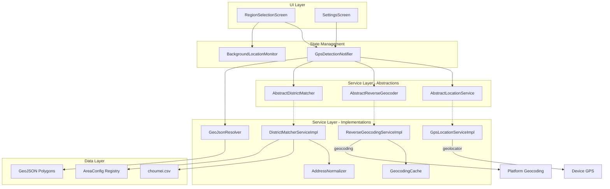
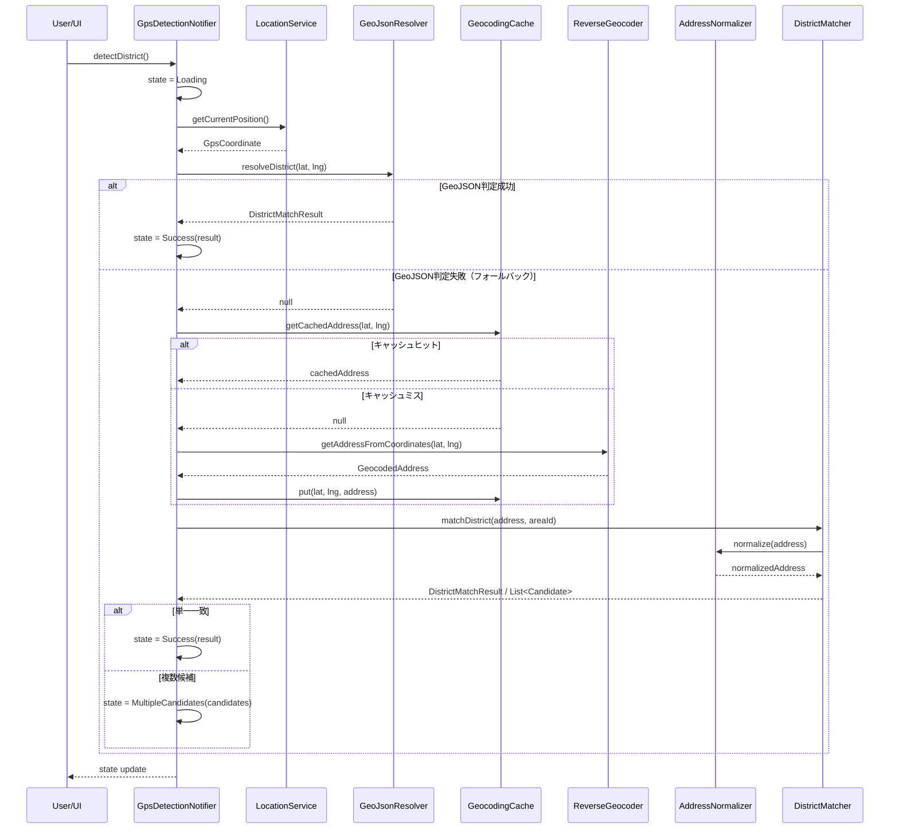

# Design Document: GPS Detection Improvements

## Overview

本設計は、既存GPS地区自動判定機能の包括的改善を行う。改善は以下の4カテゴリに分類される：

1. **UX向上**: 複数候補表示（ボトムシート）、設定アプリ誘導SnackBar、再試行SnackBar
2. **精度・信頼性強化**: ファジー住所マッチング（Address_Normalizer）、逆ジオコーディングキャッシュ、オフラインGeoJSONポリゴン判定
3. **コード品質改善**: サービスDI化（抽象インターフェース導入）、プロパティベーステスト実装
4. **将来拡張対応**: 複数エリア対応リファクタリング（Area_Config）、バックグラウンド位置変化検出

### 設計上の主要決定事項

- **オフライン判定優先**: GeoJSON_Resolverによるローカルポリゴン判定を逆ジオコーディングAPIより先に試行し、レイテンシ削減・オフライン対応を実現
- **既存アーキテクチャの尊重**: Riverpod StateNotifier パターン、既存のサービス分離を維持しつつDI化
- **段階的マッチング**: 原文照合→正規化照合→前方一致の段階的マッチングでマッチ精度を最大化
- **gladosパッケージ**: 既にdev_dependenciesに含まれるglados ^1.1.1をプロパティベーステストに使用

## Architecture

### 全体アーキテクチャ図



### GPS判定フロー（改善後）



## Components and Interfaces

### 1. AbstractLocationService（抽象インターフェース）

```dart
abstract class AbstractLocationService {
  Future<LocationPermissionStatus> checkPermission();
  Future<LocationPermissionStatus> requestPermission();
  Future<bool> isLocationServiceEnabled();
  Future<GpsCoordinate> getCurrentPosition();
}
```

実装: `GpsLocationServiceImpl extends AbstractLocationService`
- コンストラクタでGeolocatorラッパーを受け取り、テスト時にモック可能

### 2. AbstractReverseGeocoder（抽象インターフェース）

```dart
abstract class AbstractReverseGeocoder {
  Future<GeocodedAddress> getAddressFromCoordinates(
    double latitude,
    double longitude,
  );
}
```

実装: `ReverseGeocodingServiceImpl extends AbstractReverseGeocoder`

### 3. AbstractDistrictMatcher（抽象インターフェース）

```dart
abstract class AbstractDistrictMatcher {
  Future<void> loadChoumeiData();
  DistrictMatchResult matchDistrict(GeocodedAddress address, {String? areaId});
  List<DistrictCandidate> matchDistrictCandidates(GeocodedAddress address, {String? areaId});
}
```

実装: `DistrictMatcherServiceImpl extends AbstractDistrictMatcher`
- `matchDistrict`: 単一結果を返す（一致が1件の場合）
- `matchDistrictCandidates`: 前方一致で複数候補を返す（UI表示用）

### 4. AddressNormalizer

```dart
class AddressNormalizer {
  /// 住所文字列を正規化する。
  /// 処理順: 1)「大字」除去 → 2)「字」除去 → 3) スペース除去 → 4) 全角数字→半角変換
  String normalize(String input);

  /// null/空文字チェック付き正規化
  String normalizeSafe(String? input);
}
```

純粋関数として実装。副作用なし、テスト容易。

### 5. GeocodingCache

```dart
class GeocodingCache {
  static const int maxEntries = 100;
  static const double hitRadiusMeters = 50.0;

  /// キャッシュからヒットを検索（50m以内で最近傍）
  GeocodedAddress? get(double latitude, double longitude);

  /// キャッシュに追加（FIFO、上限100件）
  void put(double latitude, double longitude, GeocodedAddress address);

  /// キャッシュクリア
  void clear();

  /// 現在のエントリ数
  int get length;
}
```

メモリ内キャッシュ。Haversine公式で距離計算。

### 6. GeoJsonResolver

```dart
class GeoJsonResolver {
  /// ポリゴンデータの読み込み状態
  bool get isLoaded;

  /// アプリ起動時に非同期でポリゴンデータをロード
  Future<void> loadPolygons();

  /// 座標からどの地区ポリゴンに含まれるか判定
  /// 200ms以内に結果を返す。該当なしの場合はnullを返す。
  DistrictMatchResult? resolveDistrict(double latitude, double longitude);
}
```

Ray-casting アルゴリズムでPoint-in-Polygon判定を実装。

### 7. AreaConfig

```dart
class AreaConfig {
  final String areaId;           // 全国地方公共団体コード（例: "38201"）
  final String municipalityName; // 市区町村名（例: "松山市"）
  final List<String> oldCityNameFilters; // 旧市町名フィルタ値
  final int districtMin;         // 地区番号最小値
  final int districtMax;         // 地区番号最大値

  const AreaConfig({...});
}

/// エリア設定レジストリ
class AreaConfigRegistry {
  static const Map<String, AreaConfig> _configs = {
    '38201': AreaConfig(
      areaId: '38201',
      municipalityName: '松山市',
      oldCityNameFilters: ['旧松山市', '旧北条市', '旧中島町'],
      districtMin: 1,
      districtMax: 84,
    ),
  };

  static AreaConfig? getConfig(String areaId);
  static List<AreaConfig> getAll();
}
```

### 8. BackgroundLocationMonitor

```dart
class BackgroundLocationMonitor extends StateNotifier<BackgroundMonitorState> {
  static const double triggerDistanceKm = 2.0;
  static const Duration cooldownDuration = Duration(hours: 24);
  static const Duration minCheckInterval = Duration(minutes: 30);
  static const Duration maxCheckInterval = Duration(minutes: 60);

  /// 監視を開始（フォアグラウンド時のみ動作）
  void startMonitoring();

  /// 監視を停止
  void stopMonitoring();

  /// ユーザーが「更新する」を選択
  Future<void> acceptUpdate();

  /// ユーザーが「後で」を選択（または暗黙的にdismiss）
  void dismissPrompt();
}
```

### 9. GpsDetectionState（拡張）

```dart
sealed class GpsDetectionState {
  const GpsDetectionState();
}

class GpsDetectionIdle extends GpsDetectionState { ... }
class GpsDetectionLoading extends GpsDetectionState { ... }
class GpsDetectionSuccess extends GpsDetectionState {
  final DistrictMatchResult result;
}
class GpsDetectionMultipleCandidates extends GpsDetectionState {
  final List<DistrictCandidate> candidates;
  final String? overflowMessage; // 50件超の場合のメッセージ
}
class GpsDetectionError extends GpsDetectionState {
  final String message;
  final GpsDetectionErrorType errorType;
}
```

```dart
enum GpsDetectionErrorType {
  permissionDenied,    // 権限拒否 → 「設定を開く」ボタン表示
  serviceDisabled,     // サービス無効 → 「設定を開く」ボタン表示
  timeout,             // タイムアウト → 「再試行」ボタン表示
  inaccurate,          // 精度不足 → 「再試行」ボタン表示
  geocodingFailed,     // ジオコーディング失敗
  outOfArea,           // エリア外
  districtNotFound,    // 地区未特定
  unknown,             // 予期しないエラー
}
```

### 10. DistrictCandidate（新規モデル）

```dart
class DistrictCandidate {
  final int districtNumber;
  final String districtName;
  final String townName;

  const DistrictCandidate({...});
}
```

## Data Models

### 新規・変更データモデル一覧

| モデル | 種別 | 説明 |
|--------|------|------|
| `DistrictCandidate` | 新規 | 候補リスト表示用（地区番号、地区名、町名） |
| `GpsDetectionErrorType` | 新規 | エラー種別enum（UI分岐制御用） |
| `GpsDetectionMultipleCandidates` | 新規 | 複数候補状態 |
| `AreaConfig` | 新規 | エリア設定構造体 |
| `GeocodingCacheEntry` | 新規 | キャッシュエントリ（座標、住所、挿入時刻） |
| `BackgroundMonitorState` | 新規 | バックグラウンド監視状態 |

### GeocodingCacheEntry

```dart
class GeocodingCacheEntry {
  final double latitude;
  final double longitude;
  final GeocodedAddress address;
  final DateTime insertedAt;

  const GeocodingCacheEntry({...});

  /// Haversine公式による2点間距離（メートル）
  double distanceTo(double lat, double lng);
}
```

### BackgroundMonitorState

```dart
sealed class BackgroundMonitorState {}

class BackgroundMonitorIdle extends BackgroundMonitorState {}
class BackgroundMonitorActive extends BackgroundMonitorState {
  final GpsCoordinate? lastCheckedCoordinate;
  final DateTime? lastCheckTime;
}
class BackgroundMonitorPrompting extends BackgroundMonitorState {
  final double distanceKm;
}
class BackgroundMonitorCooldown extends BackgroundMonitorState {
  final DateTime cooldownUntil;
}
```

### GeoJSON ポリゴンデータ形式

アプリバンドル内 `assets/data/matsuyama_districts.geojson` に格納：

```json
{
  "type": "FeatureCollection",
  "features": [
    {
      "type": "Feature",
      "properties": {
        "district_number": 1,
        "district_name": "番町"
      },
      "geometry": {
        "type": "Polygon",
        "coordinates": [[[lng, lat], ...]]
      }
    }
  ]
}
```


## Correctness Properties

*A property is a characteristic or behavior that should hold true across all valid executions of a system—essentially, a formal statement about what the system should do. Properties serve as the bridge between human-readable specifications and machine-verifiable correctness guarantees.*

### Property 1: Address normalization correctness

*For any* input string, `AddressNormalizer.normalize()` SHALL apply transformations in order: (1) remove "大字" prefix before town name, (2) remove "字" prefix (applied to result of step 1), (3) remove all U+3000 and U+0020 spaces, (4) convert full-width digits (U+FF10–U+FF19) to half-width (U+0030–U+0039). The output must reflect all four transformations applied in sequence.

**Validates: Requirements 4.1, 4.2, 4.3, 4.4**

### Property 2: Normalization safety on reference data

*For any* town name present in choumei.csv, normalizing that town name SHALL produce a string that can still be matched against the normalized version of at least one entry in the choumei dataset (normalization does not destroy matchability).

**Validates: Requirements 4.6**

### Property 3: Raw match priority over normalized match

*For any* GeocodedAddress where both the raw address text and the normalized address text produce a match in choumei.csv, but to different districts, the District_Matcher SHALL return the district matched by the raw (un-normalized) text.

**Validates: Requirements 4.5, 4.8**

### Property 4: Multiple candidate completeness

*For any* choumei dataset and any GeocodedAddress whose town prefix-matches multiple entries, `matchDistrictCandidates()` SHALL return all matching entries (up to the cap limit).

**Validates: Requirements 1.1, 1.5**

### Property 5: Candidate list cap at 50

*For any* match operation producing more than 50 candidates, the returned list SHALL contain exactly 50 items and include an overflow message indicating more results exist.

**Validates: Requirements 1.6**

### Property 6: Candidate sort order

*For any* list of DistrictCandidate objects returned by `matchDistrictCandidates()`, the items SHALL be sorted in ascending Unicode order by the `townName` field.

**Validates: Requirements 1.2**

### Property 7: Cache spatial hit and miss

*For any* cached coordinate entry and any query coordinate, if the Haversine distance between them is ≤ 50 meters, `GeocodingCache.get()` SHALL return the cached address. If the distance exceeds 50 meters (and no other cached entry is within 50m), it SHALL return null.

**Validates: Requirements 5.2**

### Property 8: Cache size invariant

*For any* sequence of `put()` operations on a GeocodingCache, `cache.length` SHALL never exceed 100.

**Validates: Requirements 5.4**

### Property 9: Cache FIFO eviction

*For any* GeocodingCache at capacity (100 entries), when a new entry is added, the entry with the oldest insertion timestamp SHALL be the one evicted, and the new entry SHALL be present in the cache.

**Validates: Requirements 5.5**

### Property 10: GPS accuracy validation

*For any* accuracy value (double), `GpsCoordinate.isAccurate` SHALL return `true` if and only if `accuracy <= 500.0`.

**Validates: Requirements 8.1**

### Property 11: Town name matching correctness

*For any* town name that exists in choumei.csv, constructing a GeocodedAddress with city="松山市" and the corresponding town/subTown fields, then calling `matchDistrict()` SHALL return the correct district number and district name as defined in choumei.csv.

**Validates: Requirements 8.2**

### Property 12: Out-of-area detection

*For any* city name string that is not the registered municipality name for the current area (e.g., not "松山市"), calling `matchDistrict()` SHALL throw `OutOfAreaException`.

**Validates: Requirements 8.3**

### Property 13: Unmatched town exception

*For any* town name string that does not match (exactly or by prefix) any entry in choumei.csv for the current area, calling `matchDistrict()` with city="松山市" SHALL throw `DistrictNotFoundException`.

**Validates: Requirements 8.4**

### Property 14: District ID format

*For any* valid municipality ID (string) and district number (integer), the formatted `districtId` SHALL match the pattern `"{municipalityId}-{districtNumber}"`.

**Validates: Requirements 8.5**

### Property 15: Area filtering correctness

*For any* registered area ID and choumei dataset, `matchDistrict(address, areaId: id)` SHALL only consider entries whose `oldCityName` is in the area's configured `oldCityNameFilters` list.

**Validates: Requirements 9.1**

### Property 16: Unknown area ID error

*For any* string that is not a registered area ID in AreaConfigRegistry, calling `matchDistrict()` with that area ID SHALL return an area-not-registered error.

**Validates: Requirements 9.6**

### Property 17: Distance threshold detection

*For any* two GPS coordinates, the Background_Location_Monitor's distance check SHALL report "significant change" if and only if the Haversine distance between them is ≥ 2.0 km.

**Validates: Requirements 10.1**

### Property 18: Prompt trigger conditions

*For any* combination of (distance from reference coordinate, elapsed time since last prompt), the Background_Location_Monitor SHALL display a re-detection prompt if and only if distance ≥ 2.0 km AND elapsed time ≥ 24 hours (or no prior prompt exists).

**Validates: Requirements 10.2**

### Property 19: Check interval bounds

*For any* monitoring session, the interval between consecutive location checks by Background_Location_Monitor SHALL be ≥ 30 minutes and ≤ 60 minutes.

**Validates: Requirements 10.7**

## Error Handling

### エラー分類と対応アクション

| エラー種別 | 発生源 | UI対応 | SnackBar動作 |
|------------|--------|--------|--------------|
| `permissionDenied` | LocationService | 「設定を開く」ボタン | ユーザー操作まで維持 |
| `serviceDisabled` | LocationService | 「設定を開く」ボタン | ユーザー操作まで維持 |
| `timeout` | LocationService | 「再試行」ボタン | 10秒またはタップまで |
| `inaccurate` | LocationService | 「再試行」ボタン | 10秒またはタップまで |
| `geocodingFailed` | ReverseGeocoder | メッセージのみ | 3秒で自動非表示 |
| `outOfArea` | DistrictMatcher | メッセージのみ | 3秒で自動非表示 |
| `districtNotFound` | DistrictMatcher | メッセージのみ | 3秒で自動非表示 |
| `unknown` | any | メッセージのみ | 3秒で自動非表示 |

### エラーハンドリング方針

1. **GpsDetectionErrorType によるUI分岐**: エラー状態にerrorTypeを含めることで、UI層がエラー種別に応じたSnackBarアクション（「設定を開く」vs「再試行」vs メッセージのみ）を表示
2. **再試行の無限許可**: 再試行回数に上限なし。ユーザーが何度でも再試行可能
3. **設定アプリから戻った後**: 自動再判定しない。ユーザーが手動で「現在地から設定」を再タップ
4. **GeoJSON判定失敗時の静かなフォールバック**: GeoJSON_Resolverが失敗してもユーザーにエラーを表示せず、従来フローにフォールバック
5. **キャッシュ関連エラー**: キャッシュの読み書き失敗はログのみ。ユーザーには通知しない
6. **バックグラウンドモニターエラー**: 位置取得失敗時は静かに次のチェックまで待機。ユーザーへの通知なし

### openAppSettings 呼び出し

```dart
// geolocator パッケージの openAppSettings を使用
import 'package:geolocator/geolocator.dart';

Future<void> openSettings() async {
  await Geolocator.openAppSettings();
}
```

## Testing Strategy

### テスト構成

```
test/
├── unit/
│   ├── address_normalizer_test.dart        # AddressNormalizer単体テスト
│   ├── geocoding_cache_test.dart           # GeocodingCache単体テスト
│   ├── district_matcher_service_test.dart  # DistrictMatcher単体テスト
│   ├── geojson_resolver_test.dart          # GeoJsonResolver単体テスト
│   ├── area_config_test.dart              # AreaConfig単体テスト
│   ├── background_location_monitor_test.dart # BackgroundMonitor単体テスト
│   └── gps_detection_notifier_test.dart   # Notifier統合テスト（モック注入）
├── property/
│   ├── address_normalizer_property_test.dart  # Properties 1-3
│   ├── district_matcher_property_test.dart    # Properties 4-6, 11-16
│   ├── geocoding_cache_property_test.dart     # Properties 7-9
│   ├── gps_coordinate_property_test.dart      # Property 10
│   ├── district_id_property_test.dart         # Property 14
│   └── background_monitor_property_test.dart  # Properties 17-19
└── widget/
    ├── region_selection_snackbar_test.dart  # SnackBar表示テスト
    ├── settings_screen_snackbar_test.dart   # Settings画面SnackBarテスト
    └── candidate_bottom_sheet_test.dart    # 候補リストボトムシートテスト
```

### プロパティベーステスト（glados）

- **ライブラリ**: `glados: ^1.1.1`（既にdev_dependencies）
- **最低イテレーション**: 100回（gladosのデフォルト設定を使用、必要に応じてExplore設定で調整）
- **タグフォーマット**: 各テストに `// Feature: gps-detection-improvements, Property {N}: {description}` コメントを付与

```dart
// 例: Property 10 - GPS accuracy validation
// Feature: gps-detection-improvements, Property 10: GPS accuracy validation
Glados<double>(any.doubleInRange(0.0, 10000.0)).test(
  'isAccurate returns true iff accuracy <= 500.0',
  (accuracy) {
    final coord = GpsCoordinate(latitude: 0, longitude: 0, accuracy: accuracy);
    expect(coord.isAccurate, equals(accuracy <= 500.0));
  },
);
```

### ユニットテスト

- DI化により全サービスをモック可能
- `GpsDetectionNotifier`はモック注入した状態でフロー全体をテスト
- AddressNormalizerは純粋関数のためモック不要
- GeocodingCacheは内部状態のテスト（put/get/eviction）

### ウィジェットテスト

- SnackBar表示・アクションボタン動作の検証
- ボトムシート候補リストの表示・選択・閉じる操作の検証
- ローディング状態でのボタン無効化の検証

### テスト環境でのモック戦略

| サービス | モック手法 | 目的 |
|----------|-----------|------|
| AbstractLocationService | Riverpod overrideWithValue | 権限状態・座標のシミュレーション |
| AbstractReverseGeocoder | Riverpod overrideWithValue | 住所データのシミュレーション |
| AbstractDistrictMatcher | Riverpod overrideWithValue | マッチング結果のシミュレーション |
| GeoJsonResolver | コンストラクタ注入 | ポリゴン判定結果のシミュレーション |
| Timer/Clock | テスト用Clock注入 | バックグラウンドモニターの時間制御 |
