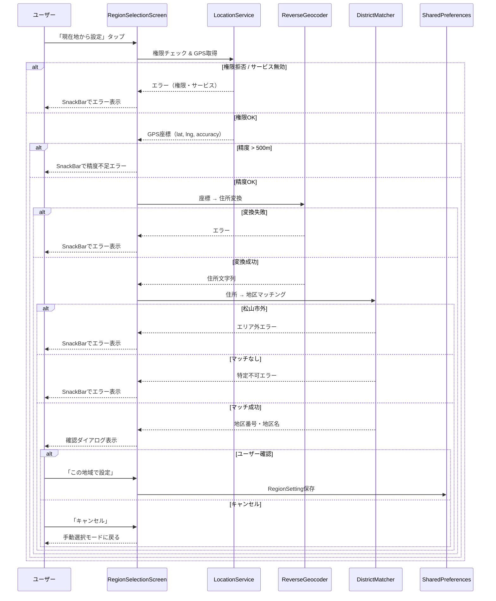
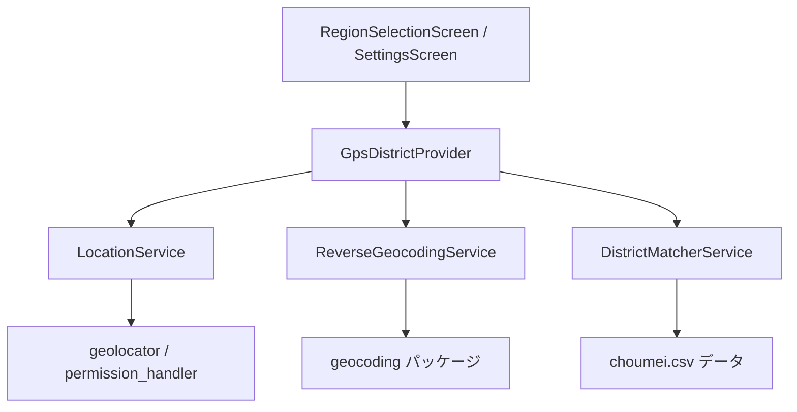

# Design Document: GPS District Detection

## Overview

GPS地区自動判定機能は、ユーザーの現在地情報から松山市内44地区のいずれに属するかを自動判定し、3段階手動選択を省略して地域設定を完了する機能である。

処理フロー:
1. ユーザーが「現在地から設定」ボタンをタップ
2. 位置情報権限を確認・取得
3. GPS座標（緯度・経度）を取得
4. 逆ジオコーディングで日本語住所に変換
5. 住所の町名部分をchoumei.csvデータとマッチング
6. 判定結果を確認ダイアログで表示
7. ユーザー確認後にRegionSettingを保存

この機能は既存の手動選択UIを置き換えるものではなく、補助的なショートカットとして追加する。GPS判定が失敗した場合は、従来の3段階手動選択にシームレスにフォールバックする。



## Architecture

### レイヤー構成

既存アプリのアーキテクチャ（Riverpod + Service層）に従い、以下のレイヤーで実装する。



| レイヤー | 責務 |
|---------|------|
| Screen | UIの表示、ボタン配置、ダイアログ表示、SnackBar表示 |
| Provider | GPS判定の状態管理（idle/loading/success/error）|
| Service | ビジネスロジック（位置取得、逆ジオコーディング、マッチング）|
| Data | choumei.csvのパース・キャッシュ |

### 技術選定

| 目的 | パッケージ | 理由 |
|------|-----------|------|
| GPS座標取得 | `geolocator` | Flutter公式推奨、iOS/Android対応、精度情報取得可能 |
| 位置情報権限 | `permission_handler`（既存） | 既にpubspec.yamlに含まれている |
| 逆ジオコーディング | `geocoding` | geolocatorと同じチームが開発、プラットフォームネイティブAPI使用 |
| CSVパース | `csv` | 軽量、標準的なCSVパーサー |

**設計判断**: 逆ジオコーディングはデバイスのネイティブAPIを使用する（`geocoding`パッケージ）。外部APIサーバーへの依存を避け、オフライン対応やAPI費用の問題を回避する。ただし、ネイティブAPIの精度には限界があるため、マッチング失敗時は手動選択にフォールバックする。

## Components and Interfaces

### 1. LocationService（新規）

GPS座標の取得と精度バリデーションを担当する。

```dart
/// GPS位置情報取得サービス
class GpsLocationService {
  /// 位置情報の権限状態を確認する
  Future<LocationPermissionStatus> checkPermission();

  /// 位置情報の権限を要求する
  Future<LocationPermissionStatus> requestPermission();

  /// 端末の位置情報サービスが有効かチェックする
  Future<bool> isLocationServiceEnabled();

  /// GPS座標を取得する（タイムアウト: 5秒）
  /// 精度が500m以内の場合のみ成功を返す
  Future<GpsCoordinate> getCurrentPosition();
}

enum LocationPermissionStatus {
  granted,        // 許可済み
  denied,         // 拒否
  deniedForever,  // 永久拒否（設定から変更必要）
  serviceDisabled // 位置情報サービス無効
}

class GpsCoordinate {
  final double latitude;
  final double longitude;
  final double accuracy; // 水平精度（メートル）

  bool get isAccurate => accuracy <= 500.0;
}
```

### 2. ReverseGeocodingService（新規）

GPS座標から住所文字列への変換を担当する。

```dart
/// 逆ジオコーディングサービス
class ReverseGeocodingService {
  /// GPS座標から住所情報を取得する
  /// 失敗時はGeocodingExceptionをスロー
  Future<GeocodedAddress> getAddressFromCoordinates(
    double latitude,
    double longitude,
  );
}

class GeocodedAddress {
  final String prefecture;    // 都道府県名（例: "愛媛県"）
  final String city;          // 市区町村名（例: "松山市"）
  final String town;          // 町名（例: "道後湯之町"）
  final String? subTown;      // 丁目等（例: "１丁目"）
  final String fullAddress;   // 完全住所文字列
}
```

### 3. DistrictMatcherService（新規）

住所情報とchoumei.csvデータのマッチングを担当する。

```dart
/// 地区マッチングサービス
class DistrictMatcherService {
  /// choumei.csvデータを読み込みキャッシュする
  Future<void> loadChoumeiData();

  /// 住所から地区を判定する
  /// 松山市外の場合: OutOfAreaException
  /// マッチなしの場合: DistrictNotFoundExceptionを
  DistrictMatchResult matchDistrict(GeocodedAddress address);
}

class DistrictMatchResult {
  final int districtNumber;   // 地区番号（1〜84）
  final String districtName;  // 地区名（例: "道後"）
  final String matchedTown;   // マッチした町名
}

class ChoumeiEntry {
  final int districtNumber;
  final String districtName;
  final String townCode;
  final String townName;
  final String oldCityName;
}
```

### 4. GpsDistrictProvider（新規）

GPS地区判定の状態管理を担当する。

```dart
/// GPS地区判定の状態
sealed class GpsDetectionState {}
class GpsDetectionIdle extends GpsDetectionState {}
class GpsDetectionLoading extends GpsDetectionState {}
class GpsDetectionSuccess extends GpsDetectionState {
  final DistrictMatchResult result;
}
class GpsDetectionError extends GpsDetectionState {
  final String message;
}

/// GPS地区判定プロバイダー
final gpsDetectionProvider =
    StateNotifierProvider<GpsDetectionNotifier, GpsDetectionState>(
  (ref) => GpsDetectionNotifier(
    ref.watch(gpsLocationServiceProvider),
    ref.watch(reverseGeocodingServiceProvider),
    ref.watch(districtMatcherServiceProvider),
  ),
);
```

### 5. UI変更（既存画面の拡張）

**RegionSelectionScreen**: 3段階選択UIの上部に「現在地から設定」ボタンを追加。

**SettingsScreen**: 地域設定セクションに「現在地から再設定」ボタンを追加。

## Data Models

### choumei.csv データ構造

| カラム | 型 | 説明 | 例 |
|--------|-----|------|-----|
| 地区番号 | int | 地区の一意識別子（1〜84） | 10 |
| 地区 | String | 地区名 | 道後 |
| 町 | String | 町コード | 159000 |
| 町名 | String | 町名（マッチングキー） | 道後湯之町 |
| 旧市町名 | String | 旧市町村名 | 旧松山市 |

### マッチングロジック

1. `GeocodedAddress.city` が「松山市」であることを確認
2. `GeocodedAddress.town` + `GeocodedAddress.subTown`（丁目付き）でchoumei.csvの町名カラムと完全一致を試行
3. 完全一致なしの場合、`GeocodedAddress.town`（丁目なし基本町名）で前方一致検索
4. それでもマッチしない場合は`DistrictNotFoundException`

**丁目の扱い**:
- CSVには「一番町３丁目」のように丁目付きエントリがある
- 逆ジオコーディング結果が「一番町3丁目」（半角）の場合もあるため、数字の全角/半角正規化を行う
- 丁目なしの町名（例: 「堀之内」「花園町」）はそのまま完全一致

### RegionSetting保存フォーマット

GPS判定から生成するRegionSettingは既存の手動選択と同一フォーマット:

```json
{
  "prefectureId": "38",
  "prefectureName": "愛媛県",
  "municipalityId": "38201",
  "municipalityName": "松山市",
  "districtId": "38201-10",
  "districtName": "道後"
}
```

`districtId`は `{municipalityId}-{districtNumber}` 形式で生成する。

## Correctness Properties

*A property is a characteristic or behavior that should hold true across all valid executions of a system—essentially, a formal statement about what the system should do. Properties serve as the bridge between human-readable specifications and machine-verifiable correctness guarantees.*

### Property 1: GPS精度バリデーション

*For any* GPS座標の精度値（0以上の実数）について、精度が500メートル以下の場合のみ座標を有効と判定し、500メートルを超える場合は無効と判定すること。

**Validates: Requirements 1.4**

### Property 2: 町名マッチングの正確性

*For any* choumei.csvに存在する町名（丁目付き・丁目なし両方を含む）について、その町名を含む住所文字列を入力した場合、DistrictMatcherは対応する正しい地区番号と地区名を返すこと。

**Validates: Requirements 4.1, 4.2, 4.5**

### Property 3: エリア外検出

*For any* 「松山市」以外の市区町村名を含む住所について、DistrictMatcherはエリア外エラーを返すこと。

**Validates: Requirements 4.3**

### Property 4: 未マッチ町名のエラーハンドリング

*For any* 松山市内の住所でchoumei.csvに存在しない町名について、DistrictMatcherは地区特定不可エラーを返すこと。

**Validates: Requirements 4.4**

### Property 5: RegionSetting保存フォーマットの一貫性

*For any* GPS判定で特定された地区について、生成されるRegionSettingは手動選択で同じ地区を選択した場合と同一のフィールド構造（prefectureId, prefectureName, municipalityId, municipalityName, districtId, districtName）を持ち、districtIdが `{municipalityId}-{districtNumber}` 形式であること。

**Validates: Requirements 5.2, 5.4**

## Error Handling

### エラー種別と対応

| エラー | 原因 | ユーザーメッセージ | 復帰方法 |
|--------|------|-------------------|----------|
| 権限拒否 | ユーザーが位置情報権限を拒否 | 「位置情報が許可されていません。設定アプリから権限を有効にしてください。」 | 手動選択 / 設定アプリへ誘導 |
| サービス無効 | 端末の位置情報サービスがOFF | 「位置情報サービスが無効です。端末の設定で有効にしてください。」 | 手動選択 / 設定アプリへ誘導 |
| タイムアウト | GPS取得に5秒以上かかった | 「位置情報の取得がタイムアウトしました。再試行するか、手動で地域を選択してください。」 | 再試行 / 手動選択 |
| 精度不足 | 水平精度 > 500m | 「位置情報の精度が不十分です。屋外で再試行するか、手動で地域を選択してください。」 | 再試行 / 手動選択 |
| 逆ジオコーディング失敗 | ネットワークエラー / API不具合 | 「住所の取得に失敗しました。手動で地域を選択してください。」 | 手動選択 |
| エリア外 | 松山市外にいる | 「現在地は対応エリア外です。手動で地域を選択してください。」 | 手動選択 |
| 地区特定不可 | 町名がCSVに存在しない | 「現在地の地区を特定できませんでした。手動で地域を選択してください。」 | 手動選択 |

### エラー表示ポリシー

- すべてのエラーはSnackBarで表示する（モーダルではブロックしない）
- エラー後も手動選択UIは利用可能な状態を維持する
- エラー後も「現在地から設定」ボタンは再タップ可能にする
- SnackBarの表示時間は3秒（ユーザーが読める程度）

### 例外クラス設計

```dart
/// GPS地区判定の例外基底クラス
sealed class GpsDetectionException implements Exception {
  String get userMessage;
}

class LocationPermissionDeniedException extends GpsDetectionException {
  @override
  String get userMessage => '位置情報が許可されていません。設定アプリから権限を有効にしてください。';
}

class LocationServiceDisabledException extends GpsDetectionException {
  @override
  String get userMessage => '位置情報サービスが無効です。端末の設定で有効にしてください。';
}

class LocationTimeoutException extends GpsDetectionException {
  @override
  String get userMessage => '位置情報の取得がタイムアウトしました。再試行するか、手動で地域を選択してください。';
}

class LocationInaccurateException extends GpsDetectionException {
  @override
  String get userMessage => '位置情報の精度が不十分です。屋外で再試行するか、手動で地域を選択してください。';
}

class GeocodingFailedException extends GpsDetectionException {
  @override
  String get userMessage => '住所の取得に失敗しました。手動で地域を選択してください。';
}

class OutOfAreaException extends GpsDetectionException {
  @override
  String get userMessage => '現在地は対応エリア外です。手動で地域を選択してください。';
}

class DistrictNotFoundException extends GpsDetectionException {
  @override
  String get userMessage => '現在地の地区を特定できませんでした。手動で地域を選択してください。';
}
```

## Testing Strategy

### テストアプローチ

Property-based testing (PBT) と example-based testing の二本立てで網羅的にテストする。

**PBTライブラリ**: `glados`（既にdev_dependenciesに含まれている）

### Property-Based Tests

各プロパティテストは最低100回のイテレーションで実行する。

| Property | テスト対象 | 生成するデータ |
|----------|-----------|---------------|
| Property 1 | `GpsCoordinate.isAccurate` | ランダムな精度値（0.0〜10000.0の実数） |
| Property 2 | `DistrictMatcherService.matchDistrict` | choumei.csvから取得した実在町名 |
| Property 3 | `DistrictMatcherService.matchDistrict` | 「松山市」以外のランダムな市区町村名 |
| Property 4 | `DistrictMatcherService.matchDistrict` | choumei.csvに存在しないランダムな町名文字列 |
| Property 5 | RegionSetting生成ロジック | ランダムな`DistrictMatchResult`値 |

タグフォーマット:
```
// Feature: gps-district-detection, Property 1: GPS精度バリデーション
// Feature: gps-district-detection, Property 2: 町名マッチングの正確性
// Feature: gps-district-detection, Property 3: エリア外検出
// Feature: gps-district-detection, Property 4: 未マッチ町名のエラーハンドリング
// Feature: gps-district-detection, Property 5: RegionSetting保存フォーマットの一貫性
```

### Unit Tests（Example-Based）

| テスト対象 | シナリオ |
|-----------|---------|
| GpsLocationService | 権限拒否時のエラーメッセージ確認 |
| GpsLocationService | サービス無効時のエラーメッセージ確認 |
| GpsLocationService | タイムアウト発生時のエラー確認 |
| ReverseGeocodingService | API成功レスポンスのパース確認 |
| ReverseGeocodingService | API失敗時のエラーメッセージ確認 |
| DistrictMatcherService | 「道後湯之町」→ 地区10（道後）のマッチ確認 |
| DistrictMatcherService | 「一番町３丁目」→ 地区1（番町）のマッチ確認 |
| DistrictMatcherService | 全角/半角丁目の正規化確認 |

### Widget Tests

| テスト対象 | シナリオ |
|-----------|---------|
| RegionSelectionScreen | 「現在地から設定」ボタンの表示位置確認 |
| RegionSelectionScreen | ローディング状態でのボタン無効化確認 |
| RegionSelectionScreen | 確認ダイアログの表示内容確認 |
| RegionSelectionScreen | エラー時のSnackBar表示確認 |
| RegionSelectionScreen | エラー後の手動選択UI利用可能確認 |
| SettingsScreen | 「現在地から再設定」ボタンの表示確認 |

### Integration Tests

| テスト対象 | シナリオ |
|-----------|---------|
| GPS → 逆ジオコーディング → マッチング → 保存 | 正常系E2Eフロー |
| GPS失敗 → 手動選択フォールバック | 異常系フォールバックフロー |
