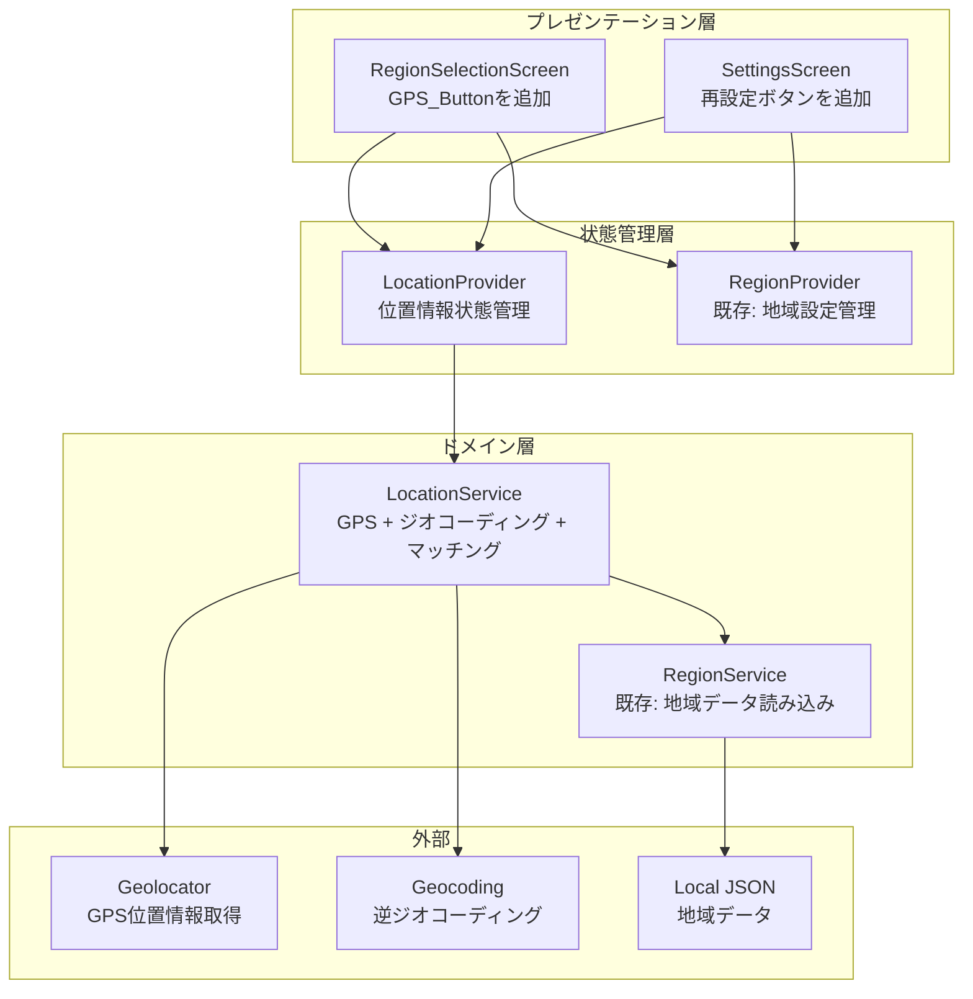
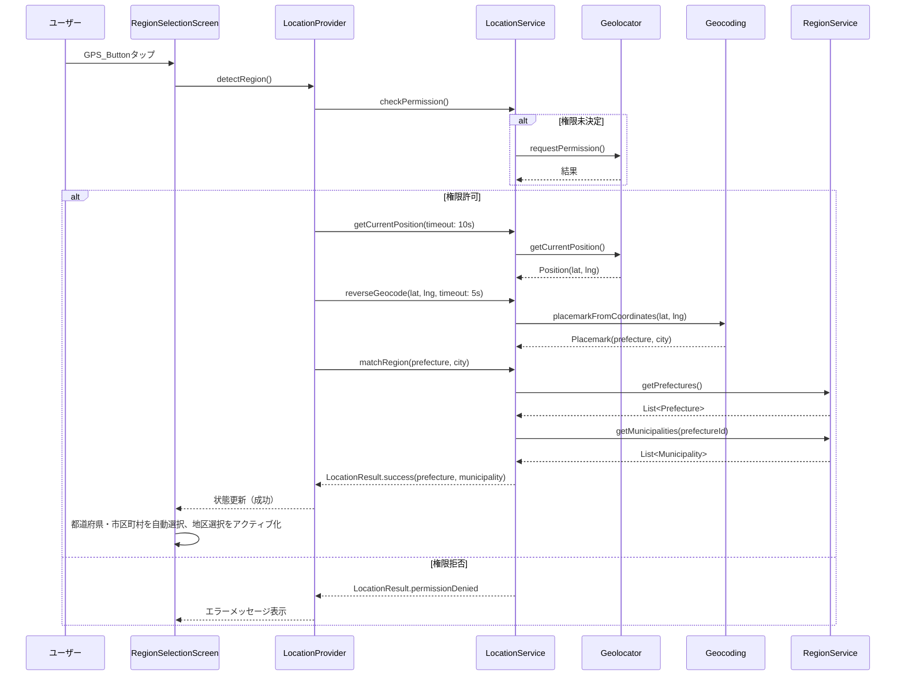

# 技術設計書: GPS位置情報による地域自動設定機能

## Overview

本設計書は、愛媛県ゴミ出しアプリケーションに追加する「GPS位置情報による地域自動設定機能」の技術設計を定義する。

デバイスのGPS位置情報を取得し、逆ジオコーディングにより都道府県・市区町村を自動検出する。検出結果をアプリ内のローカルJSONデータと前方一致で照合し、一致した場合に都道府県・市区町村を自動選択状態にする。地区は住所境界の複雑性から自動判定不可のため、ユーザーが手動選択する。

### 設計方針

- **既存アーキテクチャへの追加**: 既存のレイヤードアーキテクチャ（Service → Provider → Screen）に従い新規コンポーネントを追加する
- **パッケージ追加**: `geolocator`（GPS取得）と `geocoding`（逆ジオコーディング）を依存に追加する
- **フォールバック重視**: GPS/ジオコーディング失敗時は既存の手動選択モードを阻害しない
- **タイムアウト設定**: GPS取得10秒、逆ジオコーディング5秒で中断しUX劣化を防止する
- **テスト容易性**: サービス層を抽象化しDI可能にすることで、ユニットテストとプロパティテストを実現する

## Architecture

### コンポーネント構成



### 処理フロー



### ファイル追加・変更一覧

| 操作 | ファイルパス | 説明 |
|------|-------------|------|
| 新規 | `lib/services/location_service.dart` | GPS取得 + 逆ジオコーディング + マッチングロジック |
| 新規 | `lib/providers/location_provider.dart` | 位置情報状態管理（Riverpod） |
| 変更 | `lib/screens/region_selection_screen.dart` | GPS_Buttonの追加 |
| 変更 | `lib/screens/settings_screen.dart` | 「現在地から再設定」ボタンの追加 |
| 変更 | `pubspec.yaml` | geolocator, geocoding パッケージ追加 |
| 変更 | `android/app/src/main/AndroidManifest.xml` | 位置情報権限の追加 |
| 変更 | `ios/Runner/Info.plist` | 位置情報使用理由の追加 |

## Components and Interfaces

### LocationService

GPS位置情報の取得、逆ジオコーディング、地域マッチングを担当するサービスクラス。

```dart
/// 位置情報サービス
///
/// GPS位置情報取得、逆ジオコーディング、地域マッチングの3つの責務を持つ。
/// テスト容易性のため、各機能を個別のメソッドに分離している。
class LocationService {
  final RegionService _regionService;

  LocationService(this._regionService);

  /// 位置情報権限の状態を確認する
  Future<LocationPermissionStatus> checkPermission();

  /// 位置情報権限をリクエストする
  Future<LocationPermissionStatus> requestPermission();

  /// 位置情報サービスが有効かどうかを確認する
  Future<bool> isLocationServiceEnabled();

  /// 現在位置を取得する（タイムアウト: 10秒）
  /// 
  /// タイムアウト時は LocationException(type: timeout) をスローする。
  Future<GeoPosition> getCurrentPosition();

  /// 緯度・経度から住所情報を取得する（タイムアウト: 5秒）
  ///
  /// タイムアウト時は LocationException(type: geocodingTimeout) をスローする。
  /// 日本国外の住所の場合は LocationException(type: outsideJapan) をスローする。
  Future<GeoAddress> reverseGeocode(double latitude, double longitude);

  /// 逆ジオコーディング結果とアプリ内データをマッチングする
  ///
  /// 前方一致比較で都道府県と市区町村を検索する。
  /// マッチ失敗時は LocationException(type: noMatch) をスローする。
  Future<RegionMatchResult> matchRegion(GeoAddress address);

  /// GPS取得からマッチングまでの一連の処理を実行する
  ///
  /// 権限確認 → GPS取得 → 逆ジオコーディング → マッチング の順に実行する。
  Future<RegionMatchResult> detectRegion();
}
```

### LocationProvider

位置情報取得の状態を管理するRiverpod StateNotifier。

```dart
/// 位置情報検出の状態
enum LocationDetectionPhase {
  idle,              // 待機中
  checkingPermission, // 権限確認中
  acquiringLocation, // GPS取得中
  geocoding,         // 逆ジオコーディング中
  matching,          // マッチング中
  success,           // 成功
  error,             // エラー
}

/// 位置情報検出の状態クラス
class LocationDetectionState {
  final LocationDetectionPhase phase;
  final RegionMatchResult? result;
  final LocationError? error;
  final String? message;

  const LocationDetectionState({
    required this.phase,
    this.result,
    this.error,
    this.message,
  });

  factory LocationDetectionState.idle();
  factory LocationDetectionState.loading(LocationDetectionPhase phase, String message);
  factory LocationDetectionState.success(RegionMatchResult result);
  factory LocationDetectionState.error(LocationError error);

  bool get isLoading => phase != LocationDetectionPhase.idle && 
                         phase != LocationDetectionPhase.success && 
                         phase != LocationDetectionPhase.error;
}

/// 位置情報検出のStateNotifier
class LocationDetectionNotifier extends StateNotifier<LocationDetectionState> {
  final LocationService _locationService;

  LocationDetectionNotifier(this._locationService) 
    : super(LocationDetectionState.idle());

  /// 地域検出処理を開始する
  Future<void> detectRegion();

  /// 状態をリセットする
  void reset();
}

/// Riverpod Provider定義
final locationServiceProvider = Provider<LocationService>((ref) {
  final regionService = ref.watch(regionServiceProvider);
  return LocationService(regionService);
});

final locationDetectionProvider = 
    StateNotifierProvider<LocationDetectionNotifier, LocationDetectionState>((ref) {
  final locationService = ref.watch(locationServiceProvider);
  return LocationDetectionNotifier(locationService);
});
```

### エラーモデル

```dart
/// 位置情報エラーの種別
enum LocationErrorType {
  serviceDisabled,    // 位置情報サービスが無効
  permissionDenied,   // 権限拒否
  permissionDeniedForever, // 権限永続的拒否
  gpsTimeout,         // GPS取得タイムアウト（10秒超過）
  gpsUnavailable,     // GPS信号取得不可
  geocodingTimeout,   // 逆ジオコーディングタイムアウト（5秒超過）
  geocodingFailed,    // 逆ジオコーディング失敗
  outsideJapan,       // 日本国外
  addressIncomplete,  // 住所情報不完全（都道府県名or市区町村名なし）
  prefectureNotFound, // 都道府県マッチ失敗
  municipalityNotFound, // 市区町村マッチ失敗
}

/// 位置情報エラー
class LocationError {
  final LocationErrorType type;
  final String userMessage;  // ユーザーに表示するメッセージ
  final bool canRetry;       // 再試行可能かどうか
  final bool showSettings;   // 設定画面への遷移ボタンを表示するか

  const LocationError({
    required this.type,
    required this.userMessage,
    required this.canRetry,
    this.showSettings = false,
  });
}
```

### マッチング結果モデル

```dart
/// GPS座標
class GeoPosition {
  final double latitude;
  final double longitude;

  const GeoPosition({required this.latitude, required this.longitude});
}

/// 逆ジオコーディング結果
class GeoAddress {
  final String? country;
  final String? administrativeArea;  // 都道府県
  final String? locality;            // 市区町村

  const GeoAddress({
    this.country,
    this.administrativeArea,
    this.locality,
  });
}

/// 地域マッチング結果
class RegionMatchResult {
  final Prefecture prefecture;
  final Municipality municipality;

  const RegionMatchResult({
    required this.prefecture,
    required this.municipality,
  });
}
```

## Data Models

### 既存モデルとの関係

本機能は既存の `Prefecture`、`Municipality`、`RegionSetting` モデルをそのまま活用する。新規追加するのは位置情報関連のモデルのみである。

### マッチングロジックの詳細

逆ジオコーディング結果とアプリ内JSONデータの照合は以下のアルゴリズムで行う:

1. **都道府県マッチング**: `GeoAddress.administrativeArea` と `prefectures.json` の `name` フィールドを完全一致で比較
2. **市区町村マッチング**: `GeoAddress.locality` と `municipalities.json` の `name` フィールドを前方一致で比較

前方一致を採用する理由:
- 逆ジオコーディングAPIが返す市区町村名とアプリ内データの市区町村名に表記揺れがある可能性がある
- 例: APIが「松山市道後」を返す場合、「松山市」との前方一致で正しくマッチできる

```dart
/// マッチングアルゴリズム（擬似コード）
Future<RegionMatchResult> matchRegion(GeoAddress address) async {
  // 1. 都道府県マッチング（完全一致）
  final prefectures = await _regionService.getPrefectures();
  final matchedPrefecture = prefectures.firstWhereOrNull(
    (p) => p.name == address.administrativeArea,
  );
  if (matchedPrefecture == null) throw LocationException(type: prefectureNotFound);

  // 2. 市区町村マッチング（前方一致）
  final municipalities = await _regionService.getMunicipalities(matchedPrefecture.id);
  final matchedMunicipality = municipalities.firstWhereOrNull(
    (m) => address.locality?.startsWith(m.name) == true || m.name.startsWith(address.locality ?? ''),
  );
  if (matchedMunicipality == null) throw LocationException(type: municipalityNotFound);

  return RegionMatchResult(
    prefecture: matchedPrefecture,
    municipality: matchedMunicipality,
  );
}
```

### プラットフォーム権限設定

**Android (`android/app/src/main/AndroidManifest.xml`)**:
```xml
<uses-permission android:name="android.permission.ACCESS_FINE_LOCATION" />
<uses-permission android:name="android.permission.ACCESS_COARSE_LOCATION" />
```

**iOS (`ios/Runner/Info.plist`)**:
```xml
<key>NSLocationWhenInUseUsageDescription</key>
<string>現在地からお住まいの地域を自動設定するために位置情報を使用します。</string>
```

### pubspec.yaml 追加依存

```yaml
dependencies:
  geolocator: ^6.2.1
  geocoding: ^3.0.0
```

## Correctness Properties

*プロパティとは、システムのすべての有効な実行を通じて成り立つべき特性や振る舞いのことである。プロパティは、人間が読める仕様と機械検証可能な正確性保証の橋渡しとなる形式的な記述である。*

### Property 1: 日本国外住所の拒否

*任意の* GeoAddressにおいて、countryが「日本」（または "Japan", "JP"）以外である場合、reverseGeocode処理は `outsideJapan` エラーを返す。逆に、countryが日本を示す場合は住所検証処理を続行する。

**Validates: Requirements 3.3**

### Property 2: 地域マッチングの正確性

*任意の* アプリ内地域データ（都道府県リスト・市区町村リスト）と逆ジオコーディング結果（administrativeArea、locality）に対して:
- administrativeAreaがアプリ内の都道府県名と完全一致し、かつlocalityがアプリ内の市区町村名と前方一致する場合、matchRegionは対応するPrefectureとMunicipalityを返す
- administrativeAreaがアプリ内のどの都道府県名とも一致しない場合、matchRegionは `prefectureNotFound` エラーを返す
- localityがアプリ内のどの市区町村名とも前方一致しない場合、matchRegionは `municipalityNotFound` エラーを返す

**Validates: Requirements 4.2, 4.3, 4.4**

### Property 3: エラー時のフォールバック保証

*任意の* LocationErrorType（serviceDisabled, permissionDenied, permissionDeniedForever, gpsTimeout, gpsUnavailable, geocodingTimeout, geocodingFailed, outsideJapan, addressIncomplete, prefectureNotFound, municipalityNotFound）が発生した場合、手動選択モードの状態は変更されず、既存の手動地域選択機能（都道府県・市区町村・地区の選択）は正常に動作し続ける。

**Validates: Requirements 7.1, 7.2, 7.3, 7.4**

## Error Handling

### エラー分類と対応表

| エラー種別 | 原因 | ユーザーメッセージ | 再試行 | 設定遷移 |
|-----------|------|-------------------|--------|---------|
| serviceDisabled | 端末の位置情報サービスOFF | 「端末の位置情報サービスが無効です。設定画面から位置情報サービスを有効にしてください」 | ❌ | ✅ |
| permissionDenied | 権限拒否 | 「位置情報の権限が必要です。端末の設定画面から位置情報を許可してください」 | ❌ | ✅ |
| permissionDeniedForever | 権限永続的拒否 | 「位置情報の権限が無効です。端末の設定画面から位置情報を許可してください」 | ❌ | ✅ |
| gpsTimeout | GPS取得10秒超過 | 「位置情報の取得に失敗しました。電波状況の良い場所で再度お試しください」 | ✅ | ❌ |
| gpsUnavailable | GPS信号取得不可 | 「位置情報を取得できませんでした。手動で地域を選択してください」 | ❌ | ❌ |
| geocodingTimeout | 逆ジオコーディング5秒超過 | 「住所の特定に失敗しました。再度お試しいただくか、手動で選択してください」 | ✅ | ❌ |
| geocodingFailed | 逆ジオコーディング失敗 | 「住所情報を特定できませんでした。手動で地域を選択してください」 | ❌ | ❌ |
| outsideJapan | 日本国外 | 「愛媛県内の位置情報を検出できませんでした。手動で地域を選択してください」 | ❌ | ❌ |
| addressIncomplete | 住所情報不完全 | 「住所情報を特定できませんでした。手動で地域を選択してください」 | ❌ | ❌ |
| prefectureNotFound | 都道府県マッチ失敗 | 「検出された地域（{都道府県名}）はアプリの対応地域外です。手動で地域を選択してください」 | ❌ | ❌ |
| municipalityNotFound | 市区町村マッチ失敗 | 「検出された市区町村（{市区町村名}）はアプリの対応地域外です。手動で地域を選択してください」 | ❌ | ❌ |

### エラーハンドリング方針

1. **try-catchパターン**: LocationServiceの各メソッドはLocationExceptionをスローし、LocationDetectionNotifierがキャッチしてLocationErrorに変換する
2. **フォールバック保証**: すべてのエラーパスにおいて手動選択モードを阻害しない。LocationDetectionStateがerrorになっても、既存の地域選択UI（RegionSelectionScreenの3段階ステッパー）は独立して動作する
3. **再試行メカニズム**: canRetry=trueのエラーのみ再試行ボタンを表示。再試行時はdetectRegion()を最初から実行する

### LocationErrorのファクトリメソッド

```dart
class LocationError {
  // ...

  /// エラー種別からLocationErrorインスタンスを生成する
  factory LocationError.fromType(LocationErrorType type, {String? detail}) {
    switch (type) {
      case LocationErrorType.serviceDisabled:
        return LocationError(
          type: type,
          userMessage: '端末の位置情報サービスが無効です。設定画面から位置情報サービスを有効にしてください',
          canRetry: false,
          showSettings: true,
        );
      case LocationErrorType.permissionDenied:
        return LocationError(
          type: type,
          userMessage: '位置情報の権限が必要です。端末の設定画面から位置情報を許可してください',
          canRetry: false,
          showSettings: true,
        );
      case LocationErrorType.permissionDeniedForever:
        return LocationError(
          type: type,
          userMessage: '位置情報の権限が無効です。端末の設定画面から位置情報を許可してください',
          canRetry: false,
          showSettings: true,
        );
      case LocationErrorType.gpsTimeout:
        return LocationError(
          type: type,
          userMessage: '位置情報の取得に失敗しました。電波状況の良い場所で再度お試しください',
          canRetry: true,
        );
      case LocationErrorType.gpsUnavailable:
        return LocationError(
          type: type,
          userMessage: '位置情報を取得できませんでした。手動で地域を選択してください',
          canRetry: false,
        );
      case LocationErrorType.geocodingTimeout:
        return LocationError(
          type: type,
          userMessage: '住所の特定に失敗しました。再度お試しいただくか、手動で選択してください',
          canRetry: true,
        );
      case LocationErrorType.geocodingFailed:
      case LocationErrorType.addressIncomplete:
        return LocationError(
          type: type,
          userMessage: '住所情報を特定できませんでした。手動で地域を選択してください',
          canRetry: false,
        );
      case LocationErrorType.outsideJapan:
        return LocationError(
          type: type,
          userMessage: '愛媛県内の位置情報を検出できませんでした。手動で地域を選択してください',
          canRetry: false,
        );
      case LocationErrorType.prefectureNotFound:
        return LocationError(
          type: type,
          userMessage: '検出された地域（${detail ?? "不明"}）はアプリの対応地域外です。手動で地域を選択してください',
          canRetry: false,
        );
      case LocationErrorType.municipalityNotFound:
        return LocationError(
          type: type,
          userMessage: '検出された市区町村（${detail ?? "不明"}）はアプリの対応地域外です。手動で地域を選択してください',
          canRetry: false,
        );
    }
  }
}
```

## Testing Strategy

### テストアプローチ

本機能は「ユニットテスト」と「プロパティベーステスト」の二重アプローチで品質を保証する。

### プロパティベーステスト

既存プロジェクトで使用している **glados** パッケージ（pubspec.yamlの dev_dependencies に既に追加済み）をプロパティベーステストに使用する。

**設定**:
- 最小100イテレーション（gladosデフォルト設定を活用）
- 各テストにプロパティ番号をコメントで付与する

**テスト対象**:
- Property 1: `reverseGeocode()` の日本国外判定ロジック
- Property 2: `matchRegion()` の前方一致マッチングアルゴリズム
- Property 3: `LocationDetectionNotifier` のフォールバック動作

**タグフォーマット**:
```dart
// Feature: gps-region-detection, Property 1: 日本国外住所の拒否
// Feature: gps-region-detection, Property 2: 地域マッチングの正確性
// Feature: gps-region-detection, Property 3: エラー時のフォールバック保証
```

### ユニットテスト

以下のカテゴリでユニットテストを作成する:

| カテゴリ | 対象 | テスト内容 |
|---------|------|-----------|
| 権限管理 | LocationService | 各権限状態での分岐（要件1.1-1.6） |
| GPS取得 | LocationService | 正常取得、タイムアウト、信号不可（要件2.1-2.5） |
| ジオコーディング | LocationService | 正常変換、タイムアウト、住所不完全（要件3.1-3.5） |
| マッチング | LocationService | 成功、都道府県不一致、市区町村不一致（要件4.1-4.5） |
| 状態管理 | LocationDetectionNotifier | フェーズ遷移、エラー状態（要件5.2-5.5） |
| UI統合 | ウィジェットテスト | GPS_Button表示、ローディング、成功/エラー表示（要件5.1, 6.1） |

### テストファイル構成

```
test/
├── unit/
│   ├── services/
│   │   └── location_service_test.dart
│   └── providers/
│       └── location_provider_test.dart
└── widget/
    ├── gps_button_test.dart
    └── region_selection_gps_test.dart
```

### モック戦略

- **Geolocator**: `geolocator` パッケージのプラットフォーム依存部分をインターフェース経由でモック化
- **Geocoding**: `geocoding` パッケージの逆ジオコーディング処理をインターフェース経由でモック化
- **RegionService**: 既存クラスをそのまま使用（ローカルJSONのためモック不要、ただしテスト時はテスト用JSONを注入）

