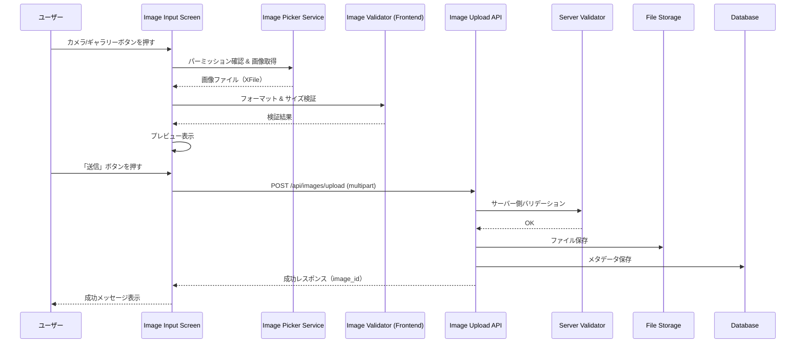
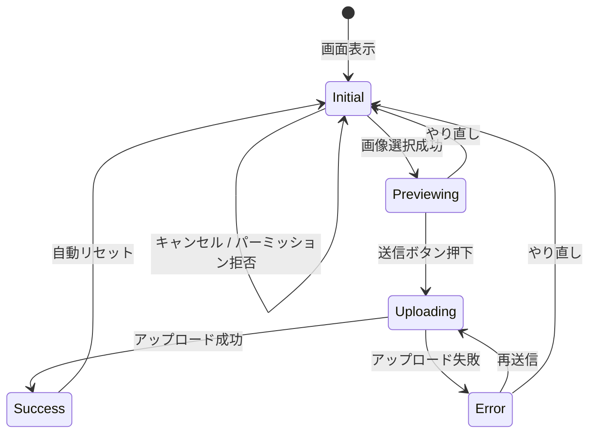

# Design Document: Image Input

## Overview

画像入力機能は、ゴミ分類アプリの前段階として、ユーザーがカメラ撮影またはギャラリーから画像を取得し、プレビュー確認後にバックエンドへアップロードする機能を提供する。

**フロントエンド（Flutter）**：`image_picker` パッケージを使用してカメラ/ギャラリーから画像を取得し、Riverpod による状態管理で画像プレビュー・バリデーション・アップロードフローを管理する。

**バックエンド（FastAPI）**：マルチパートファイルアップロードエンドポイントを提供し、画像のバリデーション、ファイルストレージへの保存、メタデータのDB記録を行う。

### 主要な設計判断

| 判断 | 選択 | 理由 |
|------|------|------|
| 画像取得ライブラリ | `image_picker` | Flutter公式推奨、iOS/Android両対応、シンプルなAPI |
| パーミッション管理 | `permission_handler` | 細かいパーミッション状態チェックと設定画面遷移が可能 |
| 状態管理 | Riverpod (StateNotifier) | 既存プロジェクトのパターンと一貫性 |
| バックエンド画像保存 | ローカルファイルシステム | 初期段階ではシンプルに。将来的にS3等へ移行可能な設計 |
| ファイルバリデーション | フロント＋バックエンド両方 | フロントで即時フィードバック、バックエンドで安全性担保 |

## Architecture

```mermaid
flowchart TB
    subgraph Flutter Frontend
        A[Image Input Screen] --> B[Image Picker Service]
        A --> C[Image Preview Widget]
        A --> D[Image Upload Service]
        B --> E[permission_handler]
        B --> F[image_picker]
        D --> G[HTTP Multipart Upload]
    end

    subgraph FastAPI Backend
        H[Image Upload Router] --> I[Image Validator]
        H --> J[File Storage Service]
        H --> K[Image Metadata Repository]
        K --> L[(SQLite DB)]
        J --> M[/uploads/ directory]
    end

    G -->|POST /api/images/upload| H
```

### データフロー



## Components and Interfaces

### フロントエンド

#### 1. ImageInputScreen（画面）

画像入力のメイン画面。状態に応じてUI表示を切り替える。

```dart
// lib/screens/image_input_screen.dart
class ImageInputScreen extends ConsumerWidget {
  // 状態に応じて以下の表示を切り替え:
  // - 初期状態: カメラ/ギャラリーボタン表示
  // - プレビュー状態: 画像プレビュー + 送信/やり直しボタン
  // - アップロード中: ローディングインジケーター
  // - エラー状態: エラーメッセージ + リトライ
}
```

#### 2. ImageInputProvider（状態管理）

```dart
// lib/providers/image_input_provider.dart

/// 画像入力画面の状態
enum ImageInputStatus {
  initial,    // 入力方法選択待ち
  previewing, // プレビュー表示中
  uploading,  // アップロード中
  success,    // アップロード成功
  error,      // エラー
}

class ImageInputState {
  final ImageInputStatus status;
  final XFile? selectedImage;
  final String? errorMessage;
  final String? uploadedImageId;
  final bool hasCameraPermission;
  final bool hasGalleryPermission;
  final bool isCameraAvailable;
}

class ImageInputNotifier extends StateNotifier<ImageInputState> {
  Future<void> pickFromCamera();
  Future<void> pickFromGallery();
  Future<void> uploadImage();
  void reset();
}
```

#### 3. ImagePickerService（画像取得）

```dart
// lib/services/image_picker_service.dart
class ImagePickerService {
  Future<XFile?> pickFromCamera();
  Future<XFile?> pickFromGallery();
  Future<bool> isCameraAvailable();
}
```

#### 4. ImageValidationService（フロントエンドバリデーション）

```dart
// lib/services/image_validation_service.dart
class ImageValidationResult {
  final bool isValid;
  final String? errorMessage;
}

class ImageValidationService {
  static const int maxFileSizeBytes = 10 * 1024 * 1024; // 10MB
  static const List<String> supportedExtensions = ['jpg', 'jpeg', 'png'];

  ImageValidationResult validate(XFile file);
}
```

#### 5. ImageUploadService（アップロード）

```dart
// lib/services/image_upload_service.dart
class ImageUploadResponse {
  final String imageId;
  final String filename;
}

class ImageUploadService {
  Future<ImageUploadResponse> upload(XFile imageFile, String authToken);
}
```

### バックエンド

#### 1. ImageUploadRouter（APIエンドポイント）

```python
# app/routers/image_router.py
router = APIRouter(prefix="/api/images", tags=["images"])

@router.post("/upload", status_code=201)
async def upload_image(
    file: UploadFile = File(...),
    current_user: User = Depends(get_current_user),
    db: AsyncSession = Depends(get_db),
) -> ImageUploadResponse:
    """画像ファイルをアップロードする"""
```

#### 2. ImageValidator（サーバーバリデーション）

```python
# app/services/image_validator.py
SUPPORTED_CONTENT_TYPES = {"image/jpeg", "image/png"}
MAX_FILE_SIZE = 10 * 1024 * 1024  # 10MB

def validate_image(file: UploadFile) -> None:
    """画像ファイルのバリデーション。不正な場合はHTTPExceptionをraise"""
```

#### 3. FileStorageService（ファイル保存）

```python
# app/services/file_storage.py
class FileStorageService:
    def __init__(self, upload_dir: str = "uploads"):
        ...

    async def save(self, file: UploadFile, filename: str) -> str:
        """ファイルを保存し、保存パスを返す"""

    async def delete(self, filepath: str) -> None:
        """ファイルを削除する"""
```

## Data Models

### フロントエンド（Dart）

```dart
// lib/models/uploaded_image.dart
class UploadedImage {
  final String id;
  final String filename;
  final int fileSize;
  final String format;
  final DateTime uploadedAt;
}
```

### バックエンド（SQLAlchemy）

```python
# app/models.py に追加
class UploadedImage(Base):
    """アップロード画像テーブル"""
    __tablename__ = "uploaded_images"

    id: Mapped[str] = mapped_column(String(36), primary_key=True)  # UUID
    user_id: Mapped[int] = mapped_column(ForeignKey("users.id"), nullable=False)
    filename: Mapped[str] = mapped_column(String(255), nullable=False)
    original_filename: Mapped[str] = mapped_column(String(255), nullable=False)
    file_size: Mapped[int] = mapped_column(nullable=False)
    content_type: Mapped[str] = mapped_column(String(50), nullable=False)
    storage_path: Mapped[str] = mapped_column(String(500), nullable=False)
    uploaded_at: Mapped[datetime] = mapped_column(DateTime, default=datetime.utcnow)
```

### APIスキーマ（Pydantic）

```python
# app/schemas.py に追加
class ImageUploadResponse(BaseModel):
    """画像アップロードレスポンス"""
    id: str
    filename: str
    file_size: int
    content_type: str
    uploaded_at: datetime

class ImageErrorResponse(BaseModel):
    """画像エラーレスポンス"""
    detail: str
```


## Correctness Properties

*A property is a characteristic or behavior that should hold true across all valid executions of a system—essentially, a formal statement about what the system should do. Properties serve as the bridge between human-readable specifications and machine-verifiable correctness guarantees.*

### Property 1: フォーマットバリデーション（フロントエンド）

*For any* file with an extension, the frontend validation service SHALL accept the file if and only if its extension is one of `jpg`, `jpeg`, or `png` (case-insensitive).

**Validates: Requirements 5.1**

### Property 2: サイズバリデーション（フロントエンド）

*For any* file with a given byte size, the frontend validation service SHALL accept the file if and only if its size is less than or equal to 10,485,760 bytes (10MB).

**Validates: Requirements 5.2**

### Property 3: アップロード round-trip（メタデータ整合性）

*For any* valid image file uploaded to the server, the stored metadata (filename, file_size, content_type) SHALL match the properties of the original uploaded file, and the returned image ID SHALL correspond to a persisted file on disk.

**Validates: Requirements 7.1, 7.2**

### Property 4: サーバー側フォーマット拒否

*For any* file with a content type that is not `image/jpeg` or `image/png`, the Image Upload API SHALL return HTTP status 400.

**Validates: Requirements 7.3**

### Property 5: サーバー側サイズ拒否

*For any* file whose size exceeds 10,485,760 bytes (10MB), the Image Upload API SHALL return HTTP status 413.

**Validates: Requirements 7.4**

## Error Handling

### フロントエンド

| エラーケース | 処理 | ユーザーへの表示 |
|---|---|---|
| カメラパーミッション拒否 | パーミッション状態を検知 | 「カメラのアクセス許可が必要です。設定から許可してください」 |
| フォトライブラリパーミッション拒否 | パーミッション状態を検知 | 「写真へのアクセス許可が必要です。設定から許可してください」 |
| 非対応フォーマット選択 | フロントバリデーションで拒否 | 「JPEG または PNG 形式の画像を選択してください」 |
| ファイルサイズ超過 | フロントバリデーションで拒否 | 「画像サイズは10MB以下にしてください」 |
| ネットワークエラー | HTTP例外をキャッチ | 「アップロードに失敗しました。ネットワーク接続を確認してください」 |
| サーバーエラー (5xx) | HTTP例外をキャッチ | 「サーバーエラーが発生しました。しばらくしてから再試行してください」 |
| カメラ非搭載 | デバイス確認 | カメラボタンを非活性に |
| ユーザーキャンセル | null返却を検知 | 何も表示せず元の状態を維持 |

### バックエンド

| エラーケース | HTTPステータス | レスポンス |
|---|---|---|
| 非対応フォーマット | 400 Bad Request | `{"detail": "サポートされていない画像形式です。JPEG または PNG を使用してください"}` |
| ファイルサイズ超過 | 413 Payload Too Large | `{"detail": "ファイルサイズが上限（10MB）を超えています"}` |
| 未認証リクエスト | 401 Unauthorized | `{"detail": "認証が必要です"}` |
| ファイル保存失敗 | 500 Internal Server Error | `{"detail": "ファイルの保存に失敗しました"}` |

### エラー時の状態遷移



## Testing Strategy

### テストフレームワーク

- **Flutter（フロントエンド）**:
  - ユニットテスト: `flutter_test`
  - プロパティテスト: `glados` (既に dev_dependencies に含まれている)
  - ウィジェットテスト: `flutter_test`

- **Python（バックエンド）**:
  - ユニットテスト: `pytest` + `pytest-asyncio`
  - プロパティテスト: `hypothesis`
  - APIテスト: `httpx` (TestClient)

### プロパティテスト構成

- 各プロパティテストは最低 **100回** のイテレーションで実行
- 各テストにはデザインドキュメントのプロパティ番号をタグ付け
- タグフォーマット: `Feature: image-input, Property {number}: {property_text}`

### テスト対象の分類

| カテゴリ | テスト手法 | 対象 |
|---|---|---|
| バリデーションロジック | プロパティテスト | フォーマット検証、サイズ検証（フロント＋バックエンド） |
| 状態遷移 | ユニットテスト | ImageInputNotifier の各状態遷移 |
| UI表示 | ウィジェットテスト | ボタン表示、エラーメッセージ、ローディング表示 |
| API統合 | 統合テスト | アップロードエンドポイントの正常系/異常系 |
| パーミッション | モックテスト | permission_handler のモックによるシナリオテスト |

### ユニットテスト方針

ユニットテストは以下に集中する:
- 特定のシナリオを実証する具体的なexample（キャンセル時の動作、パーミッション拒否時のメッセージなど）
- コンポーネント間の統合ポイント
- エッジケースとエラー条件

プロパティテストがカバーする入力バリエーションについてはユニットテストを重複させない。
