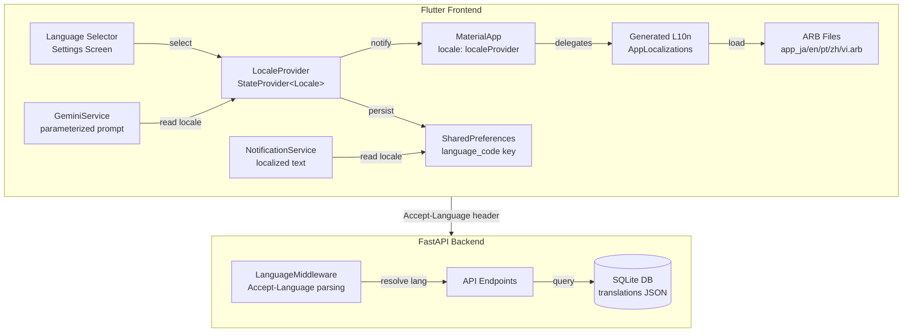
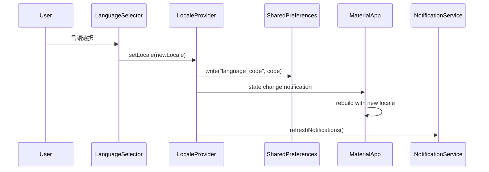
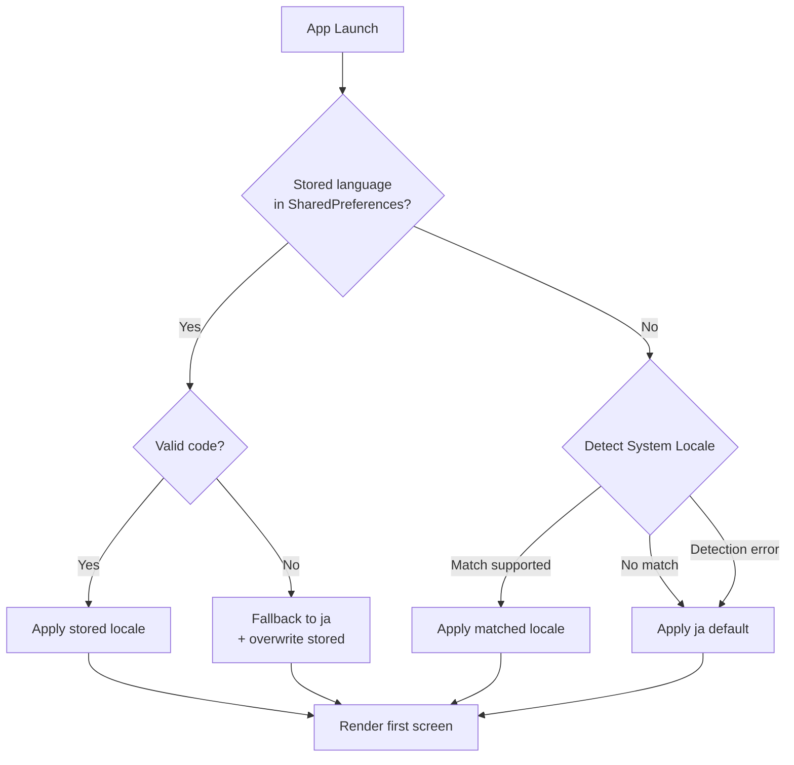

# Design Document: 多言語対応 (Multi-Language Support)

## Overview

本設計では、愛媛県ゴミ出しアプリケーションに5言語（日本語・英語・ポルトガル語・中国語簡体字・ベトナム語）対応を導入する。Flutterの標準ローカリゼーションフレームワーク（`flutter_localizations` + `gen-l10n` + ARBファイル）を中心に、Riverpodによるリアクティブなロケール状態管理、バックエンドのAccept-Languageヘッダー対応、AIチャットのシステムプロンプトパラメタライズ、通知テキストのローカライズを実現する。

### 設計方針

- **Flutter標準に準拠**: `flutter_localizations`パッケージとARBファイルによるgen-l10nを採用し、独自の翻訳管理は行わない
- **Riverpodによるリアクティブ切替**: ロケール状態をStateProviderで管理し、MaterialAppが監視することで即座の言語切替を実現
- **バックエンドはJSON翻訳カラム**: ゴミ品目データの翻訳をJSONカラムで格納し、Accept-Languageヘッダーで返却言語を決定
- **フォールバック一貫性**: フロントエンド・バックエンド共にJapanese (ja) へのフォールバックを統一
- **すべてLTR**: 対象5言語はすべて左書きのため、RTL対応は不要

## Architecture



### ロケール状態管理フロー



### 初回起動フロー



## Components and Interfaces

### 1. LocaleProvider (Frontend - Riverpod)

```dart
/// 現在のアプリロケールを管理するStateNotifierProvider
/// SharedPreferencesから初期値を読み込み、変更時に永続化する
final localeProvider = StateNotifierProvider<LocaleNotifier, Locale>((ref) {
  return LocaleNotifier();
});

class LocaleNotifier extends StateNotifier<Locale> {
  LocaleNotifier() : super(const Locale('ja'));

  static const String _storageKey = 'language_code';
  static const List<String> supportedCodes = ['ja', 'en', 'pt', 'zh', 'vi'];

  /// 初期化: SharedPreferencesから読み込み or システムロケール検出
  Future<void> initialize() async { ... }

  /// ロケール変更 + 永続化
  Future<void> setLocale(Locale locale) async { ... }

  /// ロケール解決ロジック（システムロケール → サポート言語マッチング）
  Locale resolveLocale(Locale systemLocale) { ... }
}
```

### 2. Generated Localization (AppLocalizations)

`flutter gen-l10n` により自動生成されるクラス。ARBファイルから翻訳を提供する。

```dart
// 使用例
Text(AppLocalizations.of(context)!.tabSearch)
Text(AppLocalizations.of(context)!.categoryBurnable)
```

設定ファイル `l10n.yaml`:
```yaml
arb-dir: lib/l10n
template-arb-file: app_ja.arb
output-localization-file: app_localizations.dart
output-class: AppLocalizations
nullable-getter: false
```

### 3. Language Selector Widget

```dart
class LanguageSelector extends ConsumerWidget {
  static const Map<String, String> languageNames = {
    'ja': '日本語',
    'en': 'English',
    'pt': 'Português',
    'zh': '中文',
    'vi': 'Tiếng Việt',
  };
  
  // 各言語を母国語名で表示し、選択中にチェックアイコン表示
}
```

### 4. GeminiService（多言語対応版）

```dart
class GeminiService {
  /// 言語コードに応じたシステムプロンプトを生成
  String _buildSystemPrompt(String languageCode) {
    final languageInstruction = _languageInstructions[languageCode] ?? _languageInstructions['ja']!;
    return '''
あなたは愛媛県のゴミ出しアプリのAIアシスタントです。
$languageInstruction
ゴミカテゴリ名（可燃ごみ、資源ごみ等）を言及する際は、翻訳語の後に括弧で日本語の元の用語を併記してください。
わからない場合は地元の市役所への問い合わせを案内してください。
''';
  }

  static const Map<String, String> _languageInstructions = {
    'ja': 'ユーザーの質問に日本語で簡潔に回答してください。',
    'en': 'Please respond to user questions concisely in English.',
    'pt': 'Por favor, responda às perguntas do usuário de forma concisa em português.',
    'zh': '请用中文简洁地回答用户的问题。',
    'vi': 'Vui lòng trả lời câu hỏi của người dùng một cách ngắn gọn bằng tiếng Việt.',
  };

  Future<String> sendMessage(String userMessage, {required String languageCode}) async { ... }
}
```

### 5. Backend Language Middleware

```python
from fastapi import Request

SUPPORTED_LANGUAGES = ['ja', 'en', 'pt', 'zh', 'vi']

class LanguageMiddleware:
    """Accept-Language ヘッダーを解析し、request.state.language に解決結果を設定する"""
    
    async def __call__(self, request: Request, call_next):
        language = self.resolve_language(request.headers.get("accept-language"))
        request.state.language = language
        response = await call_next(request)
        return response
    
    def resolve_language(self, accept_language: str | None) -> str:
        """RFC 9110 準拠のAccept-Language解析。q-factor重み付けで最優先のサポート言語を返す"""
        if not accept_language:
            return 'ja'
        # パース → q-factorソート → サポート言語マッチ → フォールバックja
        ...
```

### 6. NotificationService（多言語対応版）

```dart
class NotificationService {
  /// 通知テキストを現在の言語設定で構成する
  Future<void> scheduleWeeklyNotifications(String districtId) async {
    final prefs = await SharedPreferences.getInstance();
    final languageCode = prefs.getString('language_code') ?? 'ja';
    
    // ロケールに応じた通知テンプレートを使用
    final titles = _getNotificationTitles(languageCode);
    final templates = _getNotificationTemplates(languageCode);
    ...
  }
}
```

### 7. Backend Translation Schema

ゴミ品目テーブルに翻訳JSONカラムを追加するアプローチ:

```python
class GarbageItemTranslation(Base):
    """ゴミ品目翻訳テーブル"""
    __tablename__ = "garbage_item_translations"
    
    id: Mapped[int] = mapped_column(primary_key=True, autoincrement=True)
    garbage_item_id: Mapped[str] = mapped_column(String(50), index=True, nullable=False)
    language_code: Mapped[str] = mapped_column(String(5), nullable=False)  # ja, en, pt, zh, vi
    item_name: Mapped[str | None] = mapped_column(String(200), nullable=True)
    disposal_method: Mapped[str | None] = mapped_column(String(500), nullable=True)
    caution: Mapped[str | None] = mapped_column(String(500), nullable=True)
    keywords: Mapped[str | None] = mapped_column(String(500), nullable=True)  # カンマ区切り
```

同様にBulkyWasteItemにも翻訳テーブルを設ける:

```python
class BulkyWasteItemTranslation(Base):
    """粗大ごみ品目翻訳テーブル"""
    __tablename__ = "bulky_waste_item_translations"
    
    id: Mapped[int] = mapped_column(primary_key=True, autoincrement=True)
    bulky_waste_item_id: Mapped[int] = mapped_column(ForeignKey("bulky_waste_items.id"), nullable=False)
    language_code: Mapped[str] = mapped_column(String(5), nullable=False)
    item_name: Mapped[str | None] = mapped_column(String(200), nullable=True)
    notes: Mapped[str | None] = mapped_column(String(500), nullable=True)
```

### 8. Municipality Romanization Data

```dart
/// 自治体名ローマ字対応表
/// JSON asset として管理
/// assets/data/municipality_romanization.json
{
  "松山市": "Matsuyama-shi",
  "今治市": "Imabari-shi",
  "宇和島市": "Uwajima-shi",
  ...
}
```

### 9. Frontend HTTP Client (Accept-Language送信)

```dart
class ApiClient {
  Future<http.Response> get(String path) async {
    final locale = _getStoredLocale();
    return http.get(
      Uri.parse('$baseUrl$path'),
      headers: {
        'Accept-Language': locale,
        ...
      },
    );
  }
}
```

## Data Models

### ARB File Structure

**app_ja.arb** (テンプレート / ベースファイル):
```json
{
  "@@locale": "ja",
  "appName": "愛媛ゴミ出しアプリ",
  "tabSearch": "検索",
  "tabCalendar": "カレンダー",
  "tabSettings": "設定",
  "tabImageInput": "画像入力",
  "categoryBurnable": "可燃ごみ",
  "categoryRecyclable": "資源ごみ",
  "categoryPlastic": "プラスチック製容器包装",
  "categoryPetBottle": "ペットボトル",
  "categoryHazardous": "危険ごみ",
  "notificationTomorrowTitle": "明日のゴミ出し",
  "notificationTomorrowBody": "明日は{categories}の日です",
  "@notificationTomorrowBody": {
    "placeholders": {
      "categories": {
        "type": "String",
        "description": "収集カテゴリ名（・区切り）"
      }
    }
  },
  "notificationTodayTitle": "今日のゴミ出し",
  "notificationTodayBody": "今日は{categories}の日です",
  "@notificationTodayBody": {
    "placeholders": {
      "categories": {
        "type": "String",
        "description": "収集カテゴリ名（・区切り）"
      }
    }
  },
  "searchHint": "品目名を入力（2文字以上）",
  "noSearchResults": "該当する品目が見つかりませんでした",
  "dataLoadError": "データの取得に失敗しました",
  "retry": "再試行",
  "regionNotSet": "地域が設定されていません",
  "aiErrorMessage": "リクエストを完了できませんでした。しばらくしてからお試しください。",
  "dateFormat": "yyyy年M月d日",
  "municipalityRomanization": "{japaneseName}（{romanizedName}）",
  "@municipalityRomanization": {
    "placeholders": {
      "japaneseName": { "type": "String" },
      "romanizedName": { "type": "String" }
    }
  }
}
```

**app_en.arb** (例):
```json
{
  "@@locale": "en",
  "appName": "Ehime Garbage App",
  "tabSearch": "Search",
  "tabCalendar": "Calendar",
  "tabSettings": "Settings",
  "tabImageInput": "Image",
  "categoryBurnable": "Burnable",
  "categoryRecyclable": "Recyclable",
  "categoryPlastic": "Plastic Containers",
  "categoryPetBottle": "PET Bottles",
  "categoryHazardous": "Hazardous",
  "notificationTomorrowTitle": "Tomorrow's Garbage",
  "notificationTomorrowBody": "Tomorrow is {categories} day",
  "notificationTodayTitle": "Today's Garbage",
  "notificationTodayBody": "Today is {categories} day",
  "searchHint": "Enter item name (2+ characters)",
  "noSearchResults": "No matching items found",
  "dataLoadError": "Failed to load data",
  "retry": "Retry",
  "regionNotSet": "Region not set",
  "aiErrorMessage": "Unable to complete the request. Please try again later.",
  "municipalityRomanization": "{japaneseName} ({romanizedName})"
}
```

### Database Translation Table Schema

```sql
CREATE TABLE garbage_item_translations (
    id INTEGER PRIMARY KEY AUTOINCREMENT,
    garbage_item_id TEXT NOT NULL,
    language_code TEXT NOT NULL CHECK(language_code IN ('ja','en','pt','zh','vi')),
    item_name TEXT,
    disposal_method TEXT,
    caution TEXT,
    keywords TEXT,
    UNIQUE(garbage_item_id, language_code)
);

CREATE TABLE bulky_waste_item_translations (
    id INTEGER PRIMARY KEY AUTOINCREMENT,
    bulky_waste_item_id INTEGER NOT NULL REFERENCES bulky_waste_items(id),
    language_code TEXT NOT NULL CHECK(language_code IN ('ja','en','pt','zh','vi')),
    item_name TEXT,
    notes TEXT,
    UNIQUE(bulky_waste_item_id, language_code)
);

CREATE TABLE municipality_romanizations (
    id INTEGER PRIMARY KEY AUTOINCREMENT,
    municipality_name TEXT NOT NULL UNIQUE,
    romanized_name TEXT NOT NULL
);
```

### Locale Resolution Logic (shared between frontend and backend)

```
Input: locale_code (string, possibly with region subtag like "pt-BR")
Output: resolved language code (one of: ja, en, pt, zh, vi)

1. Extract language prefix: code.split('-')[0] or code.split('_')[0]
2. If prefix is in SUPPORTED_LANGUAGES → return prefix
3. Else → return 'ja'
```

### Frontend GarbageItem Model (多言語対応版)

```dart
class GarbageItem {
  final String id;
  final String name;                    // 日本語名（常に存在）
  final String? localizedName;          // 選択言語での翻訳名
  final GarbageCategory primaryCategory;
  final List<GarbageCategory> secondaryCategories;
  final String disposalMethod;          // 日本語出し方
  final String? localizedDisposalMethod;// 選択言語での翻訳
  final String? caution;
  final String? localizedCaution;
  final List<String> keywords;          // 日本語キーワード
  final List<String> localizedKeywords; // 選択言語キーワード

  /// 表示用名前（翻訳優先、フォールバックは日本語）
  String get displayName => localizedName ?? name;
  
  /// 表示用出し方
  String get displayDisposalMethod => localizedDisposalMethod ?? disposalMethod;
  
  /// 表示用注意事項
  String? get displayCaution => localizedCaution ?? caution;
}
```

## Correctness Properties

*A property is a characteristic or behavior that should hold true across all valid executions of a system—essentially, a formal statement about what the system should do. Properties serve as the bridge between human-readable specifications and machine-verifiable correctness guarantees.*

### Property 1: Frontend locale resolution correctness

*For any* system locale string (with or without region subtag), the locale resolution function SHALL return one of the 5 supported language codes if the language prefix matches, or "ja" if it does not match any supported language.

**Validates: Requirements 1.2, 3.2, 3.3, 3.4, 3.5**

### Property 2: Backend Accept-Language resolution correctness

*For any* valid Accept-Language header string containing language tags with q-factor weights, the backend resolution function SHALL return the highest-priority supported language tag, or "ja" if no supported language is present in the header. Regional variants (e.g., "pt-BR") SHALL match their base language code.

**Validates: Requirements 10.1, 10.3, 10.4**

### Property 3: Language preference persistence round-trip

*For any* supported language code, after persisting it to SharedPreferences and reading it back, the returned value SHALL equal the originally stored code.

**Validates: Requirements 4.1, 4.2**

### Property 4: Invalid stored preference correction

*For any* string value stored in the language preference key that is NOT one of {ja, en, pt, zh, vi}, loading the preference SHALL resolve the active language to "ja" and overwrite the stored value with "ja".

**Validates: Requirements 4.5**

### Property 5: Garbage item translation fallback

*For any* garbage item and *for any* supported language, if a translation field (item_name, disposal_method, caution) is null or missing for that language, the display value SHALL equal the Japanese text for that field.

**Validates: Requirements 7.5, 7.8, 10.8**

### Property 6: Dual-language search inclusiveness

*For any* non-Japanese language and *for any* search query, the search results SHALL be a superset of the union of (items matching the query in the selected language's keywords/names) and (items matching the query in Japanese keywords/names), with no duplicates.

**Validates: Requirements 7.6, 7.7**

### Property 7: AI system prompt parameterization

*For any* supported language code, the generated Gemini system prompt SHALL contain a language-specific instruction directing the AI to respond in that language, and SHALL contain the instruction to include Japanese garbage-category terms in parentheses.

**Validates: Requirements 8.3, 8.4**

### Property 8: Notification text language consistency

*For any* supported language and *for any* garbage category, the notification title and body text generated by the NotificationService SHALL use translations from the user's stored language preference, not hard-coded Japanese.

**Validates: Requirements 9.1, 9.2, 9.3**

### Property 9: Municipality name invariance

*For any* supported language, municipality names and district names SHALL always be rendered in their original Japanese characters. Additionally, *for any* non-Japanese language, a romanized reading SHALL be present adjacent to the Japanese name; and for Japanese, no romanization SHALL be shown.

**Validates: Requirements 11.1, 11.2, 11.3, 11.4**

### Property 10: Language selection idempotence

*For any* supported language that is already the currently active language, calling setLocale with the same language SHALL NOT trigger a state change notification or persistence write.

**Validates: Requirements 2.5**

### Property 11: ARB key completeness

*For any* key defined in the base Japanese ARB file (app_ja.arb), that same key SHALL exist in every other supported language ARB file (app_en.arb, app_pt.arb, app_zh.arb, app_vi.arb).

**Validates: Requirements 1.3**

### Property 12: Date and number locale formatting

*For any* date value and *for any* supported locale, formatting with `DateFormat` SHALL produce a string consistent with that locale's conventions. Similarly, *for any* numeric value, `NumberFormat` SHALL use the locale-appropriate grouping and decimal separators.

**Validates: Requirements 13.1, 13.4**

### Property 13: Backend localized field response

*For any* garbage item or bulky waste item, when the Backend_API returns item data for a resolved language that has a translation available, the item_name and disposal_method (or notes) fields SHALL be in that resolved language, not Japanese.

**Validates: Requirements 10.6, 10.7**

## Error Handling

### Frontend Error Scenarios

| Error Case | Handling |
|---|---|
| System locale detection failure | Fall back to Japanese (ja) |
| Invalid stored language code | Reset to ja, overwrite storage |
| Missing ARB translation key | Flutter's built-in fallback to template locale (ja) |
| Missing garbage item translation | Display Japanese text for that field |
| Gemini API error | Show localized error message from ARB |
| SharedPreferences write failure | Log error, continue with in-memory locale (no persistence) |

### Backend Error Scenarios

| Error Case | Handling |
|---|---|
| Missing Accept-Language header | Default to Japanese (ja) |
| Malformed Accept-Language header | Ignore malformed entries, use first valid match or ja |
| No supported language in header | Fall back to Japanese (ja) |
| Translation not found in DB | Return Japanese text for that field |
| Database query failure | Return 500 error with localized error message |

### Debug/Production Behavior

- **Debug mode**: Log warnings to console when fallback translations are used (key name + target language)
- **Production mode**: Silently display fallback text without any user-visible error indicators or logging overhead

## Testing Strategy

### Property-Based Testing (PBT)

本機能はロケール解決ロジック、フォールバック処理、検索マッチングなど、入力空間が広い純粋関数を多く含むため、PBTが適している。

**ライブラリ**: `glados` (既にdev_dependenciesに導入済み) for Flutter/Dart, `hypothesis` for Python backend

**設定**: 各プロパティテストは最低100回のイテレーション

**タグ形式**: `Feature: multi-language-support, Property {number}: {property_text}`

### Property Tests (Dart - Frontend)

| Property | テスト対象関数 | Generator |
|---|---|---|
| Property 1 | `LocaleNotifier.resolveLocale()` | 任意のLocale文字列 (サポート言語 + ランダム文字列 + 地域サブタグ付き) |
| Property 3 | SharedPreferences read/write | サポート言語コード5種 |
| Property 4 | `LocaleNotifier.initialize()` | 任意の非サポート文字列 |
| Property 5 | `GarbageItem.displayName` etc. | GarbageItemインスタンス（一部翻訳null） |
| Property 6 | 検索関数 | ランダムクエリ + ランダムGarbageItemリスト |
| Property 7 | `GeminiService._buildSystemPrompt()` | サポート言語コード5種 |
| Property 10 | `LocaleNotifier.setLocale()` | 現在のロケールと同じ値 |
| Property 11 | ARBファイルパース | app_ja.arbの全キー |
| Property 12 | `DateFormat` / `NumberFormat` | ランダム日付値 / 数値 × 5ロケール |

### Property Tests (Python - Backend)

| Property | テスト対象関数 | Generator |
|---|---|---|
| Property 2 | `resolve_language()` | ランダムAccept-Languageヘッダー文字列 |
| Property 5 (backend) | translation fallback logic | ランダムGarbageItem + language_code |
| Property 13 | API response field selection | ランダムitem + language with/without translation |

### Unit Tests (Example-Based)

- Language selector displays exactly 5 options with native names
- Language selector shows check mark on active language
- System locale "pt-BR" resolves to "pt"
- First launch without stored preference detects system locale
- Logout does not clear language preference
- Locale change preserves navigation state and form input
- Calendar widget labels update on locale change
- Notification reschedule uses new language after change

### Integration Tests

- End-to-end: select language → verify all screens render in that language
- Backend: send Accept-Language header → verify response fields are localized
- AI chat: send message in English → verify system prompt is English-parameterized
- Full migration: verify zero references to AppStrings class remain

### Smoke Tests

- ARB files parse without errors
- `flutter gen-l10n` generates without warnings
- All 5 language ARB files are present
- MaterialApp has required localizationsDelegates
- Database migration creates translation tables
