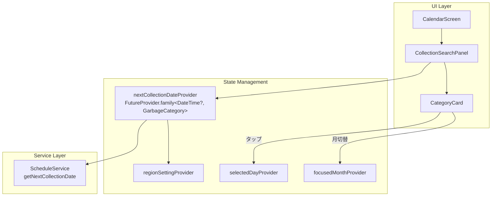

# Design Document: Next Collection Search

## Overview

カレンダー画面（`CalendarScreen`）に「カテゴリ別次回収集日検索パネル（Collection Search Panel）」を追加する。既存の `ScheduleService.getNextCollectionDate()` メソッドを活用し、全5カテゴリの次回収集日を一覧表示する。ユーザーはカテゴリカードをタップすることで、カレンダー上の該当日にジャンプできる。

### 設計方針

- **既存コードの最大活用**: `ScheduleService`、`calendar_provider.dart`の既存プロバイダー、`CategoryColors`等の既存リソースを再利用する
- **新規バックエンドロジック不要**: すべてのデータ取得は既存の`getNextCollectionDate()`で完結する
- **Riverpod FutureProvider.family パターン**: カテゴリ別にプロバイダーを作成し、地域設定変更時の自動再計算を実現する
- **カレンダー画面への統合**: 既存の次回収集バナーの下、カレンダー本体の上に配置する

## Architecture



### データフロー

1. `CalendarScreen` がビルドされると `CollectionSearchPanel` をレンダリング
2. `CollectionSearchPanel` は各 `GarbageCategory` に対して `nextCollectionDateProvider(category)` を watch
3. `nextCollectionDateProvider` は `regionSettingProvider` から `districtId` を取得し、`ScheduleService.getNextCollectionDate(districtId, categoryId)` を呼び出す
4. 結果が `CategoryCard` に表示される（次回収集日 + 残日数）
5. カードタップ時: `selectedDayProvider` と `focusedMonthProvider` を更新してカレンダーを連動

## Components and Interfaces

### 1. `nextCollectionDateProvider` (新規プロバイダー)

```dart
/// カテゴリ別次回収集日の FutureProvider.family
///
/// GarbageCategoryをパラメータとして受け取り、
/// 該当カテゴリの次回収集日(DateTime?)を返す。
/// regionSettingProviderを監視し、地域変更時に自動再計算する。
final nextCollectionDateProvider = FutureProvider.family<DateTime?, GarbageCategory>(
  (ref, category) async {
    final regionSettingAsync = ref.watch(regionSettingProvider);
    final regionSetting = regionSettingAsync.valueOrNull;
    if (regionSetting == null) return null;

    final service = ref.watch(scheduleServiceProvider);
    return service.getNextCollectionDate(
      regionSetting.districtId,
      category.toJsonString(),
    );
  },
);
```

**配置場所**: `lib/providers/calendar_provider.dart` に追加

### 2. `CollectionSearchPanel` (新規ウィジェット)

```dart
/// カテゴリ別次回収集日一覧パネル
///
/// 全5カテゴリのCategoryCardを固定順序で横スクロール表示する。
/// 地域設定未完了時は設定促すメッセージを表示する。
class CollectionSearchPanel extends ConsumerWidget {
  // カテゴリ表示順序（固定）
  static const _categoryOrder = [
    GarbageCategory.burnable,
    GarbageCategory.recyclable,
    GarbageCategory.plastic,
    GarbageCategory.petBottle,
    GarbageCategory.hazardous,
  ];

  Widget build(BuildContext context, WidgetRef ref);
}
```

**配置場所**: `lib/widgets/collection_search_panel.dart`

**インターフェース**:
- 入力: なし（内部でプロバイダーを watch）
- 出力: カテゴリカードのタップイベントで `selectedDayProvider` / `focusedMonthProvider` を更新
- 地域未設定時: 「地域を設定してください」メッセージ表示

### 3. `CategoryCard` (新規ウィジェット)

```dart
/// カテゴリ別次回収集日カード
///
/// カテゴリ色、カテゴリ名、次回収集日（M月d日（曜日）形式）、
/// 残日数表示（今日/明日/あとN日）を表示する。
/// タップでカレンダー連動を実行する。
class CategoryCard extends ConsumerWidget {
  final GarbageCategory category;

  const CategoryCard({required this.category, super.key});

  Widget build(BuildContext context, WidgetRef ref);
}
```

**配置場所**: `lib/widgets/category_card.dart`

**インターフェース**:
- 入力: `GarbageCategory category`
- 表示内容:
  - カテゴリ色（左端のカラーバー or アイコン背景）
  - カテゴリ名（`CategoryColors.getLabel()`）
  - 次回収集日（「M月d日（曜日）」形式）
  - 残日数（「今日」「明日」「あとN日」）
- ローディング時: シマーエフェクト or 小さな `CircularProgressIndicator`
- null時: 「予定なし」表示
- タップコールバック: 次回収集日が存在する場合のみ有効

### 4. `RemainingDaysFormatter` (ユーティリティ)

```dart
/// 残日数のフォーマットロジック
///
/// 次回収集日と今日の差分から表示テキストを決定する。
/// 純粋関数として実装し、テスト容易性を確保する。
class RemainingDaysFormatter {
  /// 残日数テキストを返す
  /// - 0日: 「今日」
  /// - 1日: 「明日」
  /// - 2日以上: 「あとN日」
  static String format(DateTime nextDate, DateTime today);

  /// 次回収集日を「M月d日（曜日）」形式でフォーマット
  static String formatCollectionDate(DateTime date);
}
```

**配置場所**: `lib/utils/remaining_days_formatter.dart`

## Data Models

本機能では新規データモデルの追加は不要。既存モデルをそのまま利用する。

### 利用する既存モデル

| モデル | 用途 |
|--------|------|
| `GarbageCategory` (enum) | カテゴリ識別子、5種類固定 |
| `ScheduleEntry` | 収集予定（districtId, category, date） |
| `CollectionRule` | 収集ルール（曜日ベース） |
| `RegionSetting` | 地域設定（districtId を含む） |

### カテゴリ表示順序定数

```dart
/// Collection Search Panel のカテゴリ表示順序
/// Requirement 1.3 で定義された固定順序
const kCategoryDisplayOrder = [
  GarbageCategory.burnable,    // 可燃ごみ
  GarbageCategory.recyclable,  // 資源ごみ
  GarbageCategory.plastic,     // プラスチック
  GarbageCategory.petBottle,   // ペットボトル
  GarbageCategory.hazardous,   // 危険ごみ
];
```

### 状態の型

```dart
// nextCollectionDateProvider の型
FutureProvider.family<DateTime?, GarbageCategory>

// CategoryCard が表示に使用するデータ
// - DateTime?: 次回収集日（nullは予定なし）
// - String: フォーマット済み日付テキスト
// - String: 残日数テキスト
// - Color: カテゴリ色
// - String: カテゴリラベル
```


## Correctness Properties

*A property is a characteristic or behavior that should hold true across all valid executions of a system—essentially, a formal statement about what the system should do. Properties serve as the bridge between human-readable specifications and machine-verifiable correctness guarantees.*

### Property 1: Collection date formatting produces valid pattern

*For any* valid DateTime, `RemainingDaysFormatter.formatCollectionDate(date)` SHALL produce a string matching the pattern `"M月d日（W）"` where M is the month (1-12), d is the day (1-31), and W is the correct Japanese weekday character (月/火/水/木/金/土/日) corresponding to that date.

**Validates: Requirements 1.4**

### Property 2: Remaining days formatter correctness

*For any* non-negative integer representing the day difference between today and a future collection date:
- If difference = 0, the formatter SHALL return "今日"
- If difference = 1, the formatter SHALL return "明日"
- If difference >= 2, the formatter SHALL return "あと{difference}日"

**Validates: Requirements 3.1, 3.2, 3.3**

### Property 3: Next collection date is always in the future or today

*For any* valid districtId and GarbageCategory where `getNextCollectionDate()` returns a non-null result, the returned DateTime SHALL be >= today (the date with time stripped to midnight).

**Validates: Requirements 2.1**

### Property 4: Card tap updates calendar to the correct date

*For any* CategoryCard with a non-null next collection date, tapping the card SHALL set `selectedDayProvider` to that date. Additionally, if the date's year/month differs from the current `focusedMonthProvider`, `focusedMonthProvider` SHALL be updated to a DateTime in the same year/month as the tapped date.

**Validates: Requirements 5.1, 5.2**

## Error Handling

| 状態 | 挙動 | 実装方法 |
|------|------|----------|
| 地域設定未完了（regionSetting == null） | 「地域を設定してください」メッセージ表示 | `regionSettingProvider` の `valueOrNull` が null の場合にメッセージウィジェット表示 |
| データ読み込み中 | 各 CategoryCard にローディングインジケーター表示 | `AsyncValue.when()` の `loading` 分岐で `CircularProgressIndicator` または Shimmer |
| 次回収集日なし（getNextCollectionDate → null） | 「予定なし」テキスト表示 | `DateTime?` が null の場合にフォールバックテキスト表示 |
| ScheduleService 例外 | エラー状態として静かに処理 | `AsyncValue.when()` の `error` 分岐で「予定なし」相当の表示 |
| カテゴリID変換失敗 | null を返す（既存ロジック） | `getNextCollectionDate` 内部で `try-catch` 済み |

### エラー状態のUX方針

- ローディング中はカード領域にプレースホルダーを表示し、レイアウトシフトを防止する
- エラー発生時もパネル全体を非表示にせず、各カードごとに「予定なし」で代替表示する
- 地域未設定のみパネル全体をメッセージに置換する（カード表示不可能なため）

## Testing Strategy

### Property-Based Tests (fast_check)

本機能の純粋関数ロジックに対して property-based testing を適用する。Flutter/Dart では `fast_check` パッケージを使用する。

**対象**:
- `RemainingDaysFormatter.format()` — 残日数テキスト生成
- `RemainingDaysFormatter.formatCollectionDate()` — 日付フォーマット

**設定**:
- 各プロパティテスト: 最低100イテレーション
- タグ形式: `// Feature: next-collection-search, Property {N}: {property_text}`

### Unit Tests (flutter_test)

| テスト対象 | テスト内容 |
|-----------|-----------|
| `RemainingDaysFormatter.format()` | 具体例: 今日=「今日」、明日=「明日」、7日後=「あと7日」 |
| `RemainingDaysFormatter.formatCollectionDate()` | 具体例: 2024/7/15(月)=「7月15日（月）」 |
| `nextCollectionDateProvider` | regionSetting が null の時に null を返す |
| `CollectionSearchPanel` | 地域未設定時に「地域を設定してください」を表示 |
| `CollectionSearchPanel` | ローディング中にインジケーター表示 |
| `CategoryCard` | 次回収集日が null の時に「予定なし」表示 |
| `CategoryCard` | タップ時に selectedDayProvider が更新される |
| `CategoryCard` | 異なる月のタップ時に focusedMonthProvider が更新される |

### Widget Tests (flutter_test)

| テスト対象 | テスト内容 |
|-----------|-----------|
| `CollectionSearchPanel` | 全5カテゴリのカードが表示される |
| `CollectionSearchPanel` | カテゴリが正しい順序で表示される |
| `CategoryCard` | カテゴリ名・日付・色が正しく表示される |
| `CategoryCard` | ローディング時のUI表示 |

### テストファイル構成

```
test/
├── utils/
│   └── remaining_days_formatter_test.dart      # Unit + Property tests
├── providers/
│   └── next_collection_date_provider_test.dart # Provider unit tests
└── widgets/
    ├── collection_search_panel_test.dart       # Widget tests
    └── category_card_test.dart                 # Widget tests
```
