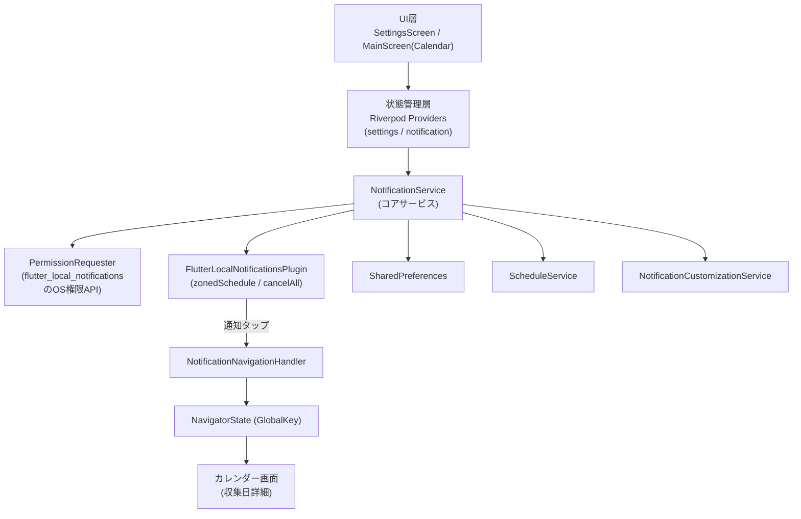
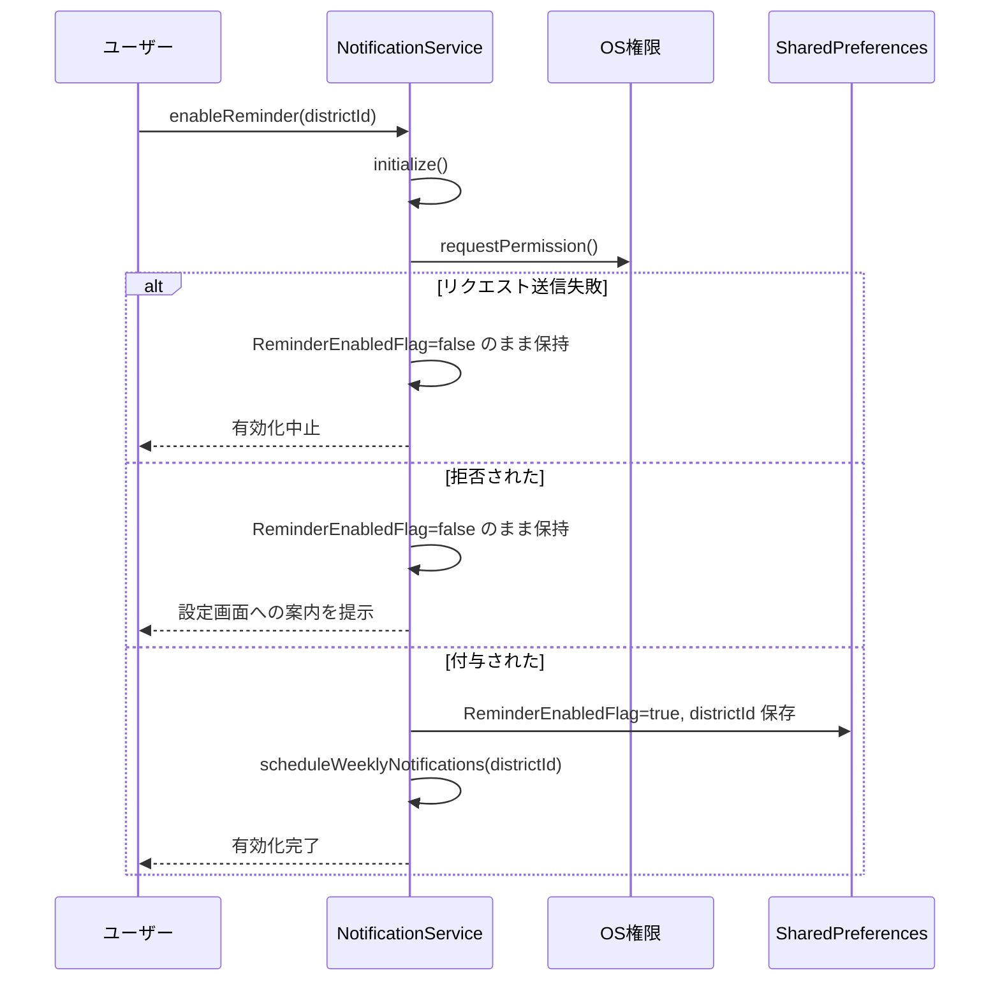
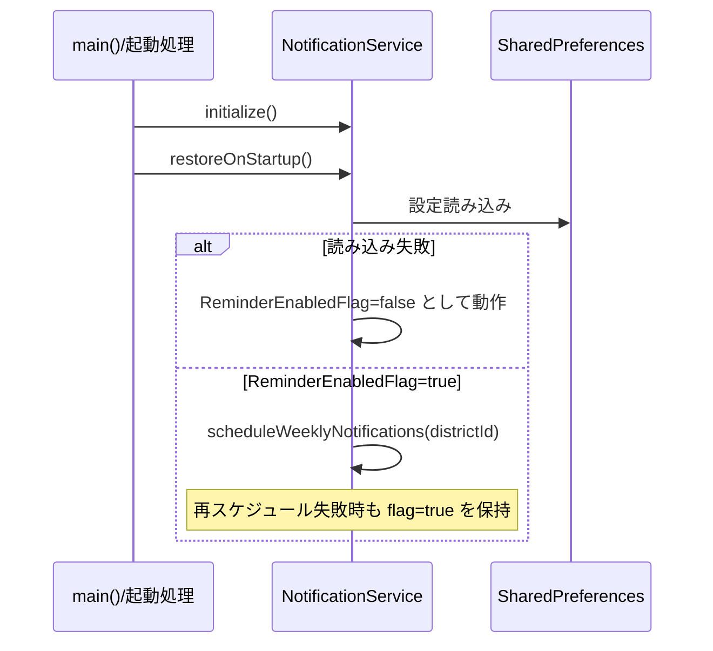

# Design Document

## Overview

本設計は、ゴミ出しアプリのコア通知機能を定義する。ユーザーの地区設定に基づき、次回のゴミ収集日の「前日」（EveningNotification）と「当日」（MorningNotification）に、端末内でスケジュールされるローカル通知（`flutter_local_notifications`）を配信する。バックエンドは使用しない完全なフロントエンド（Flutter）機能である。

本機能は、リマインダー通知全体の有効化・無効化、OS通知権限のリクエストと拒否時のハンドリング、通知時刻のユーザー変更、通知タップ時の該当画面（カレンダー）への遷移、および設定の永続化・アプリ/端末再起動時の復元を提供する。

この設計は既存の `NotificationService`（`frontend/lib/services/notification_service.dart`）を土台とし、要件文書（requirements.md）のすべての受け入れ基準を満たすように**既存実装を形式化・堅牢化（ハードニング）**するものである。既存実装には以下のギャップがあり、本設計で明示的に対処する:

- OS通知権限のリクエスト・拒否ハンドリング（要件2）が未実装
- 通知時刻保存失敗時のロールバックとエラー提示（要件4.4）が未実装
- 通知タップ時の画面遷移（要件5）が未実装
- 起動時の設定読み込みと再スケジュール（要件6.2, 6.3）がアプリ起動フローに未接続
- 各種処理（読み込み・スケジュール）の失敗時のフォールバック挙動（要件2.2, 6.4, 6.5）が未定義

ゴミ種別ごとの通知ON/OFFカスタマイズは別スペック `notification-customization`（`NotificationCustomizationService`）が担当する。本スペックはそのフィルタリングが適用される土台であり、`scheduleWeeklyNotifications` 内で `NotificationCustomizationService.getEnabledCategories` を呼び出してカテゴリを絞り込む連携点のみを保持する。

### 対象コンポーネント

| コンポーネント | 役割 |
| --- | --- |
| `NotificationService` | 通知のスケジュール・キャンセル・権限リクエスト・時刻管理のコアサービス |
| `ScheduleService`（既存） | 指定日・指定地区の収集カテゴリ一覧（`List<ScheduleEntry>`）を返す |
| `NotificationCustomizationService`（既存・別スペック） | タイミング別に有効なカテゴリ一覧を返す |
| `SharedPreferences` | 設定値の永続化 |
| `NotificationNavigationHandler`（新規） | 通知タップ時のペイロード解釈と画面遷移 |
| `CategoryColors`（既存） | カテゴリ → 日本語ラベル変換 |

## Architecture

### レイヤ構成



### 主要フロー

**有効化フロー（要件1, 2, 3）**



**起動時復元フロー（要件6）**



### 設計判断と根拠

- **7日先読みのScheduleWindow**: `flutter_local_notifications` はOSにスケジュールを委譲するが、収集ルールは動的（曜日・第n週）で無限先には展開できない。本日から7日分を先読みし、アプリ起動時・地区変更時・時刻変更時に `cancelAll` → 再スケジュールする方式を採る。既存実装を踏襲する。
- **`cancelAll` によるフル再構築**: 差分更新より単純で冪等性を保証しやすい。再スケジュールは常に「現在の設定 + 現在時刻」から全通知を再計算するため、順序に依存しない（Property 8）。
- **権限リクエストの抽象化**: iOS/Android で権限APIが異なるため、`NotificationService` 内で `flutter_local_notifications` の各プラットフォーム実装（`requestNotificationsPermission` 等）をラップした `_requestPermission()` を設ける。テスト時はこれをモック可能にする。
- **通知タップの遅延処理**: アプリがコールドスタートの場合、`getNotificationAppLaunchDetails()` で起動要因を確認し、UI（Navigator）が準備できてから遷移する。フォアグラウンド/バックグラウンドからのタップは `onDidReceiveNotificationResponse` コールバックで処理する。ナビゲーションには `MaterialApp` に登録する `GlobalKey<NavigatorState>` を使用する。

## Components and Interfaces

### NotificationService（コア）

既存メソッドを維持しつつ、権限・エラーハンドリング・復元のためのメソッドを追加・明確化する。副作用（UIへのメッセージ提示）は結果オブジェクトを返すことで呼び出し側（Provider/UI）に委譲し、テスト可能性を高める。

```dart
/// 有効化の結果
enum EnableResult {
  success,          // 権限付与＋スケジュール完了
  permissionDenied, // ユーザーが権限を拒否（設定画面案内が必要）
  requestFailed,    // 権限リクエスト送信自体が失敗
}

/// 時刻保存の結果
enum SaveTimeResult {
  success,
  failed, // 保存失敗（ロールバック済み、エラー提示が必要）
}

class NotificationService {
  Future<void> initialize();

  /// リマインダーを有効化する。権限リクエストを行い、結果を返す。
  /// - requestFailed / permissionDenied の場合、ReminderEnabledFlag は false のまま。
  /// - success の場合のみ flag=true と districtId を保存し、スケジュールする。
  Future<EnableResult> enableReminder(String districtId);

  /// リマインダーを無効化する。flag=false 保存 + cancelAll。
  Future<void> disableReminder();

  Future<bool> isReminderEnabled();

  /// ScheduleWindow(7日)内の通知を再計算してスケジュールする（cancelAll 後）。
  Future<void> scheduleWeeklyNotifications(String districtId);

  /// 有効時のみ再スケジュール（地区変更・起動・時刻変更で使用）。
  Future<void> refreshNotifications();

  /// 起動時の設定読み込みと再スケジュール（要件6.2, 6.3）。
  /// 読み込み失敗時は flag=false 相当として動作、再スケジュール失敗時は flag=true 保持。
  Future<void> restoreOnStartup();

  /// 時刻を保存し、成功時のみ再スケジュール。失敗時はロールバックし failed を返す。
  Future<SaveTimeResult> setEveningTime(int hour, int minute);
  Future<SaveTimeResult> setMorningTime(int hour, int minute);

  Future<({int hour, int minute})> getEveningTime();
  Future<({int hour, int minute})> getMorningTime();
}
```

### PermissionRequester（抽象化点）

`NotificationService` 内部で OS 権限をラップする。戻り値でリクエスト送信失敗と拒否を区別する。

```dart
enum PermissionOutcome { granted, denied, requestError }

// NotificationService 内部の private メソッドとして実装:
Future<PermissionOutcome> _requestPermission();
Future<bool> _isPermissionGranted();
```

### NotificationNavigationHandler（新規）

通知タップ時のペイロードを解釈し、カレンダー画面へ遷移する。`GlobalKey<NavigatorState>` を保持し、`MaterialApp.navigatorKey` に接続する。

```dart
class NotificationNavigationHandler {
  final GlobalKey<NavigatorState> navigatorKey;

  /// フォアグラウンド/バックグラウンドからのタップ応答
  void onNotificationResponse(NotificationResponse response);

  /// コールドスタート時: 起動要因が通知なら遷移を保留し、UI準備後に実行
  Future<void> handleAppLaunchDetails();

  /// カレンダー（収集日詳細）画面へ遷移。ペイロードに対象日付を含む。
  void navigateToCollectionDay(DateTime? targetDate);
}
```

通知ペイロードには対象収集日（ISO8601文字列）を格納し、タップ時にカレンダーの該当日を選択状態で開けるようにする。

### UI/状態管理層

- `SettingsScreen`: リマインダーON/OFFトグル、通知時刻設定UI。`enableReminder` の戻り値に応じて、`permissionDenied` 時は「OS設定画面への導線を含む案内」ダイアログを表示（要件2.5）、`requestFailed` 時は権限が必要な旨を提示（要件2.4）。`setEveningTime/setMorningTime` が `failed` を返した場合は保存失敗のエラーメッセージを表示（要件4.4）。
- Riverpod Provider: `NotificationService` をラップし、有効状態・時刻を UI に公開する。既存 `settings_provider.dart` / `notification_customization_provider.dart` と同一パターンで実装する。
- `main()`: `initialize()` と `restoreOnStartup()` を起動時に呼ぶ（要件6.2, 6.3）。`NotificationNavigationHandler.handleAppLaunchDetails()` を UI 準備後に呼ぶ。

## Data Models

### 永続化スキーマ（SharedPreferences）

既存キーを踏襲する。

| キー | 型 | 既定値 | 説明 | 要件 |
| --- | --- | --- | --- | --- |
| `reminder_enabled` | bool | `false` | ReminderEnabledFlag（マスタースイッチ） | 1.1, 6.1, 6.5 |
| `notification_district_id` | String | なし | 選択中の District_ID | 6.1 |
| `notification_evening_hour` | int | `20` | EveningNotification 時（0–23） | 4.1, 4.2, 6.1 |
| `notification_evening_minute` | int | `0` | EveningNotification 分（0–59） | 4.1, 4.2, 6.1 |
| `notification_morning_hour` | int | `6` | MorningNotification 時（0–23） | 4.1, 4.3, 6.1 |
| `notification_morning_minute` | int | `0` | MorningNotification 分（0–59） | 4.1, 4.3, 6.1 |

### 内部モデル

**ScheduleWindow**: 本日 00:00 を起点とする7日間 `[today, today+6]`。各日について `ScheduleService.getScheduleForDate(districtId, date)` を呼び、`List<ScheduleEntry>` を取得する。

**通知の構成**（各収集日 `d` について）:

- EveningNotification: 配信時刻 = `d - 1日` の `eveningTime`。本文 = 「明日は{カテゴリラベル・結合}の日です」。前日通知なので `d` がScheduleWindowの先頭日（`i == 0`）の場合は前日が範囲外のため対象外。
- MorningNotification: 配信時刻 = `d` の `morningTime`。本文 = 「今日は{カテゴリラベル・結合}の日です」。

**カテゴリラベル結合**: `entries` を `CategoryColors.getLabel(category)` で日本語化し、`・` で連結する。タイミング別に `NotificationCustomizationService.getEnabledCategories(timing)` で絞り込んだ後のカテゴリのみを対象とする。

**通知ペイロード**: 対象収集日の ISO8601 文字列。タップ時にカレンダー遷移で使用する。

### 通知時刻値オブジェクト

`({int hour, int minute})` レコード。`hour ∈ [0,23]`、`minute ∈ [0,59]` を満たす。

## Correctness Properties

*A property is a characteristic or behavior that should hold true across all valid executions of a system-essentially, a formal statement about what the system should do. Properties serve as the bridge between human-readable specifications and machine-verifiable correctness guarantees.*

以下の性質は、受け入れ基準を形式化したものである。各性質は生成された入力（地区・収集スケジュール・時刻・現在時刻・権限結果）に対して普遍的に成り立つべきである。副作用（OS権限・通知プラグイン・SharedPreferences）はテスト用のフェイク/モックに差し替えて検証する。

### Property 1: 有効化成功で状態が確定しスケジュールされる

*For any* District_ID と任意の初期状態について、権限が付与された状態で `enableReminder` を呼び出すと、`EnableResult.success` を返し、ReminderEnabledFlag が true として、District_ID が指定値として SharedPreferences に保存され、ScheduleWindow 内の通知がスケジュールされる。

**Validates: Requirements 1.1, 1.2, 2.1, 2.3, 3.1, 3.2**

### Property 2: 無効化で全通知がキャンセルされフラグが false になる

*For any* スケジュール済み通知集合について、`disableReminder` を呼び出すと、保留中の通知が 0 件になり、ReminderEnabledFlag が false として保存される。

**Validates: Requirements 1.3, 1.4**

### Property 3: スケジュールは対象地区の収集日に正確に対応する

*For any* District_ID と ScheduleWindow（本日から7日）内の収集スケジュールについて、リマインダー有効時にスケジュールされる通知集合は、次を満たす: (a) 有効カテゴリを持つ各収集日にのみ通知が存在し、収集予定カテゴリが空の日には通知が存在しない、(b) EveningNotification は「前日 + eveningTime」、MorningNotification は「当日 + morningTime」の時刻を持つ、(c) 指定地区以外の収集日に対応する通知は存在しない。

**Validates: Requirements 1.2, 3.1, 3.2, 3.6**

### Property 4: スケジュールされる通知の配信時刻は常に現在時刻より後である

*For any* ScheduleWindow と現在時刻について、スケジュールされるすべての通知の配信時刻は現在時刻より厳密に後である（現在時刻以前となる通知はスケジュールされない）。

**Validates: Requirements 3.5**

### Property 5: 通知本文には対象日の有効カテゴリのラベルが含まれる

*For any* 収集日と、その日にタイミング別で有効なカテゴリ集合（非空、かつすべてラベル解決可能）について、その日のためにスケジュールされる通知本文には、当該カテゴリすべての日本語ラベルが含まれる。あるカテゴリのラベル解決に失敗する場合、そのタイミングの通知はスケジュールされない。

**Validates: Requirements 3.3, 3.4**

### Property 6: 再スケジュールは現在設定のみに依存し冪等である

*For any* 事前のスケジュール状態、District_ID、通知時刻、現在時刻、収集スケジュールについて、`refreshNotifications` 実行後の通知集合は、事前のスケジュール状態に依存せず、現在の（District_ID・時刻・現在時刻・スケジュール）のみによって定まる。したがって、`refreshNotifications` を連続して2回実行した結果は1回実行した結果と等しく（冪等）、地区変更・時刻変更・起動時復元のいずれの経路でも、同一の現在設定に対して同一の通知集合を生成する。

**Validates: Requirements 3.7, 4.5, 6.3**

### Property 7: 通知設定の永続化は往復で保存される

*For any* 通知設定（ReminderEnabledFlag・District_ID・EveningNotification時刻・MorningNotification時刻）について、それを永続化してから再読み込みすると、同一の設定値が復元される。

**Validates: Requirements 6.1, 6.2**

### Property 8: 通知時刻の設定は往復で保存される

*For any* 有効な時（0〜23）と分（0〜59）について、`setEveningTime`（または `setMorningTime`）で保存してから `getEveningTime`（または `getMorningTime`）で取得すると、同一の時・分が返される。

**Validates: Requirements 4.2, 4.3**

### Property 9: 時刻保存失敗時は変更前の値へロールバックする

*For any* 事前に保存された通知時刻と任意の新しい時刻について、保存処理が失敗する場合、保存されている時刻は変更前の値のままであり、`SaveTimeResult.failed` が返される。

**Validates: Requirements 4.4**

### Property 10: 権限が付与されない場合は有効化が中止される

*For any* District_ID について、権限リクエストの結果が「送信失敗（requestError）」または「拒否（denied）」のいずれかである場合、`enableReminder` は成功以外の結果（それぞれ `requestFailed` / `permissionDenied`）を返し、ReminderEnabledFlag は false のまま保持され、通知はスケジュールされない。

**Validates: Requirements 2.2, 2.4**

### Property 11: 無効状態では新規通知をスケジュールしない

*For any* 収集スケジュールについて、ReminderEnabledFlag が false の状態で `refreshNotifications` または `restoreOnStartup` を呼び出しても、新規の通知はスケジュールされない（保留中の通知は 0 件のままである）。

**Validates: Requirements 1.5**

### Property 12: 起動時の再スケジュール失敗でもフラグは true を保持する

*For any* 有効化済み（flag=true）の永続設定について、起動時の再スケジュール処理が失敗する場合でも、ReminderEnabledFlag は true のまま保持される。

**Validates: Requirements 6.4**

## Error Handling

| 状況 | 挙動 | 要件 |
| --- | --- | --- |
| 権限リクエスト送信自体が失敗 | `enableReminder` は `requestFailed` を返す。flag は false のまま。スケジュールしない。UI は権限が必要な旨を提示。 | 2.2, 2.4 |
| 権限が拒否された | `enableReminder` は `permissionDenied` を返す。flag は false のまま。UI は OS設定画面への導線を含む案内を提示。 | 2.4, 2.5 |
| カテゴリラベル取得に失敗 | 当該タイミングの通知を無効として扱い、スケジュールしない（`try/catch` でラベル解決を保護し、失敗した通知をスキップ）。 | 3.4 |
| 配信時刻が現在時刻以前 | 当該通知をスキップ（`fireTime.isAfter(now)` チェック。既存実装を踏襲）。 | 3.5 |
| 収集予定が空の日 | 当該日は通知を生成しない（`entries.isEmpty` で `continue`。既存実装を踏襲）。 | 3.6 |
| 通知時刻の保存に失敗 | 保存前の値へロールバックし、`SaveTimeResult.failed` を返す。UI は保存失敗のエラーメッセージを提示。 | 4.4 |
| 起動時の再スケジュールに失敗 | 例外を捕捉し、flag=true を保持（次回起動・地区変更・時刻変更で再試行可能）。 | 6.4 |
| SharedPreferences 読み込み失敗 | flag=false（デフォルト）として動作し、通知をスケジュールしない。 | 6.5 |
| OS 配信処理中の通知 | 無効化時、OS が配信処理中の通知の完了を許容（`cancelAll` は保留中スケジュールのみを対象とし、配信中のものは制御しない）。 | 1.6 |

エラーハンドリングの原則: サービス層は UI へのメッセージ提示を直接行わず、結果を列挙型（`EnableResult` / `SaveTimeResult`）で返し、UI/Provider 層が提示を担当する。これにより副作用を分離し、テスト可能性を確保する。

## Testing Strategy

### アプローチ

本機能はコアロジック（スケジューリング計算、状態遷移、永続化の往復、エラー時のロールバック/フォールバック）に普遍的な性質を多く含むため、**プロパティベーステスト（PBT）が適切**である。通知タップ時のナビゲーション（要件5）とコールドスタート（5.2）、権限リクエストの発火確認（2.1）、既定値（4.1）は入力変化が乏しく、例題ベース/ウィジェット/統合テストで扱う。

- **プロパティテスト**: Property 1〜12 を対象。各性質を単一のプロパティテストで実装する。
- **ユニット/例題テスト**: 権限リクエストが呼ばれること（2.1）、既定時刻 20:00/06:00（4.1）、権限拒否状態での設定案内提示（2.5）。
- **ウィジェット/統合テスト**: 通知タップでカレンダー画面へ遷移（5.1）、コールドスタートからの遷移（5.2）。

### テスト用フェイク/依存注入

副作用を持つ依存を差し替え可能にする:

- `FlutterLocalNotificationsPlugin`: スケジュール/キャンセルを記録するフェイク（保留中通知の集合を保持し `pending()` で参照可能に）。
- 権限リクエスタ: `granted` / `denied` / `requestError` を返すよう制御可能なフェイク。
- `SharedPreferences`: インメモリ実装（`shared_preferences` の `setMockInitialValues` またはフェイク）。書き込み失敗を注入できるラッパを用意し、Property 9・要件6.5 の障害注入に使用する。
- `ScheduleService`: 生成された収集スケジュールを返すフェイク（`getScheduleForDate` をスタブ）。
- 現在時刻: 注入可能なクロック（`DateTime Function() now`）を `NotificationService` に導入し、Property 4 の過去時刻スキップを決定的に検証する。

### ライブラリと構成

- Flutter/Dart のプロパティベーステストには **`fast_check` ではなく Dart 向けの PBT ライブラリ**を用いる。具体的には `glados`（Dart 製 QuickCheck 系ライブラリ）を採用し、独自にゼロから実装しない。ジェネレータで収集スケジュール・時刻・地区・権限結果を生成する。
- 各プロパティテストは**最低100回**の反復で実行する。
- 各プロパティテストには対応する設計プロパティを示すコメントを付与する。
  - タグ形式: `// Feature: notification, Property {番号}: {プロパティ本文}`
- 各 Correctness Property は**単一のプロパティテスト**で実装する。

### ジェネレータ方針

- **収集スケジュール**: 本日起点7日間の各日に対し、0〜5個のカテゴリ集合をランダムに割り当てる（空の日を含む）。カテゴリは `GarbageCategory` の5値から抽出。ラベル解決失敗ケース（3.4）は、ラベル解決をフックしたフェイクで特定カテゴリの失敗を注入。
- **時刻**: `hour ∈ [0,23]`、`minute ∈ [0,59]`。
- **現在時刻**: 収集日に対して過去/未来が混在するよう、ScheduleWindow 内の任意時点を生成し、過去時刻スキップ（Property 4）を検証。
- **権限結果**: `granted` / `denied` / `requestError` を生成し、Property 1・10 を検証。
- **地区**: District_ID 文字列（例 `"38201-10"` 形式）を生成し、地区分離（Property 3c）を検証。

### 統合・境界の考慮

- `NotificationCustomizationService` との連携はフェイク（有効カテゴリ集合を返す）で分離し、フィルタ後カテゴリのみが本文・スケジュールに反映されることを確認する（Property 3, 5）。
- タイムゾーン（Asia/Tokyo）は既存どおり `timezone` パッケージで初期化し、テストでは固定ロケーションを設定する。
