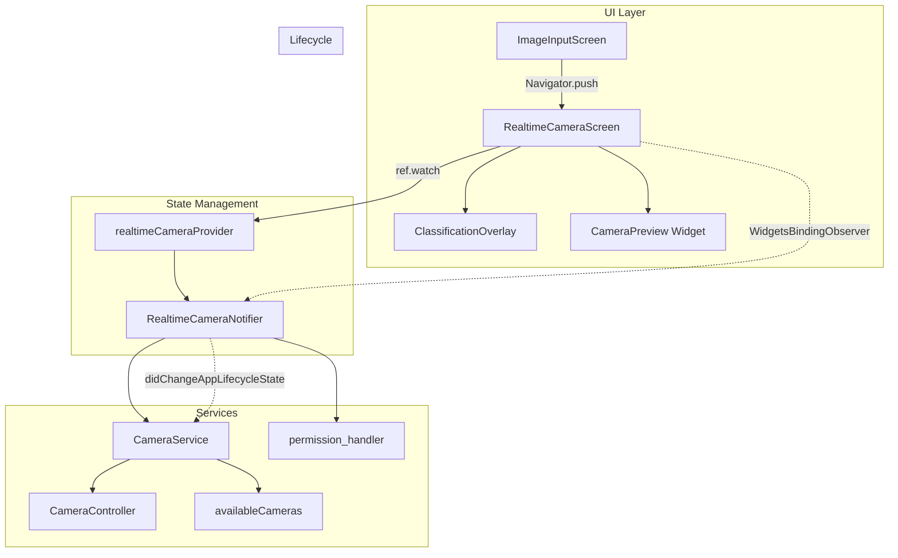
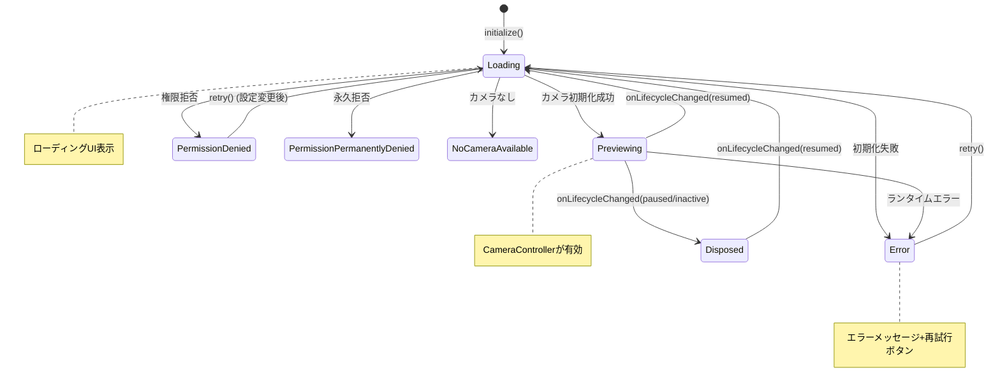

# Design Document: Realtime Camera

## Overview

本設計は、Flutter公式の`camera`パッケージを使用したリアルタイムカメラプレビュー画面の実装を定義する。既存のImageInputScreen（静止画撮影用）から遷移可能な独立画面として構築し、将来のリアルタイム判別機能の基盤とする。

**主な設計方針:**
- `camera`パッケージによるライブプレビュー（`image_picker`とは異なりCameraControllerで直接制御）
- Riverpod StateNotifierパターンによる状態管理（既存コードベースと一貫性を維持）
- `permission_handler`（プロジェクト既存）によるカメラ権限管理
- `WidgetsBindingObserver`によるアプリライフサイクル連動のカメラリソース管理

## Architecture



**アーキテクチャの選択理由:**
- `CameraService`を導入することで、`CameraController`の生成・初期化・破棄をテスタブルに抽象化する
- StateNotifierに全状態遷移ロジックを集約し、UIは状態を表示するだけの薄い層とする
- WidgetsBindingObserverはScreen側（StatefulWidget）で実装し、ライフサイクルイベントをNotifierに委譲する

## Components and Interfaces

### 1. RealtimeCameraScreen（UI）

```dart
/// リアルタイムカメラプレビュー画面
/// WidgetsBindingObserverでアプリライフサイクルを監視し、
/// Notifierに状態変更を通知する
class RealtimeCameraScreen extends ConsumerStatefulWidget
```

**責務:**
- Notifierの状態に応じたUI描画（loading / previewing / permissionDenied / error）
- WidgetsBindingObserverの登録・解除
- AppLifecycleState変更時にNotifierへ通知
- 戻るボタンの表示・ナビゲーション

### 2. RealtimeCameraNotifier（状態管理）

```dart
/// カメラ状態を管理するStateNotifier
/// 権限チェック → 初期化 → プレビュー → エラーの状態遷移を制御
class RealtimeCameraNotifier extends StateNotifier<RealtimeCameraState>
```

**インターフェース:**
```dart
Future<void> initialize();        // 権限確認 → カメラ初期化
Future<void> retry();             // エラー時の再試行
void onLifecycleChanged(AppLifecycleState state);  // ライフサイクル変更
Future<void> dispose();           // リソース完全解放
```

### 3. RealtimeCameraState（状態モデル）

```dart
enum RealtimeCameraStatus {
  loading,            // 初期化中（権限確認・カメラ準備）
  previewing,         // カメラプレビュー表示中
  permissionDenied,   // 権限拒否（通常）
  permissionPermanentlyDenied,  // 権限永久拒否
  error,              // エラー発生
  noCameraAvailable,  // デバイスにカメラなし
}

class RealtimeCameraState {
  final RealtimeCameraStatus status;
  final CameraController? controller;  // previewing時のみ非null
  final String? errorMessage;
}
```

### 4. CameraService（サービス）

```dart
/// CameraControllerの生成と管理を抽象化するサービス
/// テスト時にモック可能にするためのラッパー
class CameraService {
  Future<List<CameraDescription>> getAvailableCameras();
  Future<CameraController> createController(CameraDescription camera, ResolutionPreset preset);
  Future<void> initializeController(CameraController controller);
  Future<void> pausePreview(CameraController controller);
  Future<void> resumePreview(CameraController controller);
  void disposeController(CameraController controller);
}
```

### 5. ClassificationOverlay（UI）

```dart
/// カメラプレビュー上に表示するプレースホルダーオーバーレイ
/// 将来的に判別結果を表示するUIの土台
class ClassificationOverlay extends StatelessWidget
```

### 6. ImageInputScreenの変更

既存の`_buildInitialState`メソッドにリアルタイムカメラボタンを追加する。

## Data Models

### 状態遷移図



### RealtimeCameraState

| フィールド | 型 | 説明 |
|---|---|---|
| status | RealtimeCameraStatus | 現在の画面状態 |
| controller | CameraController? | カメラコントローラー（previewing時のみ） |
| errorMessage | String? | エラーメッセージ（error時のみ） |

### ファイル構成

```
lib/
├── screens/
│   └── realtime_camera_screen.dart    # 画面ウィジェット
├── providers/
│   └── realtime_camera_provider.dart  # StateNotifier + Provider定義
├── services/
│   └── camera_service.dart            # CameraController抽象化
└── widgets/
    └── classification_overlay.dart    # オーバーレイウィジェット
```

## Correctness Properties

*A property is a characteristic or behavior that should hold true across all valid executions of a system — essentially, a formal statement about what the system should do. Properties serve as the bridge between human-readable specifications and machine-verifiable correctness guarantees.*

### Property 1: State machine happy path transitions

*For any* camera description and permission status of "granted", initializing the RealtimeCameraNotifier should result in the state transitioning from `loading` to `previewing` with a non-null CameraController.

**Validates: Requirements 1.1, 2.3**

### Property 2: Lifecycle round-trip restores camera

*For any* RealtimeCameraNotifier in `previewing` state, transitioning the lifecycle to a non-resumed state and then back to `resumed` should result in the state returning to `previewing` with an active CameraController.

**Validates: Requirements 5.1, 5.2**

### Property 3: Non-resumed lifecycle releases resources

*For any* AppLifecycleState that is not `resumed` (paused, inactive, detached, hidden), when the notifier receives that lifecycle event while in `previewing` state, the CameraController should be disposed/paused (resources released).

**Validates: Requirements 5.1**

### Property 4: Error state transition on failure

*For any* error thrown during camera initialization or preview runtime, the RealtimeCameraNotifier should transition to `error` state with a non-null error message, regardless of the specific error type.

**Validates: Requirements 6.1, 6.3**

## Error Handling

### エラー種別と対応

| エラー種別 | 原因 | 状態遷移先 | ユーザー向けアクション |
|---|---|---|---|
| 権限拒否 | ユーザーが権限を拒否 | permissionDenied | 「設定を開く」ボタン表示 |
| 権限永久拒否 | 「今後表示しない」で拒否 | permissionPermanentlyDenied | デバイス設定への誘導 |
| カメラなし | デバイスにカメラ未搭載 | noCameraAvailable | メッセージ表示のみ |
| 初期化失敗 | CameraController.initialize()エラー | error | 「再試行」ボタン |
| ランタイムエラー | プレビュー中のカメラエラー | error | 「再試行」ボタン |

### エラーハンドリング方針

1. **CameraException**: `camera`パッケージ固有の例外。エラーコードに応じたメッセージを表示
2. **PermissionException**: `permission_handler`からの権限エラー。権限状態に応じたUIを表示
3. **汎用Exception**: 予期しないエラー。汎用メッセージ「カメラの起動に失敗しました」を表示
4. **再試行**: `retry()`メソッドで`initialize()`を再実行。状態をloadingに戻して最初からやり直す

### リソースリーク防止

- Notifierの`dispose()`で必ずCameraControllerを破棄
- ライフサイクルイベントでのpause/resumeで中間状態のリークを防止
- 再初期化時は既存のControllerを先にdisposeしてから新規作成

## Testing Strategy

### テストアプローチ

本機能はカメラハードウェアに依存するため、テストは以下の2層で実施する：

**1. Property-Based Tests（glados使用）**

プロジェクト既存の`glados`パッケージを使用し、状態遷移ロジックの網羅的検証を行う。

- 最小100イテレーション/プロパティ
- CameraServiceをモックし、純粋な状態遷移ロジックをテスト
- 各テストにプロパティ番号をタグ付け

```dart
// Tag format example:
// Feature: realtime-camera, Property 1: State machine happy path transitions
```

**対象プロパティ:**
- Property 1: 権限許可済み → loading → previewing遷移
- Property 2: pause → resume のラウンドトリップ
- Property 3: 非resumed状態でのリソース解放
- Property 4: 任意のエラーでerror状態に遷移

**2. Unit Tests（example-based）**

- 権限状態ごとのUI表示（widget test）
- ローディングインジケーター表示（widget test）
- プレースホルダーテキスト・オーバーレイ表示（widget test）
- ナビゲーション（ImageInputScreen → RealtimeCameraScreen）
- 戻るボタン動作
- カメラなし時のメッセージ表示
- dispose時のCameraController.dispose()呼び出し確認

**3. テストファイル構成**

```
test/
├── unit/
│   ├── realtime_camera_notifier_test.dart        # StateNotifierのロジックテスト
│   └── realtime_camera_notifier_property_test.dart  # Property-based tests
└── widget/
    ├── realtime_camera_screen_test.dart           # 画面UIテスト
    └── classification_overlay_test.dart           # オーバーレイテスト
```

**モック対象:**
- `CameraService` — カメラハードウェア抽象化のモック
- `permission_handler` — 権限API のモック
- `availableCameras()` — カメラ一覧のモック
