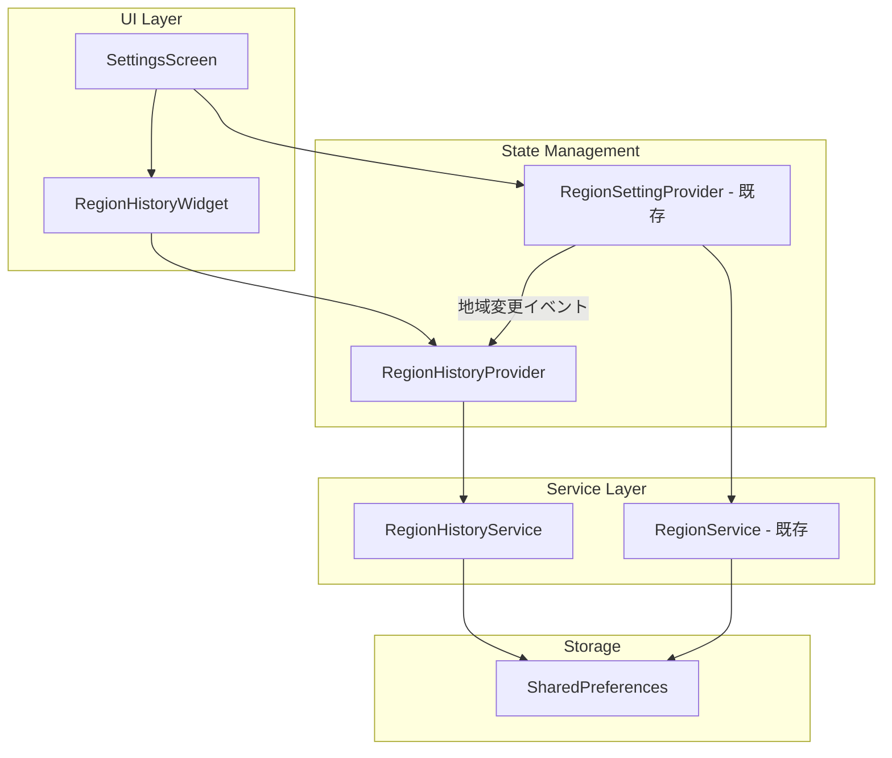

# Design Document: Region History

## Overview

地域設定の変更履歴を保存し、過去の地域設定へ素早く切り替えられる機能を実装する。この機能はフロントエンド（Flutter）のローカルストレージ（SharedPreferences）のみで完結し、バックエンドAPIへの変更は不要である。

主要な設計判断：
- **フロントエンドのみで実装**: 履歴データはデバイスローカルに保存し、サーバーとの同期は行わない。ユーザーの地域変更は頻繁ではなく、デバイス間同期の必要性は低いため。
- **SharedPreferencesを使用**: 既存の`RegionService`がSharedPreferencesを使用しており、同じパターンに従う。履歴データは最大10件のJSON配列であり、SharedPreferencesの容量制限内に収まる。
- **既存のRegionSettingモデルを再利用**: 新しいモデル（`HistoryEntry`）はRegionSettingを内包する形で定義し、保存日時を追加する。

## Architecture



データフロー：
1. ユーザーが地域設定を変更 → `RegionSettingProvider`が更新
2. `RegionSettingProvider`の変更を`RegionHistoryProvider`がリスン
3. `RegionHistoryProvider`が`RegionHistoryService`を呼び出し、変更前の設定を履歴に追加
4. `RegionHistoryService`がSharedPreferencesにJSON形式で永続化
5. `RegionHistoryWidget`が履歴一覧をUI表示

## Components and Interfaces

### 1. HistoryEntry モデル (`lib/models/region_history.dart`)

```dart
class HistoryEntry {
  final RegionSetting regionSetting;
  final DateTime savedAt;

  HistoryEntry({required this.regionSetting, required this.savedAt});

  factory HistoryEntry.fromJson(Map<String, dynamic> json);
  Map<String, dynamic> toJson();

  @override
  bool operator ==(Object other);
  @override
  int get hashCode;
}
```

### 2. RegionHistoryService (`lib/services/region_history_service.dart`)

```dart
class RegionHistoryService {
  static const String _historyKey = 'region_history';
  static const int maxHistoryCount = 10;

  /// 履歴リストをSharedPreferencesから読み込む
  Future<List<HistoryEntry>> loadHistory();

  /// 履歴リストをSharedPreferencesに保存する
  Future<void> saveHistory(List<HistoryEntry> history);

  /// 地域設定を履歴に追加する（重複削除、最大件数制限を適用）
  Future<List<HistoryEntry>> addToHistory(
    RegionSetting setting,
    List<HistoryEntry> currentHistory,
  );

  /// 指定のエントリを履歴から削除する
  Future<List<HistoryEntry>> removeFromHistory(
    HistoryEntry entry,
    List<HistoryEntry> currentHistory,
  );
}
```

### 3. RegionHistoryProvider (`lib/providers/region_history_provider.dart`)

```dart
/// 地域履歴の状態管理
final regionHistoryProvider =
    StateNotifierProvider<RegionHistoryNotifier, AsyncValue<List<HistoryEntry>>>(
  (ref) {
    final service = ref.watch(regionHistoryServiceProvider);
    return RegionHistoryNotifier(service);
  },
);

class RegionHistoryNotifier extends StateNotifier<AsyncValue<List<HistoryEntry>>> {
  /// 履歴を読み込む
  Future<void> loadHistory();

  /// 地域設定を履歴に追加する
  Future<void> addToHistory(RegionSetting setting);

  /// 履歴エントリを削除する
  Future<void> removeEntry(HistoryEntry entry);

  /// 履歴から地域設定を復元する
  Future<void> restoreFromHistory(HistoryEntry entry, RegionSettingNotifier regionNotifier);
}
```

### 4. RegionHistoryWidget (`lib/widgets/region_history_widget.dart`)

```dart
/// 設定画面に組み込む履歴一覧ウィジェット
class RegionHistoryWidget extends ConsumerWidget {
  /// 履歴一覧を表示（スワイプで削除、タップで復元）
  /// 空の場合は「履歴はありません」メッセージを表示
}
```

### コンポーネント間の連携

| 呼び出し元 | 呼び出し先 | タイミング |
|---|---|---|
| SettingsScreen | RegionHistoryWidget | 設定画面のビルド時 |
| RegionHistoryWidget | RegionHistoryProvider | 履歴の表示・操作 |
| RegionHistoryProvider | RegionHistoryService | 履歴のCRUD操作 |
| RegionSettingProvider | RegionHistoryProvider | 地域変更時に変更前設定を履歴追加 |

## Data Models

### HistoryEntry

| フィールド | 型 | 説明 |
|---|---|---|
| regionSetting | RegionSetting | 保存された地域設定 |
| savedAt | DateTime | 保存日時（UTC） |

### JSON シリアライズ形式

```json
{
  "regionSetting": {
    "prefectureId": "38",
    "prefectureName": "愛媛県",
    "municipalityId": "38201",
    "municipalityName": "松山市",
    "districtId": "38201001",
    "districtName": "中央地区"
  },
  "savedAt": "2024-01-15T09:30:00.000Z"
}
```

### SharedPreferences保存形式

キー: `region_history`
値: HistoryEntryのJSON配列（文字列）

```json
[
  {"regionSetting": {...}, "savedAt": "2024-01-15T09:30:00.000Z"},
  {"regionSetting": {...}, "savedAt": "2024-01-14T15:00:00.000Z"}
]
```

### 制約

- 最大保存件数: 10件
- 重複判定: `RegionSetting`の等価性（`districtId`で一意に識別）
- 並び順: `savedAt`の降順（最新が先頭）

## Correctness Properties

*A property is a characteristic or behavior that should hold true across all valid executions of a system-essentially, a formal statement about what the system should do. Properties serve as the bridge between human-readable specifications and machine-verifiable correctness guarantees.*

### Property 1: Serialization round-trip

*For any* valid `List<HistoryEntry>`, serializing the list to a JSON string and then deserializing it back SHALL produce a list that is equivalent to the original.

**Validates: Requirements 2.1, 2.2, 2.4**

### Property 2: No duplicates after add

*For any* `RegionSetting` and any existing `List<HistoryEntry>`, after calling `addToHistory` with that setting, the resulting list SHALL contain at most one entry with that `RegionSetting` (identified by equality on all fields).

**Validates: Requirements 1.2**

### Property 3: Maximum count invariant

*For any* `RegionSetting` and any existing `List<HistoryEntry>` (regardless of initial length), after calling `addToHistory`, the resulting list's length SHALL be less than or equal to `maxHistoryCount` (10).

**Validates: Requirements 1.3**

### Property 4: History is always sorted descending by savedAt

*For any* `RegionSetting` added to any existing `List<HistoryEntry>`, the resulting list SHALL be sorted in descending order by `savedAt` (newest first), and the newly added entry SHALL appear at index 0.

**Validates: Requirements 1.1, 3.1**

### Property 5: Invalid JSON yields empty list

*For any* arbitrary string that is not valid JSON representing a `List<HistoryEntry>`, calling `loadHistory` SHALL return an empty list.

**Validates: Requirements 2.3**

### Property 6: Date formatting pattern

*For any* valid `DateTime`, formatting it for display SHALL produce a string matching the pattern `yyyy/MM/dd` (4-digit year, slash, 2-digit month, slash, 2-digit day).

**Validates: Requirements 3.4**

### Property 7: Restore applies selected setting and preserves current

*For any* current `RegionSetting` and any `HistoryEntry` selected from the history, after performing a restore operation, the new current setting SHALL equal the selected entry's `RegionSetting`, and the previous current setting SHALL be present in the updated history list.

**Validates: Requirements 4.2**

### Property 8: Deletion removes exactly the target entry

*For any* `List<HistoryEntry>` containing at least one entry, and any entry selected for deletion from that list, after calling `removeFromHistory`, the resulting list SHALL not contain the deleted entry and SHALL have a length of `originalLength - 1`.

**Validates: Requirements 5.2**

## Error Handling

| シナリオ | 対応 | ユーザーへの影響 |
|---|---|---|
| 履歴保存時にSharedPreferencesエラー | エラーをログ記録、地域変更は続行 | なし（地域変更は成功する） |
| 履歴読み込み時に不正JSON | 空リストを返し、不正データを消去 | 履歴が空として表示される |
| 履歴からの復元失敗 | 変更前の設定を維持、エラースナックバー表示 | 設定は変わらない |
| 履歴削除失敗 | エラーをログ記録、UIは変更しない | 削除が反映されない |

### エラーハンドリングの設計方針

1. **非致命的エラー**: 履歴機能のエラーは地域変更の本処理をブロックしない
2. **データ破損対応**: 不正データは安全にリセット（空リスト）する
3. **ユーザーフィードバック**: ユーザー操作に直接影響するエラーのみスナックバーで通知する
4. **ログ記録**: すべてのエラーはデバッグ用にログに記録する

## Testing Strategy

### Property-Based Testing（PBT）

プロジェクトの既存PBTライブラリ `glados` (pubspec.yaml に記載済み) を使用する。

各プロパティテストは最低100イテレーション実行する。テストには以下のタグ形式でコメントを付与する：
```
// Feature: region-history, Property {number}: {property_text}
```

**対象プロパティ:**
- Property 1: シリアライゼーションのラウンドトリップ
- Property 2: 追加後の重複なし
- Property 3: 最大件数の不変条件
- Property 4: savedAtの降順ソート
- Property 5: 不正JSONで空リスト
- Property 6: 日付フォーマットのパターン
- Property 7: 復元操作の正確性
- Property 8: 削除の正確性

### Unit Tests（Example-Based）

| テスト対象 | テスト内容 |
|---|---|
| HistoryEntry.fromJson/toJson | 具体的なJSONデータでの変換確認 |
| エラーハンドリング | SharedPreferences障害時に地域変更が続行されること (1.4) |
| 空履歴表示 | 履歴が空の場合「履歴はありません」が表示されること (3.2) |
| 確認ダイアログ | 履歴タップで確認ダイアログが表示されること (4.1) |
| 成功スナックバー | 復元成功時にスナックバー表示 (4.3) |
| エラースナックバー | 復元失敗時にエラースナックバー表示 (4.4) |
| スワイプ操作 | 左スワイプで削除ボタン表示 (5.1) |
| 削除スナックバー | 削除成功時にスナックバー表示 (5.3) |

### Widget Tests

設定画面に関するUIテストは `test/widget/` ディレクトリに配置する。

### テストファイル構成

```
test/
├── unit/
│   ├── region_history_service_test.dart   # PBT + Unit tests
│   └── history_entry_test.dart            # モデルのシリアライズテスト
└── widget/
    └── region_history_widget_test.dart    # ウィジェットテスト
```

