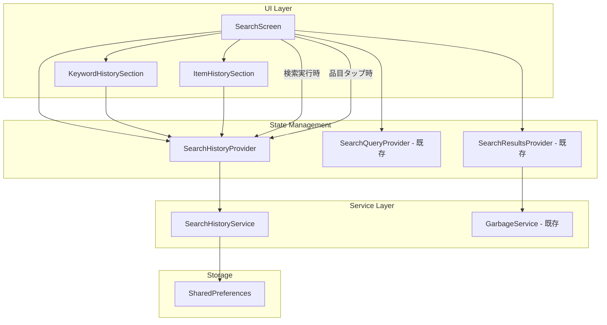

# Design Document: Search History

## Overview

ゴミ品目検索画面に検索履歴機能を追加する。ユーザーが検索実行したキーワードおよび閲覧した品目の履歴をSharedPreferencesにJSON形式で永続化し、検索画面の履歴セクションから素早く再検索・再閲覧できるようにする。

主要な設計判断：
- **フロントエンドのみで実装**: 履歴データはデバイスローカルに保存し、サーバーとの同期は行わない。検索履歴は個人的なデータであり、デバイス間同期の必要性は低いため。
- **SharedPreferencesを使用**: 既存の`CacheService`が同じパターンでSharedPreferencesを使用しており、一貫性のあるアプローチ。各履歴リストは最大50件のJSON配列であり、SharedPreferencesの容量制限内に収まる。
- **専用サービスクラスとプロバイダーで分離**: `SearchHistoryService`がデータの永続化ロジックを担当し、`SearchHistoryProvider`がUI層への状態管理を提供する。既存のRiverpodパターンに従う。
- **キーワード履歴と品目閲覧履歴を別キーで管理**: それぞれ独立したJSON配列として保存し、表示・削除を個別に制御できるようにする。
- **重複エントリは許容し新規追加**: 同一キーワード・品目の再検索・再閲覧時は新しいエントリとして追加する。これにより使用頻度を反映した履歴となる。

## Architecture



データフロー：
1. **検索履歴保存**: ユーザーが2文字以上で検索実行 → `SearchHistoryProvider`が`SearchHistoryService.addKeywordHistory()`を呼び出し → SharedPreferencesに永続化
2. **品目閲覧履歴保存**: ユーザーが品目をタップし詳細画面へ遷移 → `SearchHistoryProvider`が`SearchHistoryService.addItemHistory()`を呼び出し → SharedPreferencesに永続化
3. **履歴表示**: 検索テキストフィールドが空の時 → `SearchHistoryProvider`がメモリキャッシュから履歴を提供 → UIセクションが新しい順に表示
4. **履歴削除**: ユーザーが個別削除またはすべて削除 → `SearchHistoryService`がSharedPreferencesを更新 → UIが再描画

## Components and Interfaces

### 1. KeywordHistoryEntry モデル (`lib/models/search_history.dart`)

```dart
/// キーワード検索履歴の1エントリ
class KeywordHistoryEntry {
  final String keyword;
  final DateTime searchedAt;

  KeywordHistoryEntry({
    required this.keyword,
    required this.searchedAt,
  });

  factory KeywordHistoryEntry.fromJson(Map<String, dynamic> json);
  Map<String, dynamic> toJson();

  @override
  bool operator ==(Object other);
  @override
  int get hashCode;
}
```

### 2. ItemHistoryEntry モデル (`lib/models/search_history.dart`)

```dart
/// 品目閲覧履歴の1エントリ
class ItemHistoryEntry {
  final String itemId;
  final String itemName;
  final DateTime viewedAt;

  ItemHistoryEntry({
    required this.itemId,
    required this.itemName,
    required this.viewedAt,
  });

  factory ItemHistoryEntry.fromJson(Map<String, dynamic> json);
  Map<String, dynamic> toJson();

  @override
  bool operator ==(Object other);
  @override
  int get hashCode;
}
```

### 3. SearchHistoryService (`lib/services/search_history_service.dart`)

```dart
/// 検索履歴の永続化を担当するサービスクラス
class SearchHistoryService {
  static const String keywordHistoryKey = 'keyword_search_history';
  static const String itemHistoryKey = 'item_view_history';
  static const int maxHistoryCount = 50;

  /// キーワード履歴を追加する
  /// 2文字未満のキーワードは保存しない
  /// 50件を超える場合は最古のエントリを削除
  Future<List<KeywordHistoryEntry>> addKeywordHistory(String keyword);

  /// 品目閲覧履歴を追加する
  /// 50件を超える場合は最古のエントリを削除
  Future<List<ItemHistoryEntry>> addItemHistory(String itemId, String itemName);

  /// キーワード履歴一覧を取得する（新しい順）
  Future<List<KeywordHistoryEntry>> getKeywordHistory();

  /// 品目閲覧履歴一覧を取得する（新しい順）
  Future<List<ItemHistoryEntry>> getItemHistory();

  /// 特定のキーワード履歴エントリを削除する
  Future<List<KeywordHistoryEntry>> removeKeywordEntry(KeywordHistoryEntry entry);

  /// 特定の品目閲覧履歴エントリを削除する
  Future<List<ItemHistoryEntry>> removeItemEntry(ItemHistoryEntry entry);

  /// すべての履歴を削除する
  Future<void> clearAllHistory();
}
```

### 4. SearchHistoryProvider (`lib/providers/search_history_provider.dart`)

```dart
/// SearchHistoryServiceのプロバイダー
final searchHistoryServiceProvider = Provider<SearchHistoryService>((ref) {
  return SearchHistoryService();
});

/// キーワード履歴の状態管理
final keywordHistoryProvider = StateNotifierProvider<KeywordHistoryNotifier, AsyncValue<List<KeywordHistoryEntry>>>((ref) {
  final service = ref.watch(searchHistoryServiceProvider);
  return KeywordHistoryNotifier(service);
});

/// 品目閲覧履歴の状態管理
final itemHistoryProvider = StateNotifierProvider<ItemHistoryNotifier, AsyncValue<List<ItemHistoryEntry>>>((ref) {
  final service = ref.watch(searchHistoryServiceProvider);
  return ItemHistoryNotifier(service);
});

class KeywordHistoryNotifier extends StateNotifier<AsyncValue<List<KeywordHistoryEntry>>> {
  final SearchHistoryService _service;

  KeywordHistoryNotifier(this._service) : super(const AsyncValue.loading()) {
    _load();
  }

  Future<void> _load();
  Future<void> add(String keyword);
  Future<void> remove(KeywordHistoryEntry entry);
  Future<void> clearAll();
}

class ItemHistoryNotifier extends StateNotifier<AsyncValue<List<ItemHistoryEntry>>> {
  final SearchHistoryService _service;

  ItemHistoryNotifier(this._service) : super(const AsyncValue.loading()) {
    _load();
  }

  Future<void> _load();
  Future<void> add(String itemId, String itemName);
  Future<void> remove(ItemHistoryEntry entry);
  Future<void> clearAll();
}
```

### 5. UI Components

#### SearchHistorySection (`lib/widgets/search_history_section.dart`)

検索履歴セクション全体のウィジェット。キーワード履歴と品目閲覧履歴を統合表示する。

```dart
class SearchHistorySection extends ConsumerWidget {
  /// ヘッダー「検索履歴」+ 「すべて削除」ボタン
  /// KeywordHistoryList
  /// ItemHistoryList
  /// 履歴が0件の場合はSizedBox.shrink()を返す
}
```

#### KeywordHistoryList (`lib/widgets/keyword_history_list.dart`)

```dart
class KeywordHistoryList extends ConsumerWidget {
  /// キーワード履歴項目をリスト表示
  /// 各項目は左スワイプで削除ボタン表示（Dismissible）
  /// タップで検索テキストフィールドにキーワードをセットし検索実行
  final void Function(String keyword) onKeywordTap;
}
```

#### ItemHistoryList (`lib/widgets/item_history_list.dart`)

```dart
class ItemHistoryList extends ConsumerWidget {
  /// 品目閲覧履歴項目をリスト表示
  /// 各項目は左スワイプで削除ボタン表示（Dismissible）
  /// タップで品目詳細画面へ直接遷移
  /// 品目IDに対応するデータが存在しない場合はグレーアウト
  final void Function(ItemHistoryEntry entry) onItemTap;
}
```

## Data Models

### SharedPreferencesのデータ構造

#### `keyword_search_history` キー

```json
[
  {
    "keyword": "ペットボトル",
    "searchedAt": "2024-06-15T10:30:00.000"
  },
  {
    "keyword": "電池",
    "searchedAt": "2024-06-15T09:15:00.000"
  }
]
```

#### `item_view_history` キー

```json
[
  {
    "itemId": "item_001",
    "itemName": "ペットボトル（飲料用）",
    "viewedAt": "2024-06-15T10:31:00.000"
  },
  {
    "itemId": "item_023",
    "itemName": "乾電池",
    "viewedAt": "2024-06-15T09:16:00.000"
  }
]
```

### データ制約

| 項目 | 制約 |
|------|------|
| キーワード最小長 | 2文字 |
| キーワード最大長 | 50文字（既存の検索フィールド制限に準拠） |
| キーワード履歴最大件数 | 50件 |
| 品目閲覧履歴最大件数 | 50件 |
| タイムスタンプ形式 | ISO 8601 |
| シリアライズ形式 | JSON |


## Correctness Properties

*A property is a characteristic or behavior that should hold true across all valid executions of a system—essentially, a formal statement about what the system should do. Properties serve as the bridge between human-readable specifications and machine-verifiable correctness guarantees.*

### Property 1: シリアライズのラウンドトリップ

*For any* valid `KeywordHistoryEntry` or `ItemHistoryEntry`, serializing the entry to JSON via `toJson()` and then deserializing via `fromJson()` SHALL produce an object equal to the original entry.

**Validates: Requirements 6.5, 6.4, 1.5, 2.5**

### Property 2: 追加操作によるリスト成長

*For any* valid keyword (2文字以上50文字以下) and any initial keyword history state with fewer than 50 entries, calling `addKeywordHistory(keyword)` SHALL return a list whose length is exactly one greater than the initial state. The same property holds *for any* valid item ID and item name with item history.

**Validates: Requirements 1.1, 1.2, 2.1, 2.2**

### Property 3: 容量上限のFIFO制約

*For any* sequence of add operations on keyword history or item history, the resulting list length SHALL never exceed 50. When the list is at capacity (50 entries) and a new entry is added, the oldest entry (smallest timestamp) SHALL be removed and the new entry SHALL be present in the list.

**Validates: Requirements 1.3, 1.4, 2.3, 2.4**

### Property 4: タイムスタンプ降順の不変条件

*For any* state of keyword history returned by `getKeywordHistory()`, the entries SHALL be ordered by timestamp in descending order (newest first). The same property holds *for any* state of item history returned by `getItemHistory()`.

**Validates: Requirements 3.2, 3.3**

### Property 5: 削除操作の正確性

*For any* keyword history containing at least one entry, removing a specific entry SHALL result in a list whose length is exactly one less than before, and the removed entry SHALL no longer be present. The same property holds for item history. Additionally, *for any* non-empty history state, calling `clearAllHistory()` SHALL result in both keyword and item history being empty lists.

**Validates: Requirements 5.2, 5.3**

### Property 6: 破損データに対するエラー耐性

*For any* invalid JSON string stored in SharedPreferences under the history keys, calling `getKeywordHistory()` or `getItemHistory()` SHALL return an empty list without throwing an exception.

**Validates: Requirements 6.3**

## Error Handling

| エラー条件 | 対応 |
|-----------|------|
| SharedPreferencesのデータがJSON形式として不正 | 空リストとして初期化し、エラーをログ出力（`debugPrint`） |
| SharedPreferencesのJSON配列内に不正なエントリが含まれる | 不正エントリをスキップし、有効なエントリのみで読み込む |
| 品目IDに対応するデータがGarbageServiceに存在しない | UIで履歴項目をグレーアウトし、タップを無効化する |
| SharedPreferencesへの書き込み失敗 | UIの状態は更新するが永続化失敗をログ出力。次回操作時に再試行される |
| アプリ起動時のデータ読み込み失敗 | 空の履歴状態で起動し、ログ出力 |

## Testing Strategy

### テストの種別

| テスト種別 | 対象 | ツール |
|-----------|------|-------|
| プロパティテスト | シリアライズ、追加ロジック、容量制約、順序保証、削除ロジック、エラー耐性 | `glados` |
| ユニットテスト | SearchHistoryService の具体的シナリオ、境界条件 | `flutter_test` |
| ウィジェットテスト | 検索履歴セクションの表示/非表示、タップ操作、スワイプ操作、グレーアウト | `flutter_test` |

### プロパティベーステスト設定

- **ライブラリ**: `glados` (既に `dev_dependencies` に含まれている)
- **最小反復回数**: 100回/プロパティ
- **テストファイル**: `test/unit/search_history_service_property_test.dart`
- **タグ形式**: `// Feature: search-history, Property {number}: {property_text}`

### プロパティテスト例

```dart
// Feature: search-history, Property 1: シリアライズのラウンドトリップ
import 'package:glados/glados.dart';

Glados(any.keywordHistoryEntry).test(
  'KeywordHistoryEntry の toJson → fromJson は元のエントリと等価',
  (entry) {
    final json = entry.toJson();
    final restored = KeywordHistoryEntry.fromJson(json);
    expect(restored, equals(entry));
  },
);
```

### ユニットテストの対象

- 2文字未満のキーワードが保存されないこと
- 50件ちょうどの状態でのFIFO動作
- `clearAllHistory()`後に両方のリストが空であること
- アプリ再起動（新インスタンス）後にデータが復元されること

### ウィジェットテストの対象

- 検索フィールド空の時に履歴セクションが表示されること
- 履歴が0件の時にセクションが非表示であること
- キーワード履歴タップで検索実行されること
- 品目履歴タップで詳細画面遷移すること
- 存在しない品目IDのエントリがグレーアウトされること
- 左スワイプで削除ボタンが表示されること
- 「すべて削除」ボタンの動作
